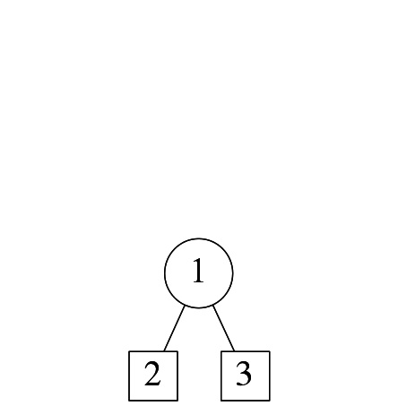
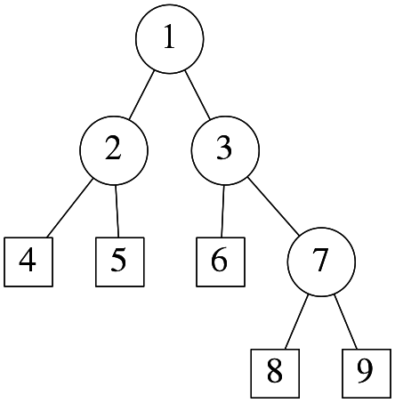
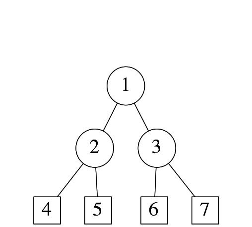
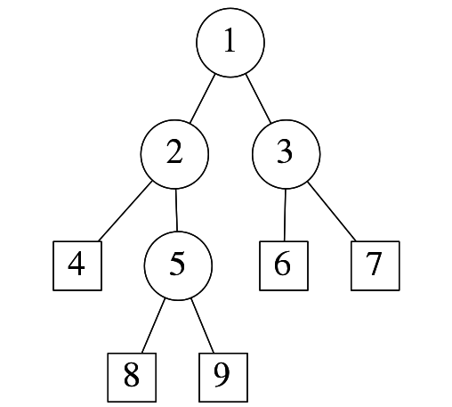
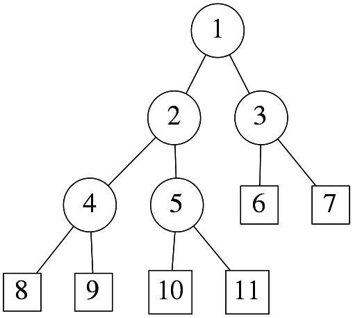
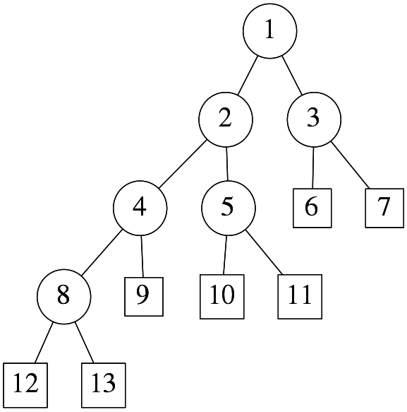
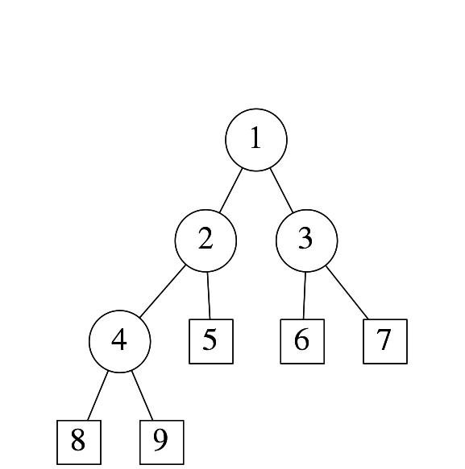
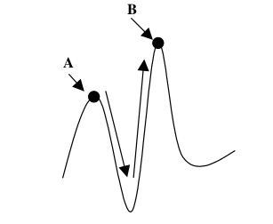
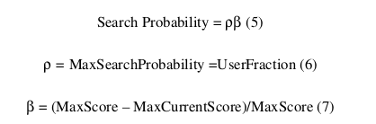
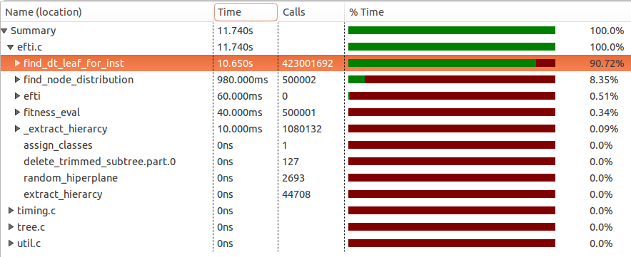

.. |algo| replace:: *EFTI*
.. |cop| replace:: *EFTIP*
.. |ealgo| replace:: *EEFTI*
.. |ecop| replace:: *DTEEP*
.. |w| replace:: :math:`\mathbf{w}`
.. |th| replace:: :math:`\theta`
.. |x| replace:: :math:`\mathbf{x}`
.. |NA| replace:: :math:`N_{A}`
.. |NAM| replace:: :math:`N^{M}_{A}`
.. |NIM| replace:: :math:`N^{M}_{I}`
.. |na| replace:: :math:`\bar{n}`
.. |NI| replace:: :math:`N_{I}`
.. |Da| replace:: :math:`\bar{D}`
.. |Nl| replace:: :math:`N_l`
.. |NlM| replace:: :math:`N^{M}_{l}`
.. |NnM_l| replace:: :math:`N^{M}_{n}(l)`
.. |NM| replace:: :math:`N_{M}`
.. |DM| replace:: :math:`D^{M}`
.. |Nc| replace:: :math:`N_{c}`
.. |NP| replace:: :math:`N_{P}`
.. |RA| replace:: :math:`R_{A}`
.. |alpha| replace:: :math:`{\alpha}`
.. |rho| replace:: :math:`{\rho}`
.. |ChLi| replace:: :math:`ChL_{i}`
.. |LfLi| replace:: :math:`LfL_{i}`
.. |ChRi| replace:: :math:`ChR_{i}`
.. |LfRi| replace:: :math:`LfR_{i}`
.. |smae| replace:: *SMAE*
.. |NTE| replace:: *NTE*
.. |SM| replace:: :math:`S_m`
.. |NIass| replace:: :math:`N_{Iass}`
.. |AM| replace:: :math:`A_{m}`
.. |IM| replace:: :math:`I_m`
.. |ACEM| replace:: :math:`ACE_m`
.. |LM| replace:: :math:`L_{m}`
.. |WDTD| replace:: :math:`W_{DTD}`
.. |ne| replace:: :math:`n_e`
.. |Ths| replace:: :math:`T_{hs}`
.. |Tsw| replace:: :math:`T_{sw}`
.. |Tswmut| replace:: :math:`T_{sw\_mut}`
.. |Tswacc| replace:: :math:`T_{sw\_acc}`
.. |Thsmut| replace:: :math:`T_{hs\_mut}`
.. |Thsacc| replace:: :math:`T_{hs\_acc}`
.. |Ko| replace:: :math:`K_o`
.. |Km| replace:: :math:`K_m`
.. |NDTc| replace:: :math:`N_{DTc}`
.. |SM| replace:: *SM*
.. |CM| replace:: *CM*

.. role:: raw(raw)
   :format: latex

==========
PHD Thesis
==========

Introduction
============

This dissertation presents new algorithms for the inudction of oblique binary decision trees and their ensembles using evolutionary strategies, named |algo| and |ealgo| respectively. The research on decision trees is a part of a broather field called machine learning which in turn is a branch of artificial intelligence. Machine learning techniques are usefull for solving problems when:

- There exists a lot of input data on the problem, but no algorithm (or no efficient one) to produce the output based on the input data
- Either the problem changes with time, or some of its characteristics are not known at the time the solution is being designed, so a solution is needed which can adapt to the new circumstances

Because of ever increasing penetration of the machine learning systems into the embedded world, and even greater potential for that in the future, the presented induction algorithms have been tailored for implementation by the embedded systems in that they use less resources for the operation than existing solutions. One way of reducing the resource consumption is to induce and thus operate on smaller decision trees. Smaller decision trees also represent a more succint solution to the problem, which is always prefered in science (Occam's razor). Hence, the main motivation for this dissertation was to develop the decision tree induction algorithms that:

#. induce smaller DTs than the existing solutions without the loss of accuracy,
#. can be effitiently used in embedded applications, and
#. are easily parallelizable and hence accelerated in hardware

For big datasets, which are common in practice, the presented decision tree induction algorithms are very time consuming. Hence, the hardware accelerators for |algo| and |ealgo| algorithms are also proposed, named |cop| and |ecop| co-processors, that significantly reduce their times of execution. Furthermore, the implementations of the proposed induction algorithms that utilize these hardware accelerators are also described.

Machine learning
----------------

Our ever-improving capabilities in collecting the data from the world and constant increase in processing power available to us, have significantly changed our approaches to problem solving in recent decades. Science has also taken advantage of the ability of computers to store massive amounts of data. Biology has led the way, with the ability to measure gene expression in DNA microarrays producing immense datasets, along with protein transcription data and phylogenetic trees relating species to each other. However, other sciences have not been slow to follow. Astronomy now uses digital telescopes, so that each night the world’s observatories are storing incredibly high-resolution images of the night sky; around a terabyte per night. Equally, medical science stores the outcomes of medical tests from measurements as diverse as magnetic resonance imaging (MRI) scans and simple blood tests. The explosion in stored data is well known; the challenge is to do something useful with that data. The Large Hadron Collider at CERN apparently produces about 25 petabytes of data per year.

The size and complexity of these datasets mean that humans are unable to extract useful information from them. Scientific field that studies the systems that make use of the abundance of available data and computational power to solve problems is called machine learning. Machine learning :cite:`flach2012machine,murphy2012machine` is a branch of artificial intelligence that studies algorithms and systems that improve their performance with experience, i.e. that can "learn" from the data. In other words, machine learning is about making computers modify or adapt their actions (whether these actions are making predictions, or controlling a robot) so that these actions get more accurate, where accuracy is measured by how well the chosen actions reflect the correct ones. Of particular interest are of course the problems that haven't been satisfactorily solved using other methods.

For an example, one of the challenges to whose solution the machine learning contributed greatly is the problem of self-driving vehicles. There are many aspects of automated driving which are best solved by some type of machine learning system. First of all, the vehicle must be made aware of its surroundings in three dimensions, usually by some kind of camera that continously provides the vehicle with images of the space around it. The final goal of this task is to recognize the objects of interest for driving: road lines to follow, pedestrians and other obstacles to avoid, road signs to acknowledge, etc. The object recognition is usually performed in two steps :cite:`levinson2011towards,khan2011image`:

- clustering of the image pixels that probably belong to the same object into so called regions of interest (ROI) (also called image segmentation), and
- classification of ROIs into classes of known objects

Second of all, based on the surrounding and the driving directions given by vehicle user, the vehicle needs to devise and maintain a driving strategy, i.e. determine control signals to vehicle actuators (the steering wheel, the gas and break pedals, etc.) in order to, among others, maximize the driving speed within the current speed limit, minimize the risk of colision, etc. These three tasks: the pixel clustering, the ROI classification and driving strategy development are usually solved using machine learning systems that are all induced (built) using different learning strategies, which will be discussed below.

The :num:`Figure #fig-machine-learning-overview` shows an overview of how machine learning is used to address a given task as presented in :cite:`flach2012machine`. A task is an abstract representation of a problem we want to solve regarding the objects of the problem domain. In essence, attributes (also called features) define a ‘language’ in which we describe the relevant objects in our domain. Once a suitable attribute representation of the domain objects is selected, the machine learning system will not be concerned with the domain objects themselves, but only operatate on their attribute representations usually in the form of an attribute vector. The attribute vector lists all the selected relevant attribute values for a domain object. Hence, the goal of machine learning is to select the right attributes to build the right models that acieve the right tasks. A task requires an appropriate mapping – a model – from data described by attributes, to outputs. Obtaining such a mapping from training data is what constitutes a learning problem.

.. _fig-machine-learning-overview:

.. bdp:: images/machine_learning_overview.py

    An overview of how machine learning is used to address a given task. A task requires an appropriate mapping – a model – from data described by attributes, to outputs. Obtaining such a mapping from training data is what constitutes a learning problem.

The machine learning systems can be constructed using supervised learning, unsupervised learning or any combination of the two techniques :cite:`flach2012machine,murphy2012machine`. Supervised learning implies using the desired responses to various input data to construct the system, while unsupervised learning implies constructing the system based on the input data only. When the supervised learning is used, the lifetime of a machine learning system usually comprises two phases:

- the training (induction or learning), during which the model is developped, and
- the deployment, during which the model is used to process new data

For an example, the classification of ROIs for self-driving vehicles is usually performed by machine learning systems induced by the method of supervised learning. During the training phase, a training set is used to build the system. The training set comprises input data and the desired system responses to that data. Once constructed, the system is ready to be used, where new, previously unseen data, will arrive and the system must provide the responses using the knowledge extracted from the training set.

When using unsupervised learning, the correct responses to the input data are not provided, instead the algorithm tries to identify similarities between the inputs so that inputs that have something in common are categorised together. The statistical approach to unsupervised learning is known as density estimation. The clustering of image pixels to obtain ROIs for self-driving vehicles is an example of machine learning system that uses unsupervised learning. The system is never trained with the examples of how to map pixel groups to ROIs (since there are too many possible correct mappings), but has to figure out on its own how the pixels should be grouped, based on the attributes they share.

Reinforcement learning is somewhere between supervised and unsupervised learning. The algorithm gets told when the answer is wrong, but does not get told how to correct it. It has to explore and try out different possibilities until it works out how to get the answer right. Reinforcement learning is sometime called learning with a critic because of this monitor that scores the answer, but does not suggest improvements. Developing the right driving strategies for self-driving vehicles is usually performed by the machine learning system that uses reinforcement learning. To provide for learning purposes the right combination of the positions of the steering wheel, acceleration and breaking pedals, etc. in each time instant, with dynamic circumstances, would be an impossible task. Hence, in order to develop the correct driving strategies, the machine learning system can be let to drive the vehicle and be given positive or negative feedback during the process based on some general parameters: the driving speed or the distance it holds from the objects for an example.

One of the main features of machine learning systems is the power of generalization, allowing them to perform well on new, unseen data instances, after having experienced a learning procedure. It is of special interest to maintain the power of generalization for the system being trained by the method of supervised learning. A machine learning problem may have multiple solutinos, and if care is not taken, it is possible for induced machine learning system to perform excelently on the training set, but fail when used on new data. This phenomenon is called overfitting, in that the induced machine learning model too many features of the training set, that are not shared by other problem instances, i.e. the model was made to overly fit the training set. Good performance on training data is only a means to an end, not a goal in itself, since it is the performance on the new data that should be maximized. The power of generalization also has the result that the algorithm can deal with noise, which is small inaccuracies in the data that are inherent in measuring any real world process, in that the algorithm must not take the instance attribute values too literaly, but should expect that each of them has some noise superimposed.

The machine learning systems can perform various tasks, such as classification, regression, clustering, etc. The classification implies categorizing problem instances in some number of discrete classes. Sometimes it is more natural to abandon the notion of discrete classes altogether and instead predict a real number, i.e. perform the task which is called regression. The task of grouping data without prior information on the groups is called clustering, which usually uses models induced by the method of unsupervised learning. A typical clustering algorithm works by assessing the similarity between instances (the things we’re trying to cluster, e.g., connected pixels) and putting similar instances in the same cluster and ‘dissimilar’ instances in different clusters. There are many other patterns that can be learned from data in an unsupervised way. Association rules are a kind of pattern that are popular in marketing applications, and the result of such patterns can often be found on online shopping web sites.

In the open literature, a range of machine learning systems have been introduced, including decision trees (DTs) :cite:`rokach2007data,rokach2005top`, support vector machines (SVMs) :cite:`abe2005support` and artificial neural networks (ANNs) :cite:`haykin2009neural`. Data mining is a field where machine learning systems have been widely used :cite:`witten2005data`, among which DTs, ANNs and SVMs are the most popular :cite:`rokach2007data,wu2009top,wang2006data`.

Decision Trees
--------------

Widely used to machine learning model for classification tasks is a DT classifier. The classification process by the DT can be depicted in a flowchart-like tree structure given in the :num:`Figure #fig-dt-traversal`. Due to their comprehensible nature resembling the human reasoning, DTs have been widely used to represent classification models. Amongst other machine learning algorithms DTs have several advantages, such as the robustness to noise, the ability to deal with redundant or missing attributes, the ability to handle both numerical and categorical data and the facility of understanding the computation process. Furthermore the computational cost of using the DT is quite low: :math:`O(log{N})`, where *N* is the number of DT nodes.

.. _fig-dt-traversal:

.. bdp:: images/dt_traversal.py

    The classification process by the binary DT.

In theory, the DTs can have an arbitrary branching factor (n-ary DTs), but the binary DTs (with the branching factor of 2), i.e. the DTs with only two children per node, are used most often for being easier to implement. Furthermore, a tree with an arbitrary branching factor can always be represented by a functionally equivalent binary DT. The :num:`Figure #fig-dt-traversal` shows the process of classification by binary DTs. The DT in the figure consists of 4 nodes represented by circles numbered 1, 2, 3 and 6. The DT also has 5 leaves represented by squares numbered 4, 5, 7, 8 and 9, where each of the leaves has been assigned a class (:math:`C_{1}` to :math:`C_{5}` in this example). The classification is performed by letting instances traverse the tree, starting from the root (enumerated as 1), until it reaches a leaf. Depending on the leaf in which the instance finished the traversal, it is classified as the class assigned to that leaf.

Each of the DT nodes is assigned one test (:math:`T_{1}`, :math:`T_{2}, :math:`T_{3} and :math:`T_{6}` in this example). Once the instance reaches a node during its traversal through the DT, the node test is used to determine through which of the node's children will the traversal continue, based on the instance's attribute values. In case of binary DTs, the node test decision is binary. If the test evaluates to **true** (T), the DT traversal is continued via the left child, otherwise it is continued via the right child. The final path of the instance through the DT depends on the test results in all the nodes the instance encounters during the traversal.

Each machine learning problem needs to have defined domain, which is in turn defined as the set of all domain objects. First, the set of attributes is chosen to uniquely represent the domain objects in form of the attribute vector - |x|. Also, the domain of each attribute needs to be defined, where there are usually two choices:

- the domain can be discrete, in which case the attribute is called categorical, or
- the domain can be a subset of the set real of real numbers, in which case the attribute is called numerical.

The set of all possible attribute vectors forms the |NA| - dimensional attribute space, where |NA| is the number of attributes that are used to describe the instances, i.e. the size of the attribute vector |x|. In the context of the attribute space, each binary DT node test splits the space into two regions, assigning to every node a sub-region of the attribute space. Based on its test, each node splits the region assigned to it by its parent into two sub-regions and assigns them to each of its children. The final result of this process is a clear partition of the attribute space into a number of disjoint regions with a class associated to each one.

Based on the characteristics of the functions implementing the node tests, the DTs can be categorized into: orthogonal, oblique and nonlinear. The names of the categories were derived from the shape of the hypersurface defined by their tests. Hence, the orthogonal DTs divide the attribute space with the orthogonal hyperplanes, the oblique DTs with oblique hyperplanes, and nonlinear DTs with nonlinear hyperplanes.

This thesis focuses on oblique binary classification DTs. The tests performed by oblique DT in each node are afine and have the following form:

.. math:: \mathbf{w}\cdot \mathbf{x} = \sum_{i=1}^{N_A}w_{i}\cdot x_{i} < \theta,
    :label: oblique-test

where |w| represents the coefficient vector and |th| (called the threshold) models the afine part of the test.

Next, an example describing the classification process by oblique DTs will be given. The :num:`Figure #fig-oblique-dt-traversal-attrspace-only` shows a dataset that will be used for this example, plotted in its attribute space. It was chosen for the instances of the dataset to be conviniently described using only two attributes :math:`x_1` and :math:`x_2`, so that they can be represented in 2-D attribute space. The dataset comprises instances belonging to one of the two classes: :math:`C_1` and :math:`C_2`. Each instance is represented in the figure by either an X (if it belongs to the class :math:`C_1`) or by a square (if it belongs to the class :math:`C_2`), with its position defined by the values of its attributes.

.. _fig-oblique-dt-traversal-attrspace-only:
.. plot:: images/oblique_dt_traversal_attrspace_only.py
    :width: 80%

    The dataset used for the demonstration of the classification process by oblique DTs. Instances of the dataset are described using two attributes :math:`x_1` and :math:`x_2`, and can belong to one of the two classes :math:`C_1` and :math:`C_2`. Each instance is represented by either an X (if it belongs to the class :math:`C_1`) or by a square (if it belongs to the class :math:`C_2`), with its position defined by the values of its attributes.

The :num:`Figure #fig-oblique-dt-traversal` shows an example of the oblique binary DT that can be used to classify instances of this dataset. Every DT node test has a form defined by the equation :eq:`oblique-test`. Each DT leaf has one of two classes of the dataset assigned to it. The classification is performed by letting each instance of the dataset traverse the DT, starting from the root node, in order to be assigned a class. During the traversal, at each of the DT nodes, the node's test is evaluated. Based on whether the test condition evaluates to **true** or **false**, the DT traversal is continued accordingly until a leaf is reached, when it is classified into the class assigned to that leaf. One possible traversal path is shown in the :num:`Figure #fig-oblique-dt-traversal` in red, where after the traversal, the instance is classified into the class :math:`C_{1}`.

.. _fig-oblique-dt-traversal:

.. bdp:: images/oblique_dt_traversal.py

    An example of the oblique binary DT with one possible traversal path shown in red.

As it was already said, a different way of looking at the classification process by the DT is by examining what happens in the attribute space. The structure of the attribute space regions is defined by the DT node tests, resulting in one region assigned to each node and each leaf of the DT as shown in the :num:`Figure #fig-oblique-dt-attrspace`. The dashed lines on the figure represent the 2-D hyperplanes generated by the node's tests that partition the attribute space. The regions of the final partition are the ones assigned to the DT leaves, and each of them is marked with the ID of its corresponding leaf and the class assigned to that leaf.

.. _fig-oblique-dt-attrspace:

.. figure:: images/oblique_dt_traversal_attrspace_0.pdf
    :width: 80%

    The attribute space partition of an example dataset generated by the DT from the :num:`Figure #fig-oblique-dt-traversal`. The instances belong to one of the two different classes: :math:`C_1` marked by Xs and :math:`C_2` marked by squares. The dashed lines on the figure represent the hyperplanes generated by the node's tests that partition the attribute space into the regions, each corresponding to a leaf of the DT. Each of the attribute space regions is marked with the ID of its corresponding leaf and the class assigned to the leaf.

In order to find out in which region the instance resides, and thus to which class it belongs, we need to let the instance traverse the DT. The :num:`Figure #fig-oblique-dt-traversal-attrspace` shows this process for the example traversal path shown in the :num:`Figure #fig-oblique-dt-traversal`. At the begining, when the classification of an instance is started at the root, all the regions are valid candidates. After the root node test is evaluated, the location of the instance can be narrowed down to the regions either to the left or to the right of the hyperplane :math:`\mathbf{w_1}\cdot \mathbf{x} - \theta = 0`, generated by the root node test. For this example instance, the root node test evaluated to **true**, the instance continues to the node 2, and the location of the instance is narrowed down to the region assigned to the node 2 and shown in the :num:`Figure #fig-oblique-dt-traversal-attrspace-1`. Then, the test of the node 2 is evaluated for the instance, and it turns out to be **false**, hence the instance continues to the node 5 and the number of possible regions is reduced again to the ones marked in the :num:`Figure #fig-oblique-dt-traversal-attrspace-2`, i.e. to the part of the attribute space assigned to the node 5. Finally, the node 5 test is evaluated to **true**, the instance hits the leaf node 8 and it is finaly located in the region marked in the :num:`Figure #fig-oblique-dt-traversal-attrspace-3` and assigned the :math:`C_1` class.

.. subfigstart::

.. _fig-oblique-dt-traversal-attrspace-1:

.. figure:: images/oblique_dt_traversal_attrspace_1.pdf
    :align: center

    Region of the attribute space assigned to the node 2 of the DT from the :num:`Figure #fig-oblique-dt-traversal`.

.. _fig-oblique-dt-traversal-attrspace-2:

.. figure:: images/oblique_dt_traversal_attrspace_2.pdf
    :align: center

    Region of the attribute space assigned to the node 5 of the DT from the :num:`Figure #fig-oblique-dt-traversal`.

.. _fig-oblique-dt-traversal-attrspace-3:

.. figure:: images/oblique_dt_traversal_attrspace_3.pdf
    :align: center

    Region of the attribute space assigned to the node 8 of the DT from the :num:`Figure #fig-oblique-dt-traversal`.

.. subfigend::
    :width: 0.48
    :label: fig-oblique-dt-traversal-attrspace

    The figure shows the attribute space regions assigned to the nodes and leafs an example instance visits during its traversal along the line shown in the :num:`Figure #fig-oblique-dt-traversal`.

Decision tree induction
-----------------------

In the field of machine learning, as is with most other scientific disciplines, simpler models are prefered over the more complex ones as stated in the principle of Occam's razor :cite:`gauch2003scientific`. This principle, in terms of information theory was proposed in :cite:`rissanen1985minimum` and called the Minimum Description Length (MDL). In essence it says that the shortest description of something, i.e., the most compressed one, is the best description. The preference for simplicity in the scientific method is based on the falsifiability criterion. For each accepted model of a phenomenon, there is extremely large number of possible alternatives with an increasing level of  complexity, because aspects in which the model fails to correctly describe the phenomenon can always be masked with ad hoc hypotheses to prevent the model from being falsified. Therefore, simpler theories are preferable to more complex ones because they are more testable. Hence, there is an obvious benefit for having the algorithm that induces smaller DTs, since smaller DT corresponds to simpler description of the phenomenon being modeled by it.

Second, with growth and advancements in the field of electronics, wireless communications, networking, cognitive and affective computing and robotics, embedded devices have penetrated deeper into our daily lives. In order for them to seemlesly integrate with our daily routine, they need to comprise some sort of machine learning system for execution of any non-trivial task. Hence, the |algo| algorithm was designed with its implementation for the embedded systems in mind. In other words, the |algo| algorithm was designed to reqire as little hardware resources for implementation as possible in order for it to be easily integrated into an embedded system.

The DT induction phase can be very computationally demanding and can last for hours or even days for practical problems, especially when run on the less powerfull embedded processors. By accelerating the |algo| algorithm in hardware, the machine learning systems could be trained faster, allowing for shorter design cycles, or could process larger amounts of data, which is of particular interest if the DTs are used in the data mining applications :cite:`witten2005data`. This might also allow the DT learning systems to be rebuilt in real-time, for the applications that require such rapid adaptation, such as: machine vision :cite:`prince2012computer,challa2011fundamentals,ali2010hardware,tomasi2010fine`, bioinformatics :cite:`lesk2013introduction,baldi2001bioinformatics`, web mining :cite:`liu2007web,russell2013mining`, text mining :cite:`weiss2010fundamentals,aggarwal2012mining`, etc. Hence, the |algo| algorithm was designed to be parallel in nature and thus be easily accelerated by an application specific co-processor. Furthermore, some of the world leading semiconductor chip makers have started offering the solutions which consist of a CPU integrated with an FPGA, like Xilinx with its Zynq series and Intel with its new generation Xeon chips. The hardware accelerated implementation of |algo| algorithm can be readily implemented on these devices, with the hardware for the |algo| algorithm acceleration built for the integrated FPGA.

General approaches to DT induction
..................................

Finding the smallest DT consistent with the training set is NP-hard problem :cite:`murthy1994system`, hence, in general it is solved using some kind of heuristic. The DT is said to be consistent with the training set if and only if it classifies all the training set instances in the same was as given in the training set. There are two general approaches to DT induction using supervised learning: incremental (node-by-node) and full tree induction.

The incremental approach uses greedy top-down recursive partitioning strategy of the training set for the tree growth. The algorithm starts with an empty DT and continues by forming the root node test and adding it to the DT. In the attribute space, the root node test splits the training set in two partitions, one that will be used to form the root's left child subtree, and the other the right child subtree. In other words, the root node is assigned the whole training set, which is partitioned in two by the root node test and each partition is assigned to one of the root's two children. The node test coefficients are optimized in the process of maximizing some cost function measuring the quality of the split. Iteratively, the nodes are added to the DT, whose tests further divide the training set partitions assigned to them. If the node is assigned a partition of the training set where all instances belong to the same class, i.e. the partition is clean, no further division is needed and the node becomes the leaf with that class assigned to it. Otherwise, the process of partitioning is continued until only clean partitions remain. In this stage, the induced DT is considered overfitted, i.e it performs flawlessly on the training set, but badly on the instances outside the training set. The common approach for increasing the performance of the overfitted DT on new instances is prunning.

This approach is greedy in the sense that the node test coefficients (coefficient vector |w| and threshold value |th|) are optimized based on the training set partition assigned to the node, i.e. based on the "local" information. The information on how the training set partitions are handled in other subtrees of the DT (subtrees not containg the node currently being inserted into the DT) are not used to help optimize the test coefficients. Furthermore, by the time the node has been added to the DT and the algorithm continued creating other nodes, the situation has changed and the new information is available, but it will not be used to further optimize the test of the node already added to the DT. This means that only some local optimum of the induced DT can be achieved. Various algorithms for incremental DT induction have been proposed in the literature :cite:`quinlan1986induction,islam2010explore,mahmood2010novel,yildiz2012univariate,lopez2013fisher,breiman1984classification,murthy1994system,cantu2003inducing,liu2011improved,manwani2012geometric,barros2014framework,struharik2014inducing`.

The other approach for the DT inference is the full DT induction. In this approach a complete DT is manipulated during the inference process. Acording to some algorithm the tree nodes are added or removed, and their associated tests are modified. Considerable number of full DT inference algorithms has been also proposed :cite:`papagelis2000ga,bot2000application,krketowski2005global,llora2004mixed,otero2012inducing,boryczka2015enhancing`.

Incremental algorithms use a simpler heuristic and are computationally less demanding than the full DT inducers. However, the algorithms that optimize the DT as a whole, using complete information during the optimization process, generally lead to more compact and possibly more accurate DTs when compared with incremental approaches. Furthermore, the DTs can be induced both using only axis-parallel node tests or using oblique node tests. The advantage of using only axis-parallel tests is in reduced complexity as the task of finding the optimal axis-parallel split of the training set is polynomial in terms of |NA| and |NI|. More precisely, the optimization process needs to explore only :math:`N_A \cdot N_I` distinct possible axis-parallel splits :cite:`murthy1994system`. On the other hand, in order to find the optimal oblique split, total of :math:`2^d \cdot \binom{N_A}{N_I}` posible hyperplanes need to be considered, making it an NP-hard problem. On the other hand, the DTs induced with oblique tests offten have much smaller number of nodes than the ones with axis-parallel tests. Hence, in order to fullfill its goal of inducing smaller DTs than existing solutions, the |algo| algorithm needs to implement oblique full DT induction.

Evolutionary oblique full DT induction
......................................

Since the process of finding the optimal oblique DT is a hard algorithmic problem, most of the oblique DT induction algorithms use some kind of heuristic for the optimization process, which is often some sort of evolutionary algorithm (EA). The :num:`Figure #fig-evolutionary-dt-algorithm-tree` shows the taxonomy of EAs for the DT induction as presented in :cite:`barros2012survey`.

.. _fig-evolutionary-dt-algorithm-tree:

.. figure:: images/taxonomy.pdf

    The taxonomy of evolutionary algorithms for DT induction.

The evolutionary algorithms for inducing DTs by global optimization (the full DT induction) are usualy some kinds of Genetic Algorithms :cite:`papagelis2000ga,llora2004mixed,krketowski2005global`, which in turn operate on a population of candidate solutions. The typical populations used by these algorithms contain tens or even hundereds of individuals. In order to save on needed resources for the implementation, the |algo| algorithm was based on HereBoy :cite:`levi2000hereboy` evolutionary algorithm which operates on a single candidate solution, hence, the |algo| algorithm requires one or even two orders of magnitude less hardware resources for the implementation then the existing evolutionary algorithms. HereBoy is an evolutionary algorithm that combines features from Genetic Algorithms and Simulated Annealing and operates on the bitstring representation of the individual being evolved. The |algo| algorithm (as well as HereBoy algorithm) operates only on a single candidate solution and single result of its mutation, which classifies it also in the class of (1+1)-ES (Evolutionary Strategy). Furthermore, stohastic algorithm that do not use populations of candidate solutions and thus do not employ recombination, can also be classified as in the class of Stochastic Hill Climbing algorithms :cite:`brownlee2011clever`. Further benefit of basing the |algo| algorithm on HereBoy is the simplicity of mutation procedure employed by HereBoy. HereBoy utilizes the simple technic of adaptive random search for mutations, which can be implemented efficently both regarding the time needed for execution and hardware resources needed (having embedded systems as target in mind).

Hardware aided decision tree induction
--------------------------------------

In order to accelerate the DT induction phase, two general approaches can be used. First approach focuses on developing new algorithmic frameworks or new software tools, and is the dominant way of meeting this requirement :cite:`bekkerman2011scaling,choudhary2011accelerating`. Second approach focuses on the hardware acceleration of machine learning algorithms, by developing new hardware architectures optimized for accelerating the selected machine learning systems.

Proposed co-processor is used for the acceleration of a new DT induction algorithm, called |algo|. |algo| (Evolutionary Full Tree Induction) is an algorithm for full oblique classification DT induction using EA. In the remaining of the paper, the proposed co-processor will be called |cop| (Evolutionary Full Tree Induction co-Processor).

The hardware acceleration of the machine learning algorithms receives a significant attention in the scientific community. A wide range of solutions have been suggested in the open literature for various predictive models. The authors are aware of the work that has been done on accelerating SVMs and ANNs, where hardware architectures for the acceleration of both learning and deployment phases have been proposed. The architectures for the hardware acceleration of SVM learning algorithms have been proposed in :cite:`anguita2003digital`, while the architectures for the acceleration of previously created SVMs have been proposed in :cite:`papadonikolakis2012novel,anguita2011fpga,mahmoodi2011fpga,vranjkovic2011new`. The research in the hardware acceleration of ANNs has been particularly intensive. Numerous hardware architectures for the acceleration of already learned ANNs have been proposed :cite:`savich2012scalable,vainbrand2011scalable,echanobe2014fpga`. Also, a large number of hardware architectures capable of implementing ANN learning algorithms in hardware have been proposed :cite:`misra2010artificial,omondi2006fpga,madokoro2013hardware`. However, in the field of hardware acceleration of the DTs, the majority of the papers focus on the acceleration of already created DTs :cite:`struharik2009intellectual,li2011low,saqib2015pipelined`. Hardware acceleration of DT induction phase is scarcely covered. The authors are currently aware of only two papers on the topic of hardware acceleration of the DT induction algorithms :cite:`struharik2009evolving,chrysos2013hc`. However, both of these results focus on accelerating greedy top-down DT induction approaches. In :cite:`struharik2009evolving` the incremental DT induction algorithm, where EA is used to calculate the optimal coefficient vector one node at a time, is completely accelerated in hardware. In :cite:`chrysos2013hc` a HW/SW approach was used to accelerate the computationally most demanding part of the well known CART incremental DT induction algorithm.

This paper is concerned with the hardware acceleration of a novel full DT evolutionary induction algorithm, called |algo|. |algo| is an algorithm for full oblique classification DT induction using EA :cite:`vukobratovic2015evolving`. As mentioned earlier, full DT induction algorithms typically build better DTs (smaller and more accurate) when compared with the incremental DT induction algorithms. However, full DT induction algorithms are more computationally demanding, requiring much more time to build a DT. This is one of the reasons why incremental DT induction algorithms are currently dominating the DT field. Developing a hardware accelerator for full DT induction algorithm should significantly decrease the DT inference time, and therefore make it more attractive. As far as the authors are aware, this is the first paper concerned with the hardware acceleration of full DT induction algorithm.

The |algo| algorithm was chosen to be accelerated by hardware, since it does not use the population of individuals as most of EA-based DT algorithms do :cite:`bot2000application,krketowski2005global,llora2004mixed,papagelis2000ga`. As far as authors are aware, this is the first full DT building algorithm that operates on a single-individual population. This makes the |algo| algorithm particularly interesting to be used in embedded applications, where memory and processing resources are tightly constrained. The |algo| algorithm proved to provide smaller DTs with similar or better classification accuracy than other well-known DT inference algorithms, both incremental and full DT :cite:`vukobratovic2015evolving`. Being that the EAs are iterative by nature and extensively perform simple computations on the data, the |algo| algorithm should benefit from the hardware acceleration, as would any other DT induction algorithm based on the EAs. This paper proposes |cop| co-processor to accelerate only the most computationally intensive part of the |algo| algorithm, leaving the remaining parts of the algorithm in software. In the paper, it is shown that the most critical part of the |algo| algorithm is the training set classification step from the fitness evaluation phase. |cop| has been designed to accelerate this step in hardware. Another advantage of this HW/SW co-design approach is that the proposed |cop| co-processor can be used with a wide variety of other EA-based DT induction algorithms :cite:`barros2012survey,bot2000application,krketowski2005global,llora2004mixed,papagelis2000ga` to accelerate the training set classification step that is always present during the fitness evaluation phase.

Induction of decision tree ensembles
------------------------------------

The ensemble classifier systems can be used to further improve the classification performance :cite:`rokach2010ensemble`. The ensemble classifier combines predictions from several individual classifiers in order to obtain a classifier that outperforms every one of them. The ensemble learning requires creation of a set of individually trained classifiers, typically DTs or ANNs, whose predictions are then combined during the process of classification of previously unseen instances. Although simple, this idea has proved to be effective, producing systems that are more accurate than a single classifier.

In the process of creation of ensemble classifiers, two problems have to be solved: ensuring the diversity of ensemble members and devising a procedure for combining individual member predictions in order to amplify correct decisions and suppress the wrong ones. Some of the most popular methods for ensuring ensemble's diversity are Breiman's bagging :cite:`buhlmann2012bagging`, Shapire's boosting :cite:`buhlmann2012bagging`, AdaBoost :cite:`buhlmann2012bagging`, Wolpert's stacked generalization :cite:`ozay2008performance`, and mixture of experts :cite:`jacobs1991adaptive`. Most commonly used combination rules include : majority voting, weighted majority voting and behavior knowledge spaces :cite:`huang1993behavior`.

The main advantage of ensemble classifier over single classifier systems is the higher accuracy and greater robustness of ensemble classifier systems. However, large amounts of memory are needed to store the ensemble classifier and high computing power is required to calculate the ensemble's output, when compared with the single classifier solutions, leading to much longer ensemble inference and instance classification times. This is because ensemble classifiers typically combine 30 or more individual classifiers :cite:`buhlmann2012bagging` so, if we want to get the same performance as with the single classifier system, 30+ times more memory and computing power would be required. Once more, hardware acceleration of ensemble classifier offers a way of achieving this goal.

Hardware aided induction of decision tree ensembles
---------------------------------------------------

Concerning the hardware acceleration of ensemble classifier systems, according to our best knowledge, most of the proposed solutions are related to the hardware implementation of ensemble classifiers that were previously inferred in the software. Most of the proposed solutions are concerned with the hardware acceleration of homogeneous ensemble classifiers :cite:`bermak2003compact,osman2009random,van2012accelerating,hussain2012adaptive,struharik2013hardware`. As far as the authors are aware, there is only one proposed solution to the hardware implementation of heterogeneous ensemble classifiers :cite:`shi2008committee`. Please notice, that all these solutions are only capable of implementing ensemble classifiers systems that were previously inferred in software, running on some general purpose processor. Authors are aware of only one paper :cite:`struharik2009evolving`, that proposes an architecture for the hardware evolution of homogeneous ensemble classifier systems based on the DTs. This solution uses the DT inference algorithm that incrementally creates DTs that are members of the ensemble classifier system.

However, in the hardware implementation the main concern is the number of required hardware resources, mainly memory, necessary to implement a DT ensemble classifier. Smaller DTs are preferred because they require less hardware resources for the implementation and lead to ensembles with the smaller hardware footprint. Therefore, algorithms for DT ensemble classifier induction that generate small, but still accurate, DTs are of great interest when the hardware implementation of DT ensemble classifiers is considered. This requirement puts the full DT induction algorithms into focus.

In this paper, a co-processor called |ecop| (DT Ensemble Evolution co-Processor) is presented. It is shown how DTEEP can be used for hardware acceleration of |ealgo|, a full DT ensemble evolutionary induction algorithm based on Bootstrap Aggregation, also known as Bagging. The Bagging algorithm was chosen since it makes the induction of the individual ensemble members completely decoupled from each other, making it very well suited for the parallelization and hence hardware acceleration. The |ealgo| algorithm uses |algo| :cite:`vukobratovic2015evolving` (Evolutionary Full Tree Induction) algorithm that performs the induction of the full oblique classification DTs. The |algo| algorithm was chosen as the ensemble member inducer since it provides smaller DTs with similar or better classification accuracy than the other well-known DT inference algorithms, both incremental and full DTs :cite:`vukobratovic2015evolving`. However, |algo| is more computationally demanding than the incremental inducers, hence |ealgo| could merit greatly from the hardware acceleration, making it more attractive. In this paper, |ecop| co-processor is proposed to accelerate parts of the |ealgo| that are most computationally intensive, with the remaining parts of the algorithm running on the CPU. The |ecop| co-processor architecture benefits also from the fact that the |algo| algorithm evolves the DT using only one individual, in contrast to many other algorithms based on the EA that require populations :cite:`bot2000application,krketowski2005global,llora2004mixed,papagelis2000ga`. The architecture can thus be simplified with hardware resources allocated only for a single individual per ensemble member. Furthermore, by using the HW/SW co-design approach, proposed |ecop| co-processor can be used to accelerate DT ensemble inducers based on the Bagging algorithm which rely on a variety of other EA-based DT induction algorithms :cite:`barros2012survey,bot2000application,krketowski2005global,llora2004mixed,papagelis2000ga`. As far as the authors are aware, this is the first paper concerned with the hardware acceleration of full DT ensemble induction algorithm based on bagging.

|algo| algorithm
================

This section describes an evolutionary algorithm for oblique full DT induction using supervised learning - the |algo|. The main motivation for creating |algo| was to develop an algorithm that:

- Suitability for the implementation on embedded systems, i.e. low hardware resource requirements,
- Ease of parallelization and acceleration in hardware, and
- Induction of smaller DTs than the existing solutions

The algorithm overview
----------------------

The :num:`Algorithm #fig-algorithm-pca` shows the algorithmic framework for the |algo| algorithm, which is similar for all evolutionary algorithms and comprises main tasks of the individual mutation, fitness evaluation and selection. The DT is induced from the training set - the argument *train_set* received by the *efti()* function. Since the |algo| algorithm performs the supervised learning, the training set consists of the problem instances which have the known class membership. The |algo| algorithm maintaines a single candidate solution, stored in the variable *dt* in pseudo-code. The evolution is started from the randomly generated one-node DT (containing only the root) by the *initialize()* function and iteratively tries to improve on it. In each iteration, DT is slightly changed by the *mutate()* function to obtain the mutated individual stored into the *dt_mut* variable. Two types of mutations are employed on the DT individual:

- Every iteration the small number of randomly selected coefficients in the certain number of randomly selected nodes are slightly changed, and
- Every few iterations, the nodes are either added or removed from the DT

The fitness of the mutated individual (variable *fit_mut*), calculated by the *fitness_eval()* function, is then compared with the fitness of the candidate solution individual (variable *fit*) by the *selection()* function, which decides whether the mutated individual will be taken as the new candidate solution, i.e. in the next iteration it will become the base for the mutation. During *max_iter* iterations the |algo| algorithm tries to improve upon the DT candidate solution, after which the algorithm exits and the candidate solution is returned. Once the DT is formed in this way, it can be used to classify new instances of the problem.

.. _fig-algorithm-pca:

.. literalinclude:: code/algorithm.py
    :caption: Overview of the |algo| algorithm

The :num:`Figure #fig-efti-overview` and :num:`Figure #fig-efti-overview-dot` show one example evolution of the DT by the |algo| algorithm. The :num:`Figure #fig-efti-overview` shows the DT evolution from the perspective of the attribute space partitioning. Each partition is labeled in the format *i-Cj*, where *i* equals the ID of the leaf that corresponds to the partition, and *j* equals the class number assigned to the leaf. The :num:`Figure #fig-efti-overview-dot` shows the DT evoultion from the perspective of the DT structure. The nodes are drawn using circles and the leaves using squares, and each node and each leaf is assigned a unique ID.

Both figures capture the state of the induced DT in 8 of the critical moments where the fitness of the DT has advanced, within subfigures enumerated from *a - f*. Their subfigures wich share the enumeration correspond to the DT individual in the same iteration, i.e the :num:`Figure #fig-efti-overview-00` corresponds to the :num:`Figure #fig-efti-overview-dot00`, etc. The caption below each of the subfigures, shows the status of the DT individaul in the corresponding iteration:

- iter - the iteration count
- fit - the fitness of the DT
- size - the size of the DT: calculated as the number of leaves in the DT
- acc - the accuracy of the DT on the training set: calculated as the percentage of the instances from the training set that are classified correctly

.. subfigstart::

.. _fig-efti-overview-00:

.. figure:: images/efti_overview_dts/dt00.pdf
    :width: 80%
    :align: center

    iter: 000000, fit: 0.602, size: 2, acc: 0.600

.. _fig-efti-overview-01:

.. figure:: images/efti_overview_dts/dt01.pdf
    :width: 80%
    :align: center

    iter: 000013, fit: 0.629, size: 2, acc: 0.627

.. _fig-efti-overview-02:

.. figure:: images/efti_overview_dts/dt02.pdf
    :width: 80%
    :align: center

    iter: 003599, fit: 0.914, size: 5, acc: 0.920

.. _fig-efti-overview-03:

.. figure:: images/efti_overview_dts/dt03.pdf
    :width: 80%
    :align: center

    iter: 007859, fit: 0.927, size: 4, acc: 0.930

.. _fig-efti-overview-04:

.. figure:: images/efti_overview_dts/dt04.pdf
    :width: 80%
    :align: center

    iter: 030268, fit: 0.927, size: 5, acc: 0.933

.. _fig-efti-overview-05:

.. figure:: images/efti_overview_dts/dt05.pdf
    :width: 80%
    :align: center

    iter: 177050, fit: 0.927, size: 6, acc: 0.937

.. _fig-efti-overview-06:

.. figure:: images/efti_overview_dts/dt06.pdf
    :width: 80%
    :align: center

    iter: 279512, fit: 0.927, size: 7, acc: 0.940

.. _fig-efti-overview-07:

.. figure:: images/efti_overview_dts/dt07.pdf
    :width: 80%
    :align: center

    iter: 415517, fit: 0.934, size: 5, acc: 0.940

.. subfigend::
    :width: 0.48
    :label: fig-efti-overview

    The figures capture the attribute space partition induced by the DT individual in 8 of the critical moments where the fitness of the DT has advanced. Each partition is labeled in the format *i-Cj*, where *i* equals the ID of the leaf that corresponds to the partition, and *j* equals the class number assigned to the leaf. The caption below each of the subfigures, shows the status of the DT individaul in the corresponding iteration: iter - the iteration count, fit - the fitness of the DT, size - the size of the DT, acc - the accuracy of the DT on the training set.

.. subfigstart::

.. _fig-efti-overview-dot00:

    iter: 000000, fit: 0.602, size: 2, acc: 0.600

.. _fig-efti-overview-dot01:

    iter: 000013, fit: 0.629, size: 2, acc: 0.627

.. _fig-efti-overview-dot02:

    iter: 003599, fit: 0.914, size: 5, acc: 0.920

.. _fig-efti-overview-dot03:

    iter: 007859, fit: 0.927, size: 4, acc: 0.930

.. _fig-efti-overview-dot04:

    iter: 030268, fit: 0.927, size: 5, acc: 0.933

.. _fig-efti-overview-dot05:

    iter: 177050, fit: 0.927, size: 6, acc: 0.937

.. _fig-efti-overview-dot06:

    iter: 279512, fit: 0.927, size: 7, acc: 0.940

.. _fig-efti-overview-dot07:

    iter: 415517, fit: 0.934, size: 5, acc: 0.940

.. subfigend::
    :width: 0.32
    :label: fig-efti-overview-dot

    The figures capture the structure of the DT individual in 8 of the critical moments where the fitness of the DT has advanced. The nodes are drawn using circles and the leaves using squares, and each node and each leaf is assigned a unique ID. The caption below each of the subfigures, shows the status of the DT individaul in the corresponding iteration: iter - the iteration count, fit - the fitness of the DT, size - the size of the DT, acc - the accuracy of the DT on the training set.

At the beggining of the |algo| algorithm, the initial individual needs to be generated (:num:`Figure #fig-efti-overview-00` and :num:`Figure #fig-efti-overview-dot00`). Since |algo| has a goal of creating DTs as small as possible, the initial individual will be first created empty and than only the root node will be generated and inserted into it. By the iteration 13 (:num:`Figure #fig-efti-overview-01` and :num:`Figure #fig-efti-overview-dot01`), no new nodes were added, but the root node test was modified to produce the increase in the DT accuracy from 0.6 to 0.627. During the further evolution the nodes are added, which raises the accuracy of the DT. Notice how fitness becomes to deviate from the accuracy when more nodes are added. This is because the fitness also depends on the size of the DT, in that it is penalized the more leaves the DT has. In this example, the biggest drop in the fitness because of the DT size is in the iteration 279512 of the DT evolution (:num:`Figure #fig-efti-overview-06` and :num:`Figure #fig-efti-overview-dot06`), where the DT individual comprises 7 leaves and although the accuracy climbs to 0.94 (classification success rate of 94%), the fitness remains at 0.927. In this way, the evolutionary process is forced to search for the smaller DT solutions, in which it eventually succeds by the iteration 415517 (:num:`Figure #fig-efti-overview-07` and :num:`Figure #fig-efti-overview-dot07`), where the DT size drops to only 5 leaves without affecting the accuracy.

Detailed description
--------------------

In this section, the detailed descriptons of all |algo| subtasks is given.

Mutation
........

The |algo| algorithm performs two types of mutations on the DT individual:

- The node test coefficients mutation
- The DT topology mutation

During each iteration of the |algo| algorithm, a small portion (|alpha|) of DT nodes' test coefficients is mutated at random. To improve the convergence of the DT optimization procedure, higher probability of being mutated is assigned to the nodes whose sub-trees contain leaves with higher impurity (the variable *impurity* in the :num:`Algorithm #fig-algorithm-pca`), which is calculated by the *fitness_eval()* function. Please notice that every DT leaf has a class assigned to it, as shown in the :num:`Figure #fig-oblique-dt-traversal`, and not all training set instances that finish in a leaf must belong to its class. The impurity measures the percentage of the training set instances that finished in a leaf, but belong to a different class than that of the leaf. The nodes whose subtrees contain leaves with high impurity values are good candidates for further optimizations that could lead to significant improvements in the evolved DT accuracy, thus improving the convergence of the |algo| algorithm.

When the node test coefficients mutation is performed, the selected coefficient is mutated by flipping one of its bits at random position. Every change in the node test influences the classification, as the instances take different paths through the DT, hence being classified differently. Usually, one coefficient per several nodes (dictated by the parameter |alpha|) is mutated in each iteration, in order for the classification result to change in small steps. The parameter |alpha| is adapted dynamically from one iteration to the other, depending on the speed at which the DT fitness is improving, in a manner that |alpha| is increased in each iteration when there is no improvement, and reset to default minimal value when a new individual is selected as the current best.

On the other hand, the topology mutations represent very large moves in the search space, so they are performed even less often. In every iteration, there is a small chance (|rho|) that a node will either be added to the DT or removed from it. This change either adds an additional test for the classification, or removes one or whole subtree of tests. The node is always added in place of an existing leaf, i.e. never in place of an internal non-leaf node. The leaves with higher impurity have higher probability of being selected for this mutation. The test coefficients of the newly added non-leaf node are calculated in the same way as are the root test coefficients during the DT initialization. On the other hand, if a node is to be removed, it is always one of the non-leaf nodes. By adding a test, a new point is created, where during the classification, instances from different classes might separate and take different paths through the DT and eventually be classified as different, which can increase the accuracy of the DT. On the other hand, by removing unnecessary tests, the DT is made smaller. The size of the DT is also an important factor in the fitness calculation in the |algo| algorithm.

The DT node insertion algorithm
...............................

Each time a node is to be added to the DT, both the root node in the initialization procedure and any other node by mutation, the node's test needs to be initialized. In order to allow for wider search space exploration, the node tests are generated at random, but they still need to be guided by the structure of the training set to speed up the convergence of the evolutianary algorithm towards the optimal solution. One of the approaches for the random initialization basically ensures that two randomly selected training set instances (called a mixed dipole) take different paths during classification at the node being initialized, and is suggested in :cite:`krketowski2005global`. The mixed dipole is defined by two instances from the training set that belong to different classes. As shown in :num:`Figure #fig-dipole-hyperplane`, the procedure consists of placing the hyperplane :math:`H_{ij}(\mathbf{w},\theta)` in the attribute space, perpendicular to the line connecting the mixed dipole :math:`(\mathbf{x}^i, \mathbf{x}^j)`. The hyperplane corresponds to the node test given by the equation :eq:`oblique-test`, where |w| is the test coefficient vector and |th| is the test threshold. The example attribute space in :num:`Figure #fig-dipole-hyperplane` has two dimensions, one for each of the attributes :math:`x_1` and :math:`x_2`. The hyperplane exact position is further fixed by randomly generated parameter :math:`\delta \in (0,1)`, which determines whether the hyperplane is placed closer to :math:`\mathbf{x}^i` (for :math:`\delta < 0.5`), or closer to :math:`\mathbf{x}^j` (for :math:`\delta > 0.5`). Mathematically, the equation for the hyperplane generated by the method of the mixed dipole described in this paragraph is obtained in the following way:

.. math::
    :label: eq-rnd-dipole-hyperplane

    H_{ij}(\mathbf{w},\theta) &= \mathbf{w}\begin{pmatrix}x_1\\x_2\end{pmatrix} - \theta,\\
    \mathbf{w} &= (\mathbf{x}^i - \mathbf{x}^j),\\
    \theta &= \delta\mathbf{w}\cdot\mathbf{x}^i + (1-\delta)\mathbf{w}\cdot\mathbf{x}^j

.. _fig-dipole-hyperplane:
.. plot:: images/dipole_hyperplane_plot.py
    :width: 80%

    Initialization of the node tast based on the randomly chosen dipole :math:`H_{ij}(\mathbf{w},\theta)` is a hyperplane corresponding to the node test, |w| is coefficient vector, and |th| is the threshold. The attribute space shown in the figure has two dimensions, one for each of the attributes :math:`x_1` and :math:`x_2`.

This procedure aims to introduce a usefull test into the DT, based on the assumption that the instances of the same class are somehow grouped in the attribute space, and that the test produced in this way will help separate the instances belonging to the instances of the dipole.

Fitness evaluation
..................

The DT can be optimized with respect to various parameters, where the DT accuracy and its size are usually the most important. However, there are many more parameters of interest, like the number of training set classes not represented in the DT, the purity of the DT leaves, the deegree at which the DT is balanced, etc. Hence, in order to solve this multi-objective optimizational problem with the evolutionary approach, a fitness function needs to be defined to effectively collapse it to a single objective optimizational problem. This can be done in various ways, and here one procedure to do it is given.

.. _fig-fitness-eval-pca:

.. literalinclude:: code/fitness_eval.py
    :caption: The pseudo-code of the fitness evaluation task.

Accuracy calculation
;;;;;;;;;;;;;;;;;;;;

The main task of the optimization procedure is to maximize the accuracy of the DT individual on the training set. The accuracy is calculated by letting the DT individual classify all problem instances from the training set and then comparing the classification results to the desired classifications, specified in the training set. The pseudo-code for this task is given in the :num:`Algorithm #fig-accuracy-calc-pca`. The input parameter *dt* is the current DT individual and *train_set* is the training set.

.. _fig-accuracy-calc-pca:

.. literalinclude:: code/accuracy_calc.py
    :language: python3
    :caption: The pseudo-code of the accuracy calculation task.

First, the class distribution is determined, by letting all instances from the training set traverse the DT, i.e. by calling the *find_dt_leaf_for_inst()* function whose pseudo-code is given in the :num:`Algorithm #fig-find-dt-leaf-for-inst-pca`. This function determines the instance traversal path, and returns the leaf node in which the instance finished the traversal. The traversal starts at the root node (accessed via *dt.root*), and is performed in the manner depicted in the :num:`Figure #fig-oblique-dt-traversal`, where one possible path is given by the red line. Until a leaf is reached, the node test is performed and a decision to which child to proceed is made based on it. The function *dot_product()*, calculates the scalar product of the node test coefficient vector |w| (stored in *cur_node.w* attribute), and the attribute vector of the instance |x| (stored in *instance.x* variable), and the value returned is compared with the node test threshold |th| (stored in *cur_node.thr* attribute).

.. _fig-find-dt-leaf-for-inst-pca:

.. literalinclude:: code/find_dt_leaf_for_inst.py
    :caption: The pseudo-code of the procedure for determining the end-leaf for an instance.

Next step in the accuracy calculation process (the first for loop in the :num:`Algorithm #fig-accuracy-calc-pca`) is to calculate the class distribution matrix. The distribution matrix has one row for each DT leaf, i.e. for each attribute space partition induced by the DT. Each row in turn contains one element for each of the classes in the training set. Hence, a row of the distribution matrix contains the statistics on how many instances of each of the training set classes finished the traversal in the leaf corresponding to the row.

The classes of all the instances from the training set are known and accessed for each instance via the attribute *instance.cls* (within the *accuracy_calc()* function). Based on the leaf nodes' IDs, returned by the *find_dt_leaf_for_inst()* function and the instances class, the distribution matrix is updated. The :math:`d_{i,j}` element of the distribution matrix contains the number of instances of the class *j* that finished in the leaf node with the ID *i* after the DT traversal. After all the instances from the training set traverse the DT, this matrix contains the distribution of classes among the leaf nodes.

The second for loop of the *accuracy_calc()* function finds the dominant class for each leaf node. The dominant class for a leaf node is the class having the largest percentage of instances finishing the traversal in that leaf node. Formally, the dominant class :math:`k_i` of the leaf node with the ID *i* is:

.. math:: k_i | (d_{i,k} = \max_{j}(d_{i,j}))
    :label: dominant_class

.. _fig-distribution-matrix:

.. bdp:: images/distribution_matrix.py
    :width: 80%

    The distribution matrix

If we were to do a classification run with the current DT individual over the training set, the maximum accuracy would be attained if all leaf nodes were assigned their corresponding dominant classe. Thus, each instance which finishes in a certain leaf node, that is of the node's dominant class, is added to the number of classification hits (the *hits* variable of the :num:`Algorithm #fig-accuracy-calc-pca`), otherwise it is qualified as a missclassification. The accuracy of the DT is hence the percentage of the instances whose classifications were declared as hits: *accuracy* = *hits* / len(*train_set*).

Oversize
;;;;;;;;

The DT oversize is calculated as the relative difference between the number of leaves in the DT and the total number of classes (|Nc|) in the training set (obtained via the *train_set.cls_cnt()* function). In order to be able to classify correctly all training set instances, after the DT induction, the DT needs to have at least one leaf for each class occurring in the training set. Therefore, the DT starts to suffer penalties to the fitness only when the number of the DT leaves exceeds the total number of classes in the training set, given by :eq:`eq-oversize`.

.. math:: oversize = \frac{\Nl - \Nc}{\Nc}
    :label: eq-oversize

DT oversize negatively influences the fitness as it can be seen from the way fitness is calculated in the :num:`Algorithm #fig-fitness-eval-pca`: *fitness = accuracy \* (1 - Ko*oversize)*. The parameter |Ko| is used to control how much influence oversize will have on overall fitness. In other words, it determines the shape of the collection of Pareto frontiers for the DT individual. Each DT individual can be represented as a point in a 2-D space induced by DT oversize and accuracy measures. A Pareto set is formed for each possible fitness value, where all elements of the set are assigned the same fitness value, even though they have different accuracy and oversize measures.

.. _fig-fit-oversize:
.. plot:: images/pareto.py
    :width: 90%

    Position of Pareto frontiers for accuracy value of 0.8, when |Nc| equals 5, for |Ko| parameter values of: 0, 0.1 and 0.2.

The :num:`Figure #fig-fit-oversize` shows the position of the Pareto frontier for an example of fitness value of 0.8 and few values of the parameter |Ko|. Also, fot this example, it was taken for |Nc| to be equal 5. It can be seen that if |Ko| is chosen to be 0, the oversize does not influence the fitness which is always equal to the accuracy value. When :math:`K_o > 0`, the |algo| algorithm will be willing to trade accuracy for the DT size. As it can be seen from the figure, the DT individuals of size 2 and accuracy of 0.72 are equally fit for the algorithm as the one of size 10 and almost perfect accuracy of 1.

Selection
.........

The selection task is responsible for deciding in each iteration which DT will be taken for candidate solution for the next iteration: either the current candidate solution, i.e. the parent, or the mutated individual. Whenever the mutated individual outperforms its parent in fitness, it is always taken as the new candidate solution.

**Iz HEREBOY rada, prepevati**

Evolving a solution is inherently an unpredictable process. Like running a maze and only seeing what is in the immediate vicinity, sometimes the system runs into a local dead-end and needs to backtrack to the main path. Consider :num:`Figure #fig-escaping-local-maxima`, a simple 1-dimensional curve of a scoring function. At point A, the solution is at a local maximum, all points in its neighborhood having lower scores. In order to get to point B the solution has to first traverse through the lower scoring regions in order to get to the base of the hill from which it can start scaling to a better solution. The probability test to accept poorer performing solutions is a process that allows the system to search its surrounding neighborhood for better opportunities. Without a search, the system would tend to get stuck at local maximas.

.. _fig-escaping-local-maxima:

    Escaping a local maxima

**Ovo cak nije ni uradjeno, probati da li unapredjuje rezultate**

This concept is well documented in the Simulated Annealing literature. The test probability starts off with high values and reduces over time. This is referred to in the literature as the cooling schedule. The basic idea is to allow the system a lot of freedom at the beginning of the run when the system is in a high state of disorder in order to allow it to search for optimal structures. Then as structures emerge the freedom is reigned in so that the structures aren’t destroyed. Typically cooling schedules are predefined, although it has been shown that adaptive schedules produce better results.

HereBoy employs an adaptive scheme to reduce the search probability. The search probability is defined by Formula 5 which closely resembles the adaptive mutation rate formula. Again, the output is the product of two terms: the maximum search probability (ρ) and a fractional term that reduces from 1 to 0 as the process converges (β). The maximum search probability is a user-defined parameter between 0 and 1. It defines the maximum chance that a poor performing mutation will be accepted. The fractional term is identical to the one in the adaptive mutation rate formula and performs the same function, to reduce the output from the maximum to 0 as the process converges.

.. _fig-adaptive-search-eq:

    The equations explaining the adaptive search

Improvements to the |algo| algorithm
------------------------------------

Percentage of missing classes
.............................

The percentage of missing classes is calculated as the percentage of the classes for which the DT does not have a leaf, to the total number of classes in the training set (|Nc|):

.. math:: missing = \frac{\Nc - N_{DTc}}{\Nc}
    :label: eq-missing

where |NDTc| is the number of classes represented in the DT leaves. The fitness calculation is then updated so that the penalties are taken for the missing classes in the DT individual: *fitness = accuracy \* (1 - Ko*oversize) \* (1 - Km*missing)*, where the parameter |Km| is used to control how much influence the number of missing classes will have on overall fitness.

Return to best
..............

Impurity
........

Delta classification
....................

The fitness evaluation task performs the following:

- Finding the distribution of the classes over the leaves of the DT - implemented by the first **for** loop
- Finding the dominant class and the impurity for each leaf, and creating a list of classes that were assigned as dominant to at least one leaf in the current DT - implemented by the second **for** loop
- Calculating the fitness as a combination of different factors: the DT accuracy, the DT oversize and the percentage of missing classes, i.e. the classes that were not assigned to a leaf in the current DT - implemented by the last five statements.

Please notice that the DT mutations alter only a small portion of the DT in each iteration. Hence, majority of instances will travel along identical paths from iteration to iteration, meaning that all related computations will remain the same. Recomputation is thus only necessary for the instances whose paths contain a mutated node. Please also notice that even when the mutated node test coefficients change, only corresponding elements of the vector scalar product sum (given in the equation :eq:`oblique-test`) must be recomputed, while the computation of all other elements can be skipped.

To implement the optimizations mentioned above, the |algo| algorithm memorizes, for each instance, the traversal path and the vector scalar products of the node tests along the path. In the subsequent iterations, this data is used to eliminate the unnecessary node test evaluations in the following way:

- As long as an instance stays on the same path as it took in the iteration before, the node tests are not evaluated and the path information is retrieved from the memory by calling the *get_next_node_from_stored_path()* function.
- When an instance reaches the node that has been mutated, the vector scalar product can be updated based on the memorized value from the iteration before. By updating only those elements of the vector scalar product sum whose node test coefficients were changed by the mutation, the multiplication and addition operations for all other elements can be skipped. This is performed by calling the *update_node_test_sum()* function. If the newly calculated sum causes the instance to change its traversal path, variable *path_diverged* is set to *True* indicating that the remainder of the traversal path has to be completely recalculated.
The *calculate_node_test_sum()* function is used to recalculate and store the vector scalar product of the subsequent node tests, while the *update_instance_path()* function updates the stored instance traversal path.

Complexity of the |algo| algorithm
----------------------------------

The computational complexity of the |algo| algorithm can be calculated using the algorithm pseudo-code. The computational complexity will be given in the big O notation. Since the individual selection is performed in constant time it can be omitted, and the total complexity can be computed as:

.. math:: T(EFTI) = max\_iter\cdot(O(mutate) + O(fitness\_eval))
    :label: cplx_algo_tot_components

Let *n* be the number of non-leaf nodes in the DT. In the worst case, the depth of the DT equals the number of non-leaf nodes:

.. math:: D=n
	:label: depth

Let |NA| equal the size of attribute (|x|) and coefficient (|w|) vectors. Each non-leaf node in the DT has |NA| + 1 (*thr*) coefficients, and the portion |alpha| is mutated each iteration, so the complexity of mutating coefficients is:

.. math:: T(coefficient\ mutation) = O(\alpha \cdot n \cdot \NA)
	:label: cplx_mut_coef

The topology can be mutated by either adding or removing the node from the DT. When the node is removed, only a pointer to the removed child is altered so the complexity is:

.. math:: T(node\ removal) = O(1)
	:label: cplx_rem_node

When the node is added, the new set of node test coefficients needs to be calculated, hence the complexity is:

.. math:: T(node\ addition) = O(\NA)
	:label: cplx_add_node

Since :math:`\rho\ll\alpha\cdot n`, the complexity of the whole DT Mutation task sums to:

.. math:: T(mutation) = O(\alpha \cdot n \cdot \NA + \rho (O(1)+O(\NA))) = O(\alpha \cdot n \cdot \NA)
    :label: cplx_mutation

Let |NI| be the number of instances in the training set, |Nl| the number of leaves and |Nc| the total number of classes in the classification problem. The number of leaves in binary DT is:

.. math:: N_l = n + 1
    :label: leaves_cnt

Once the number of hits is determined, the fitness can be calculated in constant time :math:`O(1)`, hence the complexity of the whole *fitness_eval()* function is:

.. math:: T(fitness\_eval) = N_I\cdot O(find\_dt\_leaf\_for\_inst) + O(N_l\cdot N_c) + O(1)
    :label: fitness_eval

As for the *find_dt_leaf_for_inst()* function, the complexity can be calculated as:

.. math:: T(find\_dt\_leaf\_for\_inst) = D\cdot O(calculate\_node\_test\_sum),
    :label: find_dt_leaf

and the complexity of the node test evaluation is:

.. math:: T(calculate\_node\_test\_sum) = O(\NA)
    :label: node_test_eval

By inserting the equation :eq:`node_test_eval` into the equation :eq:`find_dt_leaf`, and then both of them into the equation :eq:`fitness_eval`, we obtain the complexity for the *fitness_eval()* function:

.. math:: T(fitness\_eval) = O(N_{I}\cdot D\cdot\NA + \Nl\cdot N_c)
    :label: fitness_eval_tot

By inserting the equations :eq:`fitness_eval_tot`, :eq:`cplx_mutation`, :eq:`leaves_cnt` and :eq:`depth` into the equation :eq:`cplx_algo_tot_components`, we obtain the total complexity of the |algo| algorithm:

.. math:: T(EFTI) = max\_iter\cdot(N_I\cdot n\cdot\NA + n\cdot N_c + \alpha \cdot n \cdot \NA)
    :label: cplx_all_together

Since :math:`\alpha\cdot n \ll N_I\cdot n` the mutation insignificantly influences the complexity and can be disregarded. We finally obtain that complexity of the |algo| algorithm is dominated by the fitness evaluation task complexity, and sums up to:

.. math:: T(EFTI) = O(max\_iter\cdot(N_I\cdot n\cdot\NA + n\cdot N_c))
    :label: cplx_final

It is clear from the equation :eq:`cplx_final` that the *fitness_eval()* function is a good candidate for the hardware acceleration, while the mutation tasks can be left in the software since they insignificantly influence the complexity of the |algo| algorithm.

Software implementations
------------------------

PC implementation
.................

- deljenje hits/inst_cnt nije potrebno, jer je uvek isti inst_cnt
- deljenje sa Nc nije potrebno

ARM implementation
..................

DSP implementation
..................

Experiments
-----------

Conducted experiments were devised to compare the performance of evolved DTs using the proposed EFTI algorithm with the DTs inferred using some of the previously proposed algorithms. In particular, DTs were compared by their size and accuracy.

In total, 21 different datasets from the UCI machine learning repository [36] have been used in the experiments: Wisconsin Breast Cancer (bcw), Pima Indians Diabetes (pid), Glass Identification (gls), Iris Plants (irs), Vehicle Silhouettes (veh), Vowel Recognition (vow), Statlog Heart Disease (hrts), Australian Credit Approval (ausc), Hepatitis Domain (hep), Lymphography Domain (lym), Balance Scale Weight & Distance (bc), Zoo (zoo), 1984 United States Congressional Voting Records (vote), Ionosphere (ion), Sonar (son), Contraceptive Method Choice (cmc), German Credit (ger), Liver Disorders (liv), Page Blocks Classification (page), Thyroid Disease (thy) and Waveform 40 (w40). Only change to the original datasets was that the instances with missing values have been removed from the datasets.

All reported results are the averages of the five ten-fold cross-validation experiments. Experimental setup was the following. Each dataset D, was divided into 10 non-overlapping sets, D1, D2, … D10, by randomly selecting the instances from D using uniform distribution. In each cross-validation run, a DT was created using a selected DT inference algorithm. During the inference process, D\Di set was used as the training set. Inferred DT was than tested using Di set as the test set. This procedure was repeated 5 times, resulting in 50 inferred DTs for each dataset and for each DT inference algorithm. Using these sets of 50 DTs, average inferred DT size, measured as the number of DT leafs, was calculated for every dataset and every DT inference algorithm. Using test set classification accuracies, calculated as a percentage of correctly classified test set instances, average DT classification accuracy for every dataset and DT inference algorithm has been also calculated. Both the DT size and test set classification accuracy are reported with 95% confidence intervals.

For DT inference algorithms that require DT pruning a pruning set has been created, taking 30% of the training set instances selected randomly, and used to prune the DT.

In the performance comparison process, following incremental DT inference algorithms have been used:

# OC1-AP, Oblique Classifier Algorithm developed and used by S. K. Murthy and others in [16], but limited to using only axis-parallel tests,
# OC1, developed and used by S. K. Murthy and others with default parameters [16],
# CART-LC, as used by Murthy in [16],
# OC1-ES, extension to OC1 using evolution strategies described in [17],
# OC1-GA, extension to OC1 using genetic algorithms described in [17],
# OC1-SA, extension to OC1 using simulated annealing described in [17] and
# HBDT, proposed in [21], that uses HereBoy algorithm for hyperplane optimization process.

DTs generated by algorithms 1-6 have used error complexity pruning algorithm [37] for DT pruning, while DTs generated by the algorithm 7 have been pruned by the Prune_DT algorithm proposed in [21].

In addition, two full DT induction algorithms, previously proposed in the open literature have also been used:
# GaTree algorithm proposed by the Papagelis and Kalles in [22] and
# GALE evolutionary model proposed by Llorà and Wilson in [24].

Since these algorithms infer optimized DTs, no additional pruning algorithm and pruning set are needed.

Average test set accuracies for all DT inference algorithms that have been used in the experiments, and average tree sizes are presented in Tables 1 and 2 respectively. For every reported value, 95% confidence interval is also provided.

.. raw:: latex

   \begingroup
   \scriptsize
   \setlength{\tabcolsep}{.1em}

.. tabularcolumns:: p{0.05\linewidth} *{10}{R{0.095\linewidth}}

.. csv-table:: Average Test Set Accuracies on Selected Data Sets from the UCI Database for Different DT Inference Algorithms
    :header-rows: 1
    :file: data/efti_experiments/accuracy.csv

.. tabularcolumns:: p{0.05\linewidth} *{10}{R{0.095\linewidth}}

.. csv-table:: Average Tree Sizes on Selected Data Sets from the UCI Database for Different DT Inference Algorithms
    :header-rows: 1
    :file: data/efti_experiments/size.csv

.. raw:: latex

    \endgroup

In order to discover was there a statistical difference among the estimated test set accuracies and tree sizes of the ten DT inference algorithms one-way analysis of variance (ANOVA) [38] has been applied on collected data with the significance level set at 0.05. If ANOVA analysis indicated that at least one of the results was statistically different for the others, Tukey multiple comparisons test [39] was used to group the algorithms into groups of statistically identical results. Bold values in Tables 1 and 2 indicate algorithms with the best results for every dataset that was used in the experiments.

From Table 1 it can be seen that proposed EFTI algorithm has the best accuracy, or is in the group of algorithms with the best accuracy for 16 out of 21 datasets that were used in the experiments. When induced tree size is considered, performance of the EFTI algorithm is even better. EFTI algorithm induces smallest DTs for 18 out of 21 selected datasets.
In order to better estimate improvements in the accuracy and tree size of DTs inferred using proposed EFTI algorithm, Tables 3 and 4 present the relative increase and decrease in DT accuracy and size when DTs induced using nine other, previously proposed algorithms,  are compared with the results obtained using EFTI algorithm.

.. raw:: latex

   \begingroup
   \footnotesize
   \setlength{\tabcolsep}{.1em}

.. tabularcolumns:: p{0.05\linewidth} *{9}{R{0.1\linewidth}}

.. csv-table:: Percentage DT size increase (if reported value is positive) or decrease (if reported value is negative)
    :header-rows: 1
    :file: data/efti_experiments/accuracy_delta.csv

.. tabularcolumns:: p{0.05\linewidth} *{9}{R{0.1\linewidth}}

.. csv-table:: Percentage of accuracy increase (if reported value is positive) or decrease (if reported value is negative)
    :header-rows: 1
    :file: data/efti_experiments/size_delta.csv

.. raw:: latex

    \endgroup

Table 3 presents relative increase or decrease in the tree size when size of the DTs induced by the EFTI algorithm is compared with size of DTs induced by other algorithms that have been used in the experiments. Values in the Table 3 are expressed in terms of percentages. If reported value is negative, this indicates that the DT induced by EFTI algorithm is smaller than the DT induced by some of the previously proposed algorithms. Positive value indicates that the DT induced by EFTI algorithm is bigger than the DT induced by some of the previously proposed algorithm. Using this notation, large negative values are preferred, because they indicate that EFTI is able to induce significantly smaller DTs that previously proposed algorithms.

Table 4 presents results of percentage increase or decrease in DT accuracy when EFTI built DTs are compared with DTs induced by previously proposed algorithms. In this case large positive values would be preferred, since they would indicate that the DTs built by EFTI are significantly more accurate than DTs built using previously proposed algorithms. In both tables, last row presents the average results in size and accuracy increase/decrease of EFTI DTs over DTs induced by previously proposed algorithms.

From Table 3 it can be seen that EFTI algorithm is able to induce significantly smaller DTs when compared with previously proposed DT building algorithms. When compared with incremental DT building algorithms (OC1-AP, OC1, CART-LC, OC1-SA, OC1-GA, OC1-ES and HBDT) relative decrease in DT size ranges from 21.07%, in case of OC1-GA, up to 65.69% in case of OC1-ES. This is a very significant decrease, especially when hardware implementation is concerned. EFTI built DTs would require from 21.07% to 65.69% less hardware resources when compared with DTs that were induced using some of the previously proposed algorithms. When compared with full DT induction algorithms (GALE and GaTree), EFTI shows less improvement, but is still able to induce DTs that are on average -8.40% and -12.14% smaller.

When DT accuracy is concerned, from Table 4 it can be seen that when compared with incremental DT building algorithms, EFTI is inducing DTs with almost identical accuracy. For most incremental algorithms increase in DT accuracy, when using EFTI, is only a couple of percentages. The only significant improvement is made in case of OC1-GA, 11.66%. On the other hand, when accuracy of DTs induced by EFTI is compared with accuracies of DTs built with previously proposed full DT inference algorithms (GALE and GaTree), increase in DT accuracy is more significant, 15.36% and 12.67% respectively.

Co-processor for the DT induction - the |cop|
=============================================

In this section, the |cop| co-processor is presented...

.. _profiling-results:

Profiling results
-----------------

To confirm the results obtained by the computational complexity analysis, the software profiling was performed on the |algo| algorithm's C implementation. The software implementation was developed using many optimization techniques:

- arithmetic operation on 64-bit operands only (optimized for the 64-bit CPU),
- loop unfolding for the node test evaluation loop,
- maximum compiler optimization settings, etc.

To perform the experiments 21 datasets, presented in the :num:`Table #tbl-uci-datasets`, were selected from the UCI benchmark datasets database :cite:`newman1998uci`. The UCI database is commonly used in the machine learning community to estimate and compare the performance of different machine learning algorithms.

.. tabularcolumns:: l p{30pt} p{40pt} p{40pt} p{40pt}

.. _tbl-uci-datasets:

.. list-table:: Characteristics of the UCI datasets used in the experiments
    :header-rows: 1

    * - Dataset Name
      - Short Name
      - No. of attributes
      - No. of instances
      - No. of classes
    * - Australian Credit Approval
      - ausc
      - 14
      - 690
      - 2
    * - Credit Approval
      - ca
      - 15
      - 699
      - 2
    * - Car Evaluation
      - car
      - 6
      - 1728
      - 4
    * - Contraceptive Method Choice
      - cmc
      - 9
      - 1473
      - 3
    * - Cardiotocography
      - ctg
      - 21
      - 2126
      - 10
    * - German Credit Data
      - ger
      - 24
      - 1000
      - 2
    * - Japanese Vowels
      - jvow
      - 14
      - 4274
      - 9
    * - Page Block Classification
      - page
      - 10
      - 5473
      - 5
    * - Pima Indians Diabetes
      - pid
      - 8
      - 768
      - 2
    * - Parkinson Speech
      - psd
      - 27
      - 1040
      - 2
    * - Seismic Bumps
      - sb
      - 18
      - 2584
      - 2
    * - Image Segmentation
      - seg
      - 18
      - 2310
      - 7
    * - Sick
      - sick
      - 29
      - 3722
      - 2
    * - SPECT Heart
      - spect
      - 22
      - 267
      - 2
    * - Steel Plates Faults
      - spf
      - 21
      - 1941
      - 7
    * - Thyroid Disease
      - thy
      - 29
      - 3722
      - 4
    * - Vehicle Silhouettes
      - veh
      - 18
      - 846
      - 4
    * - Congressional Voting Records
      - vote
      - 16
      - 435
      - 2
    * - Vowel Recognition
      - vow
      - 10
      - 990
      - 11
    * - Waveform Database Generator
      - w21
      - 21
      - 5000
      - 3
    * - Wall Following Robot Navigation
      - wfr
      - 24
      - 5456
      - 4

The software implementation of the |algo| algorithm was compiled using the GCC 4.8.2 compiler, run on the AMD Phenom(tm) II X4 965 (3.4 GHz) computer and profiled using the GProf performance analysis tool for each of the tests listed in the :num:`Table #tbl-uci-datasets`. The results obtained by profiling were consistent with the algorithm complexity analysis performed in the previous chapter and are shown in the :num:`Figure #fig-profiling-plot`. The :num:`Figure #fig-profiling-plot` shows the percentage of time spent in the *fitness_eval()* function and its subfuctions for each dataset. On average, |algo| spent 99.0% of time calculating the fitness of the individual.

.. _fig-profiling-plot:

.. plot:: images/profiling_plot.py
    :width: 100%

    The percentage of time spent in the *fitness_eval()* function and its subfuctions for each dataset listed in the :num:`Table #tbl-uci-datasets`

The results of one example profiling experiment on the *veh* dataset are shown in the :num:`Figure #fig-profiling`. The results are given in tabular fashion, with each row providing the profiling data for one function. The following data are given for each function:

- **Name** - The name of the function.
- **Time** - Total amount of time spent in the function.
- **Calls** - Total number of calls to the function.
- **% Time** - Percentage of time spent in the function relative to the total execution time.

.. _fig-profiling:

    The profiling results of the |algo| algorithm's C implementation.

The execution times shown for the functions represent only self times, i.e. the execution times of its subfunctions are subtracted from their total execution time. The functions *fitness_eval()*, *find_dt_leaf_for_inst()* and *find_node_distribution()* from the table in the :num:`Figure #fig-profiling` (which was sorted by the execution times) belong to the fitness evaluation task. By summing the execution times of these four functions, we obtain that the fitness evaluation task takes about 99.41% of the total time for this particular test.

Hence, the |algo| algorithm has obvious computational bottleneck in the fitness evaluation task, which takes 99.0% of the computational time on average, which makes it an undoubtful candidate for the hardware acceleration. Since the DT mutation task takes insignificant amount of time to perform, it was decided to be left in software. Further advantage of leaving the mutation task in software, is the ease of changing and experimenting with this task. Many other evolutionary algorithms for optimizing the DT structure can then be implemented in software and make use of the hardware accelerated fitness evaluation task, like: Genetic Algorithms (GA), Genetic Programming (GP), Simulated Annealing (SA), etc. This fact significantly expands the potential field of use for the proposed EFTIP co-processor core.

.. _classifier-arch-overview:

Architectures for hardware implementation of DT accuracy calculation
--------------------------------------------------------------------

The accuracy of a DT is calculated by letting the DT classify the instances of a training set. The results of the DT classification are then compared with the known classification of the training set and the accuracy is calculated as a number of the correct classifications to the total number of instances in the training set. A sequential algorithm for performing this task is employed by the |algo| algorithm and is described in the :num:`Section #accuracy-calculation`.

First attempt in developping a hardware implementation of this procedure might be to implement every DT node as a separate hardware module, and connect the modules in the form of the DT. The hardware architecture based on this idea is proposed in :cite:`lopez2006decision`, and shown in the :num:`Figure #fig-dt-class-arch-ex1`.

.. _fig-dt-class-arch-ex1:

.. bdp:: images/dt_class_arch_ex1.py
    :width: 60%

    The DT classification hardware implementation using one hardware module per DT node

The instance that is to be classified is sent to each of the hardware DT nodes where the node test is evaluated. All the DT classes are made available on the inputs of the Demultiplexer (:num:`Figure #fig-dt-class-arch-ex1`). Depending on the classification result, one of the classes will be passed by the Demultiplexer to the output of the classifier. Starting from the root, the node tests' are evalulated sequentially along the classification path of the instance, and based on their results  the correct class for the output by the Demultiplexer is selected.

The hardware architecture proposed in :cite:`lopez2006decision` has two major drawbacks, one regarding the amount of hardware resources needed and the other regarding the time needed to perform the classification. First, the architecture needs one hardware module per DT node, which in turn requires a significant amount of resources in order to be able to perform the dot product calculation of the node test (equation :eq:`oblique-test`). Second, the time needed to perform the classification is proportional to the depth of the DT and to the time needed to perform the node test calculation. In other words, this architecture does not scale well with the size of the DT.

One possible way of decreasing the classification time using this architecture is to perform all the node tests in parallel. This is akin to what has been suggested in :cite:`bermak2003compact`, where an equivalence between decision trees and threshold networks is used to devise a hardware architecture for decision tree classification, where all of the node tests are performed in parallel. Once all of the node tests have been evaluated, their results can be combined using a boolean function in order to determine in which node the instance finished the classification, and hence to which class it should be classified into. This way, the time needed to perform the classification equals the time needed to evaluate one node test, plus the time needed to evaluate the output boolean function. Still, the issue with number of node hardware modules remains.

The architecture that remedies both resource and timing problems and was adapted for the |cop| co-processor, is proposed in :cite:`struharik2009intellectual` and called *SMPL* (Single Module Per Layer). Instead of implementing each DT node in hardware separately, this architecture requires only one universal node per DT level, which is associated to all the DT nodes at that level and is able to evaluate all the test assigned to these nodes. The idea behind this solution lies in the fact that a single instance never visits two nodes on the same DT level during its traversal.

.. _fig-smpl-dt:

.. bdp:: images/smpl_dt.py
    :width: 100%

    The idea behind *SMPL* (Single Module Per Layer) architecture. There is one universal hardware module (Universal nodes :math:`L_1 - L_3`) per DT level that implements all the DT nodes on the level.

The :num:`Figure #fig-smpl-dt` shows the structure of the *SMPL* architecture implementation for the same example DT used in :num:`Figure #fig-dt-class-arch-ex1`. The architecture implementation consists of three universal nodes :math:`L_1` through :math:`L_3`, one for each of the DT levels that contain nonleaf nodes. The instance starts its traversal of the DT by being input to the :math:`L_1` module, which implements the root DT node in every *SMPL* architecture implementation. The universal node :math:`L_1` evaluates the root node test and passes the instance along with the test results to the :math:`L_2` module, which is akin to the instance continuing its traversal to the level 2 of the DT. Based on the root node test results received from :math:`L_1`, the :math:`L_2` module knows to which root child the instance has been passed (either node ID 2 or 3), and thus the appropriate level 2 node test is evaluated. Then the universal node :math:`L_2` passes the instance and the test results to its successor and this process is continued until one of the unicersal nodes detects that the instance has arrived to a leaf node, i.e. it has been classified. Thereafter, the information about the class is passed onwards and following universal nodes perform no test evaluations on this instance. Finally, the last module of the *SMPL* architecture outputs the class of the instance.

The *SMPL* is a pipelined architecture, hence the instances can be effectively classified in parallel on all universal nodes, with the small cost of an initial pipeline latency. The node test evaluation results calculated by an universal node, that are to be made available to the next universal node in pipeline, are stored in the register available between every two nodes (blocks named *reg* in the :num:`Figure #fig-smpl-dt`). That way, once the node test is evaluated for an instance and stored in the output register, the universal node is free to start processing the following instance from the dataset, while the next universal node in pipeline consumes the stored results from the register.

The |cop| co-processor classification module is based on *SMPL* architecture as it requires significantly less hardware resources for the implementation then architectures :cite:`lopez2006decision` and :cite:`bermak2003compact`. In order to evalate oblique DT node tests, the addition, multiplication and comparison operations are needed. Hence, the *SMPL* architecture requires notably less adders, multipliers and comparators then architectures proposed in :cite:`lopez2006decision` and :cite:`bermak2003compact`. However, the memory resources requirements for storing the node test coefficients and leaf classes are identical between all three given architectures.

Overview
--------

In this section, an overview of the |cop| co-processor is given. As it was discussed in the section :num:`Section #profiling-results`, the |cop| is designed to accelerate the most time consuming task of the evolutionary DT induction algorithms, which is the task of determining the accuracy of the DT individual, which is in turn needed for the fitness evaluation of the DT (the :num:`Algorithm #fig-fitness-eval-pca`). More precisely, the |cop| co-processor calculates the number of successfull classifications, i.e. the number of classifications hits - the *hits* variable of the :num:`Algorithm #fig-accuracy-calc-pca`.

The |cop| co-processor is designed as an IP core and embedded to the SoC through the interconnect interface AXI4 AMBA bus. The ARM Advanced Microcontroller Bus Architecture (AMBA) is an open-standard, on-chip interconnect specification for the connection and management of functional blocks in system-on-a-chip (SoC) designs. Today, AMBA is widely used on a range of ASIC and SoC parts including applications processors used in modern portable mobile devices like smartphones. Via the AXI4 bus, the software running on the CPU can completely control the |cop| operation:

- Download of the training set
- Download of the DT description, including the structural organization and the coefficient values for all node tests present in the DT
- Start of the accuracy evaluation process
- Read-out of the classification performance results

.. _fig-system-bd:

.. bdp:: images/eftip_system_bd.py
    :width: 100%

    The |cop| co-processor structure and integration with the host CPU

The major components of the |cop| co-processor and their connections are depicted in the :num:`Figure #fig-system-bd`:

- **Classifier** - Performs the DT traversal for each training set instance, i.e. implements the *find_dt_leaf_for_inst()* function from the :num:`Algorithm #fig-find-dt-leaf-for-inst-pca`. The classification process is pipelined using a number of Node Test Evaluator modules (*NTEs*), with each NTE performing the DT node test calculations for one DT level. The parameter |DM| is the number of pipeline stages and thus the maximum supported depth of the induced DT. For each instance in the training set, the Classifier outputs the ID assigned to the leaf in which the instance finished the traversal (please refer to the *fitness_eval()* function from the :num:`Algorithm #fig-fitness-eval-pca`).
- **Training Set Memory** - The memory for storing all training set instances that should be processed by the |cop| co-processor.
- **DT Memory Array** - The array of memories used for storing the DT description, composed of sub-modules :math:`L_{1}` through :math:`L_{D^{M}}`. Each Classifier pipeline stage requires its own memory that holds the description of all nodes at the DT level it is associated with. Each DT Memory sub-module is further divided into two parts: the CM (Coefficient Memory - memory for the node test coefficients) and the SM (Structural Memory - memory for the DT structural information).
- **Accuracy Calculator** - Based on the classification data received from the Classifier, calculates the accuracy and the impurity of the DT and keeps track of which training set classes were found as dominant for at least one DT leaf. For each instance of the training set, the Classifier supplies the ID of the leaf in which the instance finished the DT traversal. Based on this information, the Accuracy Calculator updates the distribution matrix, calculates the results, which are then forwarded to the Control Unit, ready to be read by the user.
- **Control Unit** - Acts as a bridge between the AXI4 interface and the internal protocols. It also controls the accuracy evaluation process.

Hardware description
--------------------

Classifier
..........

The classifier module performs the classification of an arbitrary set of instances on an arbitrary binary oblique DT. As it was already discussed in the :num:`Section #classifier-arch-overview`, the Classifier module was implemented by modifying the *SMPL* architecture described in :cite:`struharik2009intellectual`. The original architecture from :cite:`struharik2009intellectual` was designed to perform the classification using already induced DTs, hence it was adapted so that it could be used with the |algo| algorithm for the DT induction as well.

.. _fig-dt-classifier-bd:

.. bdp:: images/classifier.py

    The architecture of the Classifier module consisting of the |NTE| modules connected in an array.

In order for the |cop| co-processor to calculate the accuracy of a DT on a dataset, the Classifier needs to perform the DT traversal for each instance of the dataset, i.e. it needs to implement the *find_dt_leaf_for_inst()* function from the :num:`Algorithm #fig-find-dt-leaf-for-inst-pca` in hardware. As it was discussed in the :num:`Section #classifier-arch-overview`, during the traversal of an instance, only one node per DT level is visited, i.e. only one node test is performed per DT level for a single instance. Hence, a single module that implements the evaluation of the oblique node test (equation :eq:`oblique-test`), could be used to incorporate the test evaluations for all nodes on one DT level. Naturally, this module would have to be programmable in that it would have to support the node test evaluation with different coefficient vectors in order to be able to evaluate tests for all nodes residing at same DT level. However, this would need to be the case even if one module was used to implement each DT node, since the |cop| co-processor is used for the DT induction so the node test coefficients are not known in advance.

The :num:`Figure #fig-dt-classifier-bd` shows the Classifier module as being composed from |NTE| modules, each of which is associated with one DT level, and implements the node test evaluation procedure for all nodes on that DT level. The |NTE| modules correspond to the universal nodes of the *SMPL* architecture. During the traversal of the DT, an instance always descends one DT level at the time, and never returns to the levels it already visited. The |NTE| modules are thus connected into a chain, where an instance is transfered from the first |NTE| to the last one in the chain in order to calculate its DT traversal path. The number of *NTEs* the Classifier comprises - |DM|, determines the maximum depth of the DT whose accuracy can be calculated by that hardware instance of the |cop| co-processor. The |DM| value can be specified by the user during the design phase of the |cop| co-processor.

Since an instance always travels down the |NTE| chain, one |NTE| at a time, there is no reason why multiple instances could not traverse the chain simultaneously. The moment the :math:`NTE_1` evaluated the node test for the first instance of the dataset and the instance was transferred to the :math:`NTE_2`, the :math:`NTE_1` is free to evaluate the node test for next instance in dataset. In other words, the |NTE| modules can form the pipeline, with one stage per DT level, capable of accomodating |DM| instances in parallel after the initial latency.

The :math:`NTE_1` always processes the root DT node, however, which nodes are processed by other stages, depends on the path of the traversal for each individual instance. Hence, each |NTE| module needs to have access to the descriptions of all the nodes on the DT level assosicated with it. Since each stage of the |NTE| pipeline needs to operate in parallel (in a distributed manner), the node description data need to be distributed as well and thus each stage has one sub-module of the DT Memory Array assigned to it, that holds the descriptions of all the nodes on the DT level associated with that stage. Furthermore, each DT Memory Array sub-module is divided in two parts, namely |CM| and |SM|, in order to save on some |NTE| hardware resources, because the data from these two memomory parts are needed at different times in the node test evaluation, which will be discussed in more detail in the following text. Therefore, each |NTE| contains interfaces, comprising the address and data buses, for accessing the |CM| and |SM| parts of the assigned DT Memory Array sub-module: *CM addr*, *CM data*, *SM addr* and *SM data*.

When an instance is transferred from one |NTE| module to the next, along with it the decision via which node the traversal continues (made by evaluating the node test) needs to be communicated too. There are two major cases that need to be handled differently:

1. the instance continues the traversal via one of the children of the node whose test has been evaluated by the current |NTE| module. In this case, the next |NTE| in the chain is sent the ID of the child (non-leaf) node to which the instance should descend.

2. the instance has already been classified, in which case the traversal is finished. However, in order not to disturbe the filled pipeline, the instance is nevertheless transfered down the |NTE| chain. In this case, the next |NTE| in the chain is sent the ID of the leaf in which the instances finished its traversal. Based on that, the next |NTE| will recognize that no further calculation needs to be done for this instance and simply pass this information onward.

The inter-NTE interface comprises the following buses:

- **Instance bus** - Passes the instance to the next |NTE|, as the instance traverses the DT.
- **Node ID bus** - Passes to the next |NTE| either the ID of a non-leaf node, through which the traversal is to be continued, or the ID of a leaf node into which the instance has already been classified in some of the previous pipeline stages. The leaf and the non-leaf IDs are distinguished by the value of the node ID's MSB. If the value of the MSB is zero, the node ID is a non-leaf ID, otherwise it is a leaf ID.

For each instance, received at the Classifier input, the first NTE block processes the calculation given by the equation :eq:`oblique-test` using the attributes of received instance |x| and the root node coefficients |w|. Based on the result, it then decides on how to proceed with the DT traversal: via the left or via the right child. The ID of the selected child node, which can either be a leaf or a non-leaf, is output via the *Node ID Output* port. If the selected child is a leaf node, the classification is done and the next stages will perform no further calculations, but only pass forward the ID of the leaf into which the instance has been classified. On the other hand, if the selected child is a non-leaf node, the next stage will continue the traversal through the selected child by calculating the node test associated to it. The calculation of each NTE corresponds to one iteration of the *find_dt_leaf_for_inst()* function loop (:num:`Algorithm #fig-find-dt-leaf-for-inst-pca`), and NTE output *Node ID* corresponds to the *cur_node* variable, more specifically to its attribute *id* needed for the formation of the distribution matrix in the function *accuracy_calc()* of the :num:`Algorithm #fig-accuracy-calc-pca` (*leaf.id*). The node ID is output synchronously with the instance via the *Instance Output* port.

All subsequent stages operate in a similar manner, except that in addition, they also receive the calculation results from their predecessor stage. Somewhere along the NTE chain, all instances will have finished into some leaf. This information is output from the Classifier module via the *Node ID Output* port of the last |NTE| in the chain to the Accuracy Calculator module (together with the corresponding instance description via the *Instance Output* port) in order to update the distribution matrix and calculate the final number of classification hits.

To evaluate a DT node test, each |NTE| needs to evaluate the dot product between node test coefficient vector |w| and instance attribute vector |x|, which is at the same time by far the most complex operation of the |NTE| module. By extracting the parallelism from the dot product operation, additional speedup could be gained. The :num:`Figure #fig-node-test-parallelism` shows which parts of the dot product calculation can be performed in parallel on an example where :math:`N_A=7`. If we are only allowed to perform binary addition (which is usually the case when the addition is performed by hardware), the calculation could be performed in 4 steps, with all the operations that could be executed in parallel in each step circled with dashed line. In Step 1 all the multiplications could be performed in parallel, while in later steps the |NA|-ary addition is broken down into the sequence of binary addition operations, where some of them could be executed in parallel in each of the remaining steps to obtain the final dot product result value.

.. _fig-node-test-parallelism:

.. bdp:: images/node_test_parallelism.py
    :width: 100%

    The figure shows which parts of the dot product calculation can be performed in parallel on an example where :math:`N_A=7`. If we are only allowed to perform binary addition (which is usually the case when the addition is performed by hardware), the calculation could be performed in 4 steps, with all the operations that could be executed in parallel in each step circled with dashed line.

To take advantage of this parallelism of the dot product calculation, the |NTE| module could be again pipelined internally for the maximal throughput. Each of the steps (:num:`Figure #fig-node-test-parallelism`) of the dot product calculation could be mapped into one internal pipeline stage. The number of stages needed for the dot product pipeline equals 1 for the multiplication step, plus
:math:`\left \lceil ld(\NA)  \right \rceil` for |NA|-ary addition to be performed via binary addition operations. Finally, there is no additional overhead that could come from the need of pipeline flushing, since for this application of the DT accuracy calculation, the instances enter the pipeline in predefined order, one by one, until whole dataset is classified.

The block diagram in the :num:`Figure #fig-dt-test-eval-bd` shows the architecture of the NTE module. If the value received at the *Node ID Input* contains a non-leaf node ID, the following is performed:

1. the node coefficients |w| are fetched from the CM part of the DT Memory Array sub-module, by using the value received from the *Node ID Input* port to calculate the address and pass it via the *CM addr* port,
2. the node test calculation is performed according to the equation :eq:`oblique-test`, and
3. the information about the node's children is retrieved from the SM part of the DT Memory Array sub-module, by using the *Node ID* value,
4. the decision on where to proceed with the DT traversal is made, and the result is output to the next NTE via the *Node ID Output* port, along with the training set instance.

.. _fig-dt-test-eval-bd:

.. figure:: images/evaluator.pdf

    The NTE (Node Test Evaluator) block architecture

The NTE module's main task is the calculation of the sum of products given by the equation :eq:`oblique-test`. The maximum supported number of attributes per instance - |NAM|, is the value which can be specified by the user, during the design phase of the |cop|. If the instances have less than |NAM| number of attributes, the surplus attributes should be set to zero, in order not to affect the calculation of the sum.

By using only two input multipliers and adders, this computation is parallelized and pipelined as much as possible. The multiplications are performed in parallel, for all |NAM| coefficient and attribute pairs. Since, usually, two input adders are used in hardware design, and the |NAM|-ary sum is needed, the tree of two input adders is necessary, that is :math:`\left \lceil ld(\NAM)  \right \rceil` deep. The output of each of the adders is registered to form the pipeline. The value of the sum output by each adder is 1 bit larger than the value of its operands, hence the registers increase in size, by 1 bit per pipeline stage. After the final addition, the value of the sum is truncated to the width of |RA| bits, i.e. to the size of the threshold value. The total number of pipeline stages needed (|NP|), equals to the depth of the adder tree, plus a DT Memory fetch and the multiplication stage:

.. math:: N_{P}=\left \lceil log_{2}(\NAM) + 2 \right \rceil
	:label: np

The Instance Queue and the Node Queue delay lines are necessary due to the pipelining. The instance Queue delays the output of the instance to the next NTE module until all calculations of the current NTE module are finished.

The Node Queue is necessary for preserving the *Node ID* value (which is the value received from the *Node ID Input* port). This value will be used to calculate the address of the node's structural description, stored in the SM part of the DT Memory Array sub-module, that will be passed via the *SM addr* port. For each node, three values are stored in the SM memory: the ID of the left child - :math:`ChL`, the ID of the right child - :math:`ChR` and the node test threshold value - *thr*. These values are needed in the last pipeline stage, where a decision on how to continue the traversal will be made.

At the last pipeline stage, the result of the calculation is compared with the node test threshold, to determine if the traversal will continue to the left or to the right child, whose ID will be output to the *Node ID Output* port.

However, if the value received at the *Node ID Input* port contains a leaf node ID, this value will simply be passed forward to the *Node ID Output* port, disregarding the result of the node test calculation. Since leaf ID's MSB value is always 1 and non-leaf node ID's MSB value is always 0, this information can be used to select the correct value to be passed to the *Node ID Output* port, using the MUX2 multiplexer from the :num:`Figure #fig-dt-test-eval-bd`.

Training Set Memory
...................

This is the memory that holds all the training set instances that should be processed by the |cop| co-processor. It is a two-port memory with ports of different widths and is shown in the :num:`Figure #fig-inst-mem-org`. It is comprised of the 32-bit wide stripes, in order to be accessed by the host CPU via the 32-bit AXI interface. Each instance description, spanning multiple stripes, comprises the following fields:

- Array of instance attribute values: :math:`A_{i,1}` to :math:`A_{i,\NAM}`, each :math:`R_A` bits wide (parameter specified by the user at design time),
- Instance class: :math:`C_{i}`, which is :math:`R_C` bits wide (parameter specified by the user at design time)

The training set memory can be accessed via two ports:

- **User Port** - Read/Write port accessed by the CPU via the AXI interface, 32-bit wide.
- **NTE Port** - Read port for the parallel read-out of the whole instance, :math:`R_{A}\cdot\NAM + R_{C}` bits wide.

The width of the NTE Port is determined at the design phase of the |cop|, and corresponds to the maximal size of the instance, i.e. the instance with the |NAM| number of attributes, that can be processed. When the co-processor is used for solving a problem with less attributes, the Training Set Memory fields of unused attributes need to be filled with zeros in order to obtain the correct calculation.

.. _fig-inst-mem-org:

.. figure:: images/inst_mem.pdf
    :width: 80%

    The Training set memory organization

The instance attributes are encoded using an arbitrary fixed point number format, specified by the user. However, the same number format has to be used for all instances' attribute encodings. The total maximum number of instances (|NIM|), i.e. the size of the Training Set Memory, is selected by the user at the design phase of the |cop|, and determines the maximum possible training set size that can be stored inside the |cop| co-processor.

DT Memory Array
...............

DT Memory Array is composed of |DM| sub-modules, that are used for storing the DT description, including the structural information and the coefficient values for every node test of the DT. Each sub-module of the DT Memory Array is a three-port memory with ports of different widths (as shown in the :num:`Figure #fig-dt-mem-array-org`) and is comprised of 32-bit wide stripes in order to be accessed by the host CPU via the 32-bit AXI interface.

.. _fig-dt-mem-array-org:

.. figure:: images/dt_mem.pdf

    The DT memory organization

Each DT Memory Array sub-module contains a list of node descriptions as shown in the :num:`Figure #fig-dt-mem-array-org`, and has two parts. The CM part of the memory comprises the array of the node test coefficients: :math:`a_{i,1}` to :math:`a_{i,\NAM}`, each :math:`R_A` bits wide. The SM part of the memory contains the following fields:

- The node test threshold: :math:`thr_{i}`, which is :math:`R_A` bits wide
- The ID of the left child: :math:`ChL_{i}`, which is :math:`R_{Node\ ID}` bits wide
- The ID of the right child: :math:`ChR_{i}`, which is :math:`R_{Node\ ID}` bits wide

An array of parameters, :math:`N^{M}_{n}(l), l \in (1, D^M)`, that can be specified by the user at the design stage, is used to control the size of the individual DT Memory Array sub-modules. These parameters impose a constraint on the maximum number of nodes that the induced DT can have on each level. The size of each DT Memory Array sub-module is configured separately, since the first DT level can only have one node (which is the root node). At the worst case, possible number of nodes per DT level increases exponentially with the depth of the DT level. However, in practice, the induced DTs are never full binary trees, hence the increase of the sub-modules' size with the corresponding DT level depth saturates quickly. To make the addressing of the DT Memory Array sub-modules of different size easier, every sub-module is given the address space of an identical size and it is up to the user to take care of how many DT node descriptions are actually available in each sub-module.

Since the fields :math:`ChL_{i}` and :math:`ChR_{i}` can either contain a leaf or a non-leaf ID, and the ID's MSB is used to discern the ID type, with their width of :math:`R_{Node\ ID}`, they can encode :math:`2^{R_{Node\ ID} - 1}` IDs. The value of the parameter :math:`R_{Node\ ID}` is calculated at the design time so that the fields :math:`ChL_{i}` and :math:`ChR_{i}` can encode both the the maximum number of nodes per any DT level and the maximum number of leaves the induced DT can have, i.e.:

.. math:: R_{Node\ ID} = 1 + \left \lceil ld(max(N^{M}_{n}(1), ..., N^{M}_{n}(D^M), N^{M}_{l})) \right \rceil
	:label: r_node_id_constraint

DT Memory Array sub-module can be accessed via three ports:

- **User Port** - The read/write port, accessed by the CPU via the AXI interface, 32-bit wide.
- **CM Port** - The read port for the parallel read-out of all node test coefficients for the addressed node, :math:`R_{A}\cdot\NAM` bit wide.
- **SM Port** - The read port for the parallel read-out of the node structural information for the addressed node, :math:`R_{A} + 2\cdot R_{Node\ ID}` bit wide.

Accuracy Calculator
...................

This module calculates the accuracy of the DT via the distribution matrix, as described by the :num:`Algorithm #fig-fitness-eval-pca`. It monitors the output of the Classifier module, i.e the training set classification, and for each instance in the training set, based on its class (*C*) and the leaf in which it finished the traversal (*Leaf ID*), the appropriate element of the distribution matrix is incremented. The Accuracy Calculator block is shown in the :num:`Figure #fig-fit-calc-bd`.

.. _fig-fit-calc-bd:

.. figure:: images/fitness_calc_bd.pdf
    :width: 85%

    The Accuracy Calculator block diagram

In order to speed up the dominant class calculation (second loop of the *fitness_eval()* function in the :num:`Algorithm #fig-fitness-eval-pca`), the Accuracy Calculator is implemented as an array of calculators, whose each element keeps track of the distribution for the single leaf node. Hence, the dominant class calculation for a leaf (the *dominant_class* and the *dominant_class_cnt* variables from the :num:`Algorithm #fig-fitness-eval-pca`) and counting the total number of instances that finished the traversal in the leaf, can be performed in parallel for each leaf node. The number of elements in the array equals the value of the maximum number of leaf nodes parameter - |NlM|, which can be specified by the user during the design phase of the |cop| co-processor. This value imposes a constraint on the maximum number of leaves in the induced DT. Each calculator comprises:

- **Class Distribution Memory** - For keeping track of the class distribution of the corresponding leaf node.
- **Incrementer** - Updates the memory based on the Classifier output.
- **Dominant Class Calculator** - Finds and outputs the following values: the dominant class for the leaf, the number of instances of the dominant class that were classified in the leaf and the total number of instances that were classified in the leaf, using the signals :math:`dominant\_class_{i}`, :math:`dominant\_class\_cnt_{i}` and :math:`total\_cnt_{i}` respectively, where :math:`i \in (1, N^{M}_{l})`, shown in the :num:`Figure #fig-fit-calc-bd`.

For the leaf it is responsible for, each Dominant Class Calculator keeps track of how many instances of each of the training set classes were classified in the leaf. It then finds a class that has the largest number of instances in the leaf (the dominant class corresponding to the *dominant_class* variable in :num:`Algorithm #fig-fitness-eval-pca`), and outputs its ID via the *dominant_class* port. If the instance's class equals the dominant class of the leaf node it finished the traversal in, it is considered a hit, otherwise it is considered a miss. Hence, the value output to the *dominant_class_cnt* port represents the number of classification hits for the corresponding leaf node and corresponds to the *dominant_class_cnt* variable in :num:`Algorithm #fig-fitness-eval-pca`. The total number of instances classified in the leaf is output via *total_cnt* port.

The Accuracy Provider then performs the following:

- It sums the classification hits for all leaf nodes and outputs the sum as the number of hits for the whole DT (the *hits* port), which is then stored in the Classification Performance Register of the Control Unit.
- It determines the impurities (corresponding to the *impurity* variable in :num:`Algorithm #fig-fitness-eval-pca`) for all the leaves, as the ratio of the their *dominant_class_cnt* to the *total_cnt*. The impurities are calculated using pipelined divider and provided as an array in parallel, via the *dt_impurity* port, for storing in Leaf Impurity Registers of the Control Unit.
- Forms a bit vector that represents which training set classes have been found as dominant by any of the Fitness Calculators, and which ones are missing. This value is output via *dt_classes* port for storing in Classes Register in Control Unit.

Control Unit
............

Control Unit provides the AXI4 interface access to the configuration and the status registers, as well as to the DT Memory Array and the Training Set Memory. The following registers are provided:

- **Operation Control** - Allows the user to start, stop and reset the |cop| co-processor.
- **Traning Set Size** - Allows the user to specify the number of instances in the training set.
- **Classification Performance Register** - Informs the user when the accuracy evaluation task is done, and enables the user to read the calculated number of the classification hits.
- **Classes Register** - Stores the bit vector output via Accuracy Calculator's *dt_classes* port.
- **Leaf Impurity Registers** - Stores the impurity measures output via Accuracy Calculator's *dt_impurity* port.

Required Hardware Resources and Performance
-------------------------------------------

The |cop| co-processor is implemented as an IP core with many customization parameters that can be configured at the design phase and are given in the :num:`Table #tbl-cop-params`. These parameters mainly impose constraints on the maximum size of the DT that can be induced, and the maximum size of the training set that can be used.

.. tabularcolumns:: c p{0.4\linewidth} p{0.4\linewidth}

.. _tbl-cop-params:

.. list-table:: The customization parameters that can be configured at the design phase of the |cop| co-processor
    :header-rows: 1
    :widths: 15 30 30

    * - Parameter
      - Description
      - Constraint
    * - |DM|
      - The number of NTEs in the Classifier
      - The maximum depth of the induced DT
    * - |NAM|
      - Determines: Training Set Memory width, :raw:`\newline`
        DT Memory Array sub-module width, :raw:`\newline`
        NTE adder tree size.
      - The maximum number of attributes training set can have
    * - :math:`R_A`
      - Determines: Training Set Memory width, :raw:`\newline`
        DT Memory Array sub-module width, :raw:`\newline`
        NTE adder tree size.
      - Resolution of induced DT coefficients
    * - :math:`C^M`
      - Accuracy Calculator memory depth
      - The maximum number of training set and induced DT classes
    * - :math:`R_C`
      - Parameter must be at least :math:`log_{2}(C^M)`
      - --
    * - |NlM|
      - Number of Accuracy Calculator Elements
      - The maximum number of leaves of the induced DT
    * - |NIM|
      - Training Set Memory depth
      - The number of training set instances that can be stored in the |cop| co-processor
    * - |NnM_l|
      - DT Memory Array sub-modules' depths
      - The maximum number of nodes per level of the induced DT

The amount of hardware resources required to implement the |cop| co-processor is a function of the customization parameters given in the :num:`Table #tbl-cop-params` and is given in the :num:`Table #tbl-req-res`. Please note that :math:`R_{Node ID}` and |NP| parameter values cannot be selected independently, but are calculated based on parameters from the :num:`Table #tbl-cop-params`.

.. tabularcolumns:: p{0.2\linewidth} p{0.2\linewidth} p{0.5\linewidth}

.. _tbl-req-res:

.. list-table:: Required hardware resources for the |cop| architecture implementation
    :header-rows: 1

    * - Resource Type
      - Module
      - Quantity
    * - RAMs
      - Training Set Memory
      - :math:`\NIM\cdot (R_A*\NAM + R_C)`
    * - (total number of bits)
      - DT Memory Array
      - :math:`\sum_{i=l}^{D^M}(N^{M}_{n}(l)\cdot((R_A+1)*\NAM + 2*R_{Node\ ID}))`
    * -
      - Accuracy Calculator
      - :math:`\NlM\cdot C^{M}\cdot \left \lceil log_{2}(N^{M}_{I})  \right \rceil`
    * -
      - NTE
      - :math:`\DM\cdot N_P\cdot (R_{A}\cdot\NAM + R_{C}) +` :raw:`\newline`
        :math:`\DM\cdot N_P\cdot R_{Node\ ID}`
    * - Multipliers
      - NTE
      - :math:`\DM\cdot \NAM`
    * - Adders
      - NTE
      - :math:`\DM \left \lceil log_{2}(\NAM)  \right \rceil`
    * - Incrementers
      - Accuracy Calculator
      - :math:`\NlM`

Second, the number of clock cycles required to determine the DT accuracy will be discussed. The Classifier has a throughput of one instance per clock cycle, hence all instances are classified in :math:`N_I` cycles. However, there is an initial latency equal to the total length of the pipeline :math:`\DM\cdot N_{P}`. Furthermore, the Accuracy Calculator needs extra time after the classification has finished, in order to determine the dominant class which is equal to the total number of classes in the training set :math:`N_{C}`, plus the time to sum all dominant class hits, which is equal to the number of active leaves :math:`N_{l}`. Finally, the time required to calculate the DT accuracy, expressed in clock cycles, for a given training set can be calculated as follows:

.. math:: accuracy\_evaluation\_time = (N_{I} + \DM\cdot N_{P} + N_{C} + N_{l}) \ clock\ cycles,
	:label: accuracy_evaluation_time

and is thus dependent on the training set size.

Software for the |cop| assisted DT induction
--------------------------------------------

With the |cop| co-processor performing the DT accuracy evaluation task, remaining functionality of the |algo| algorithm (:num:`Algorithm #fig-algorithm-pca`) is implemented in software. Furthermore, the software needs to implement procedures for interfacing the |cop| co-processor as well. The pseudo-code for the software used in the co-design is given by the :num:`Algorithm #fig-co-design-sw-pca`.

.. _fig-co-design-sw-pca:

.. literalinclude:: code/co_design_sw.py
    :caption: The pseudo-code of the |algo| algorithm using the |cop| co-processor
    :language: none

The only difference to the pure software solution of the main *efti()* function, is that the training set needs to be transfered to the |cop| co-processor, which is performed by the *hw_load_training_set()* function. Since the |cop|'s memory space is mapped to the host CPU's memory space via the AXI bus, this function simply copies the instances to the memory region corresponding to the Training Set Memory of the |cop|.

The *fitness_eval()* function performs the following:

- uploads the new (mutated) DT description (by changing only the mutated parts of the DT) to the |cop|'s DT Memory Array, using the *hw_load_dt_diff()* function,
- initiates the DT accuracy evaluation by writing to the Operation Control register of the |cop|, using the *hw_start_accuracy_eval()* function,
- waits for the DT accuracy evaluation results to become available, by polling the |cop| Classification Performance Register, using the *hw_finished_accuracy_eval()* function,
- fetches the number of classification hits (*hits* variable), the list of classes that were assigned to a leaf (*dt_classes* variable) and the list of leaf impurity measures (*dt_impurity* variable), from the |cop| Classification Performance Register, using the *hw_get_hits()*, and calculates the fitness in the same manner as in the :num:`Algorithm #fig-fitness-eval-pca`.

The hardware interface functions pseudo-codes were omitted for brevity. It should be noted, however, that the descriptions of the training set instances in the Training Set Memory and the DT node descriptions in the DT Memory Array are stored compacted to save the memory resources, as opposed to their storage in the host CPU memory, where they are word aligned to gain the maximum execution speed on the CPU. Hence, before sending either the instance or node description data to the |cop| internal memories, the data needs to be packed in chunks of 32 bits in the manner showed in the :num:`Figure #fig-inst-mem-org` for the Training Set Memory, and in the :num:`Figure #fig-dt-mem-array-org` for the DT Memory Array. Each instance description slot in the Training Set Memory and each node description slot in the DT Memory Array can be individually addressed, read and written to, in chunks of 32 bits, via their User Ports.

Regarding the accessing of the DT Memory Array, every memory sub-module from the array is assigned its own address space. All address spaces assigned to the sub-modules are equal in size and are big enough to accommodate the largest sub-module. When the host CPU wants to update the description of a certain node, it needs to pack the coefficients and the structural information into an array of 32 bit values, so that the fields have the same layout as shown in the :num:`Figure #fig-dt-mem-array-org`. Next, it can update a DT Memory Array sub-module's node description by writing this array into the successive memory locations assigned to the node. This operation is repeated sequentially, for every EFTIP pipeline stage requiring the DT Memory Array sub-module update.

Experiments
-----------

In this section, the results of the experiments designed to estimate DT induction speedup of the HW/SW implementation of the |algo| algorithm using the |cop| co-processor over pure software implementation of the |algo| algorithm are given.

Required Hardware Resources for the |cop| Co-Processor Used in Experiments
..........................................................................

The customization parameters of the |cop| co-processor, whose descriptions is given in the :num:`Table #tbl-cop-params`, have been set for the experiments to support all training sets from the :num:`Table #tbl-uci-datasets`. The values of the customization parameters are given in the :num:`Table #tbl-exp-params`.

.. tabularcolumns:: p{0.5\linewidth} p{0.2\linewidth}

.. _tbl-exp-params:

.. list-table:: The values of customization parameters of the |cop| co-processor instance used in the DT induction speedup experiments
    :header-rows: 1

    * - Parameter
      - Value
    * - DT Max. depth (|DM|)
      - 6
    * - Max. attributes num. (|NAM|)
      - 32
    * - Attribute encoding resolution (:math:`R_{A}`)
      - 16
    * - Class encoding resolution (:math:`R_{C}`)
      - 8
    * - Max. training set classes (:math:`C^{M}`)
      - 16
    * - Max. number of leaves (|NlM|)
      - 16
    * - Max. number of training set instances (|NIM|)
      - 4096
    * - Max. number of nodes per level (|NnM_l|)
      - (1, 2, 4, 8, 16, 16)

The |cop| co-processor has been modeled in the VHDL hardware description language and implemented using the Xilinx Vivado Design Suite 2014.4 software for logic synthesis and implementation, with the default synthesis and P&R options. From the implementation report files, the device utilization data has been analyzed and the information about the number of used slices, BRAMs and DSP blocks has been extracted, and is presented in the :num:`Table #tbl-utilization`. The maximum operating frequency of 133 MHz of the system clock frequency for the implemented |cop| co-processor was attained.

.. tabularcolumns:: l l l l

.. _tbl-utilization:

.. list-table:: FPGA resources required to implement the |cop| co-processor for the DT induction with selected UCI datasets
    :header-rows: 1

    * - FPGA Device
      - Slices
      - BRAMs
      - DSPs
    * - XC7Z020
      - 6813 (57%)
      - 65 (47%)
      - 192 (87%)
    * - XC7Z100
      - 6806 (10%)
      - 65 (9%)
      - 192 (10%)
    * - XC7K325
      - 7052 (14%)
      - 65 (15%)
      - 192 (23%)
    * - XC7VX690
      - 6949 (6%)
      - 65 (4%)
      - 192 (5%)

Given in the brackets, along with each resource utilization number, is the percentage of used resources from the total resources available on the corresponding FPGA devices. :num:`Table #tbl-utilization` shows that implemented |cop| co-processor fits even into the entry level XC7Z020 Xilinx FPGA device of the Zynq series, and requires even smaller percentage of resources on entry- to mid-level Kintex7 and Virtex7 Xilinx FPGA devices (XC7K325 and XC7VX690).

The scallability of the HW/SW solution can be observed from the point of several customization parameters of the |cop| co-processor given in the :num:`Table #tbl-cop-params`. The :num:`Table #tbl-req-res` shows how some of these customization parameters influence the utilization of the hardware resources.

The number of instances the |cop| co-processor can store in its Training Set Memory is limited by the parameter |NIM|, selected at the design phase of the the |cop|. In case that the datasets, which cannot fit into the Training Set Memory, need to be used, either a double buffering approach could be used or the |cop| could be used in the streaming mode. In the streaming mode, the data would be continuously streamed from the host CPU memory using the DMA transfer. In this case, there would be no Training Set Memory, as the instances would be supplied to the Classifier from the outside via the DMA. In the double buffering approach, the Training Set Memory would be used as a ring buffer. While the |cop| is using the NTE port to read the instance descriptions to the Classifier, the User port would be used to load new instances to the Training Set Memory. The DMA transfer from the main memory would be used here as well. |cop| reads instances from the data set in predictable, sequential order, so it is easy to setup the DMA transfer and execute it without the intervention of the software during the transfer. This means that the full bandwidth of the main memory can be used for the data without any overhead.

If the |cop| co-processor were to support the datasets with larger number of attributes, which results in wider training set instance encodings, the training set transfer time could impact the HW/SW implementation performance. In this case, again, the double buffering or the |cop| in streaming mode could be used. The throughput of the |cop| co-processor, i.e. the widest possible training set instance encoding that could be used without degrading the performance, would then be limited only by the bandwidth of the main memory, since there is no overhead to the training set data streaming. If the bandwidth of one main memory module is not enough, the |cop| could use several memory modules simultaneously to read the data out in parallel. The internal memory widths would also increase, but this would pose no significant problem either, because the internal FPGA memory primitives can be easily configured to have arbitrary data widths. Next, the number of attributes affects the size of the adder tree of the NTE module. However, by increasing the size and depth of the adder tree, only the pipeline depth is increased, resulting only in the increase in the initial latency of the |cop| co-processor, without degrading the |cop| throughput.

If the attribute encodings (|RA|) were to be enlarged, other than increasing the encoding width of the training set instance, which was discussed above, the |cop| co-processor multipliers and adders would need to support wider operands. Regarding the multipliers, this would not pose a significant constraint, since the arbitrary width multipliers can be build using a number of DSP blocks connected in a pipeline. The similar pipelining approach can be used if the width of adders needs to be enlarged. Hence, all this increase in data widths would not affect the HW/SW implementation performance, because only the pipeline depths would be increased, increasing the initial latency, but not affecting the throughput of the system. However, as far as authors are aware, attribute encodings  with more than 32 bits are rarely used in hardware acceleration of the machine learning algorithms, please refer to :cite:`struharik2009intellectual,vranjkovic2015reconfigurable,anguita2008support`.

If the |cop| co-processor were to support the datasets with larger number of classes |NlM|, only the depth of the Fitness Calculators' memories needs to be enlarged without any effect on the HW/SW implementation performance.

Estimation of Induction Speedup
...............................

Four implementations of the |algo| algorithm have been developed for the experiments, all of them written in the C language:

- **SW-PC** - Pure software implementation for the PC.
- **SW-ARM** - Pure software implementation for the ARM Cortex-A9 processor.
- **SW-DSP** - Pure software implementation for the TI TMS320C6713 DSP processor. Since the calculations from the equation :eq:`oblique-test` resemble the MAC operation of the DSPs, it was decided to include the DSP implementation into the experiments, to investigate its performance.
- **HW/SW** - HW/SW co-design solution, where the |cop| co-processor implemented in the FPGA was used for the time critical fitness evaluation task. The remaining functionality of the |algo| algorithm (shown in the :num:`Algorithm #fig-co-design-sw-pca`) was left in software, and implemented for the ARM Cortex-A9 processor.

For the PC implementation, the AMD Phenom(tm) II X4 965 (3.4 GHz) platform was used, and the software was built using the GCC 4.8.2 compiler. For the SW-ARM and the HW/SW implementations, the ARM Cortex-A9 667 MHz (Xilinx XC7Z020-1CLG484C Zynq-7000) platform has been used. The software was built using the Sourcery CodeBench Lite ARM EABI 4.8.3 compiler (from within the Xilinx SDK 2014.4) and the |cop| co-processor was built using the Xilinx Vivado Design Suite 2014.4. For the SW-DSP implementation, Texas Instruments TMS320C6713 (225 MHz) DSP processor was used, and the software was built using TMS320C6x C/C++ Compiler v7.4.4.

Care was taken when writing the software and many optimization techniques were employed, as described in the section `Profiling results`_, in order to create the fastest possible software implementation and have a fair comparison with the HW/SW solution. For the SW-DSP implementation all data structures used in the |cop| implementation and the executable code have been stored in the DSP's on-chip memory to maximize the performance. Furthermore, the number representations for the instance attributes and the node test coefficients have been set to 16-bit fixed point, to optimize them for the 16x16 bit multipliers that are available on the DSP used.

For each of the datasets from the :num:`Table #tbl-uci-datasets`, an experiment consisting of five 5-fold cross-validation runs has been performed for all three |algo| algorithm implementations. For each cross-validation run, 500000 iterations were performed (the *max_iter* variable from the :num:`Algorithm #fig-algorithm-pca` has been set to 500000) and the DT induction time has been measured. The software timing was obtained by different means for two target platforms:

- For the PC platform, the <time.h> C library was used and timing was output to the console,
- For the ARM and DSP platforms, hardware timer was used and the timing was output via the UART.

.. tabularcolumns:: l R{0.15\linewidth} R{0.15\linewidth} R{0.15\linewidth} R{0.15\linewidth}

.. _tbl-results:

.. csv-table:: The DT induction times for various |algo| implementations and average speedups of HW/SW implementation over pure software implementations
    :header-rows: 1
    :file: scripts/results.csv

All datasets from the :num:`Table #tbl-uci-datasets` were compiled together with the source code and were readily available in the memory. Therefore, the availability of the training set in the main memory was the common starting point for all three implementations, thus there was no training set loading overhead on the DT induction timings. However, in the HW/SW co-design implementation, the datasets need to be packed in the format expected by the Training Set Memory organization (shown in the :num:`Figure #fig-inst-mem-org`) and loaded to the |cop| co-processor via the AXI bus (performed by the *hw_load_training_set()* function). To make a fair comparison with the pure software implementations, time needed to complete these two operations was also included in the total execution time of the HW/SW implementation.

The results of the experiments are presented in the :num:`Table #tbl-results`. For each implementation and dataset, the average induction times of the five 5-fold cross-validation runs are given together with their 95% confidence intervals. The last row of the table provides the average speedup of the HW/SW implementation over the SW-ARM, SW-PC and SW-DSP implementations, together with the 95% confidence intervals.

The :num:`Table #tbl-results` indicates that the average speedup of the HW/SW implementation is 34.2 times over the SW-ARM, 3.4 times over the SW-PC implementation and 65.8 times over the SW-DSP implementation. The speedup varies with different datasets, which is expected since the |algo| algorithm computational complexity is dependent on the dataset as the equation :eq:`cplx_final` suggests. The computational complexity increases as |NI|, |NA|, *n* and |Nc| increase. The number of nodes in DT, *n*, is dependent on the training set instance attribute values, but can be expected to increase also with |NI|, |NA| and |Nc|. By observing the speedups of the HW/SW implementation over the pure software implementations shown in the :num:`Figure #fig-speedup`, for each dataset and the datasets' characteristics given in the :num:`Table #tbl-uci-datasets`, it can be seen that indeed, more speedup is gained for datasets with larger |NI|, |NA| and |Nc| values.

Datasets jvow, w21 and wfr are the largest of the datasets, and thus have some of the largest speedup gains. However, for example, the sick dataset which is almost as large as these ones, has noticeably smaller speedup gain. This is due to the fact that the DTs induced on the sick dataset have the depth of 1.2 levels on average, meaning that the instances of the sick dataset are obviously easily divisible into two classes by only one or two oblique tests. This means that the majority of instances gets classified within the first two NTE stages of the Classifier (with others only passing the result forward), which practically eliminates the benefits of pipelining the NTE modules inside the Classifier module. The only source of acceleration in this case, remains the parallel computation of the node test within the NTE. On the other hand, the datasets like ctg, seg and spf, which have only nearly half as many instances as the sick dataset, have much higher speedup gains, since deeper DTs are induced on them. This is in part because these datasets have more classes than the sick dataset, but it is also the consequence of the relative position of the dataset instances of different classes in the attribute space.

It can also be noticed that the confidence intervals of the pure software implementations are much wider than the ones of the HW/SW implementation. The reason for this is that during 25 cross-validation runs for a single dataset, the DT individuals of different depths get induced. For a single dataset, the |cop| co-processor has fixed execution time, regardless of the size of the DT individual. Hence, HW/SW implementation has rather constant execution time between the cross-validation runs, aside from the negligible variations caused by the variances in the mutation execution times. On the other hand, in the pure software implementations, with each level of depth added to the DT, there is an additional iteration of the *find_dt_leaf_for_inst()* function (from the :num:`Algorithm #fig-find-dt-leaf-for-inst-pca`), contributing to the execution time as given by the equation :eq:`find_dt_leaf`. Since this is one of the major components of the total execution time, given by the equation :eq:`cplx_final`, the execution time varies noticeably between the cross-validation runs, hence the bigger confidence intervals for the pure software implementations.

.. _fig-speedup:

.. plot:: images/speedup_plot.py
    :width: 100%

    The speedup of the HW/SW implementation over a) the SW-ARM implementation, b) the SW-PC implementation and c) the SW-DSP implementation, given for each dataset listed in the :num:`Table #tbl-uci-datasets`

The :num:`Figure #fig-speedup` and the :num:`Table #tbl-results` suggest that the HW/SW implementation using the |cop| co-processor offers a substantial speedup in comparison to the pure software implementations, for the ARM, PC and the DSP. This is mainly because all processors that were used in the experiments have a limited number of on-chip functional units that can be used for multiplication and addition operations, as well as the limited number of internal registers to store the node test coefficient values and instance attributes. This means that the loop from the equation :eq:`oblique-test` can only be partially unrolled, when targeting these processors, which would be the case for any processor type. On the other hand, the |cop| co-processor can be configured to use as many multiplier/adder units as needed, and as many internal memory resources for storing coefficient and attribute values which can be accessed in parallel. Because of this, in case of |cop|, the loop from the equation :eq:`oblique-test` can be fully unrolled, therefore gaining the maximum available performance. Furthermore, the |cop| implementation used in the experiments, operates at much lower frequency (133MHz) than ARM (667MHz), PC (3.4GHz) and DSP (225 MHz) platforms. If the |cop| co-processor were implemented in the ASIC, the operating frequency would be increased by an order of magnitude, and the DT induction speedups would increase accordingly.

|ealgo| algorithm
=================

In this section, the |ealgo| algorithm for the induction of DT ensembles using the full DT induction approach based on the EA is described. Only one individual per ensemble member is required for the induction by the |algo| algorithm. Each individual represents the best DT evolved up to the current iteration for its corresponding ensemble member. Because |algo| uses supervised learning, the training set used to induce the ensemble consists of the problem instances together with their corresponding class memberships. Since the |ealgo| uses the Bagging algorithm, one subset of the training set is generated for each ensemble member which will be used to induce it. Two common ways of forming the subsets are:

- **random sampling without replacement** - formed subsets are disjoint sets of size :math:`N_{Iass}=\frac{N_I}{n_e}`, and
- **random sampling with replacement** - formed subsets are of size :math:`N_{Iass} \leq N_I`,

where |NI| is the size of the training set and |ne| the number of subsets, i.e. ensemble members. Each ensemble member starts off as a randomly generated one-node DT and the algorithm iteratively tries to improve on it. DT is slightly changed, i.e. mutated, in each iteration, and let to perform classification of its corresponding subset of the training set. The known training set classification is then used to calculate the quality of the classification results. When the newly mutated DT performs better at the classification than its predecessor, it is promoted to the new current best individual for its ensemble member and will become the base for the mutations in the following iterations, until a better one is found. After the desired number of iterations, the algorithm exits and returns the set of best DT individuals, one for each ensemble member.

.. _fig-algorithm-pca:
.. literalinclude:: code/algorithm.py
    :caption: Overview of the |ealgo| algorithm

The :num:`Algorithm #fig-algorithm-pca` shows the |ealgo| algorithm. Please note that all algorithms in this paper are described in the Python language style and that many details have been omitted for the sake of clarity. The |algo| algorithm is used for the induction of each ensemble member since it is suitable for the hardware acceleration (it uses only one individual for the induction and creates smaller DTs with no loss of accuracy compared to many other well-known algorithms :cite:`vukobratovic2015evolving`). It was decided to implement the Bagging algorithm for the |ealgo|, since the induction process of one ensemble member is then uninfluenced by the induction processes of other ensemble members in any way, hence they can be performed in separate tasks, created by a successive calls to the *create_task* function in the :num:`Algorithm #fig-algorithm-pca`. These tasks implement the |algo| algorithm whose pseudo-code is shown in the :num:`Algorithm #fig-task-pca`. The |ealgo| first divides the training set in the subsets using the *divide_train_set()* function and stores them in the array *task_train_sets*. The result array is then created using the *initialize_result_array()* function and stored in the *res* variable. The *res* array contains one item for each ensemble member, to which the corresponding |algo| will output induced DTs and various miscellaneous corresponding statistical data. Next, the |algo| tasks are created, assigned their corresponding *task_train_sets* and *res* items, and started. The |ealgo| waits for the completion of all |algo| tasks and returns the *res* array populated by them.

.. _fig-task-pca:
.. literalinclude:: code/task.py
    :caption: Overview of the |algo| algorithm for full DT induction

The :num:`Algorithm #fig-task-pca` shows the algorithmic framework for each of the |algo| tasks. The current best DT individual is called *dt* in the pseudo-code. Initially, each individual starts of as a single node DT. In order to generate the node test coefficients, two instances with different class associations are selected at random from the training set. Each instance with its attribute vector, forms a point and each node test with its node coefficients forms a plane in the |NA|-dimensional space, where |NA| equals the size of the instance attribute vector (|x|) and node test coefficient vector (|w|). The node test coefficients of the root node are then calculated in such a way to form a plane perpendicular to the line connecting the points representing the two selected training set instances. The consequence of the way the node test is devised is that when the DT is let to classify the training set, at least two selected instances (selected to have different classes) will be split by the node test, i.e. they will take different paths. The splitting of the instances is fundamental for building a classifier. Furthermore, it is expected that the instances of the same class are grouped in same regions of the attribute vector space, thus it is likely that the node test will also split many other instances that share classes with the two selected ones. All this is implemented in the *initialize()* function. Additionally, this function will be called each time a new node is added to the DT.

Once the DT individual is initialized, the |algo| iteratively performs three main operations:

- **DT Mutation** - implemented in the *mutate()* function of which there are two types:

	- **Node test coefficients mutation**, and
	- **DT topology mutation**.

- **Fitness Evaluation** - implemented in the *fitness_eval()* function
- **Individual Selection** - given by the last **if** statement of the :num:`Algorithm #fig-task-pca`.

Node test coefficient is mutated by switching the value of one of its bits at random position. Only a small fraction (|alpha|) of the node test coefficients are mutated in each iteration, in order not to generate large shifts in the search space. The node tests determine the paths the instances will take during the classification, i.e. determine their classification, hence these mutation are done with the hope of obtaining better classification results. Parameter |alpha| changes dynamically between the iterations. At the end of the iteration, if there was an improvement to the DT fitness, i.e. new best individual is found, |alpha| is reset to some initial value. However, in each iteration there was no improvement |alpha| is gradually increased, in order to allow for bigger steps in the search space.

Topology mutations represent even larger steps in the search space and are thus employed even less often, only every few iterations. Parameter |rho| defines the probability a single node will be either removed from the DT individual or added to it. In case a new node is to be added, first one leaf node is selected at random to be replaced by the new non-leaf node. Next, the test coefficients for the new node are calculated using the *initialize()* function described above and two leaf nodes are generated as its children. This way, a new test is introduced into the DT where instances of different classes might separate, take different paths through the DT and eventually finish being classified as different, thus increasing the DT accuracy and its fitness.

On the other hand, when node is to be removed, it is selected at random from all non-leaf DT nodes. The selected non-leaf node is deleted along with the whole sub-tree of nodes rooted at it. The removal of the node is done in the hope of removing an unnecessary test and making the DT smaller, since the size of the DT, besides the accuracy, influences the DT fitness as well.

After the DT individual is mutated, its fitness is calculated using the algorithm given in the :num:`Algorithm #fig-fitness-eval-pca` as weighted sum of two values: DT accuracy and DT oversize. The input parameter *dt* is the current DT individual and *train_set* is the associated training set. DT oversize negatively influences the fitness and is calculated as the relative difference between the number of leaves in the DT (|Nl|) and the total number of classes in the training set (|Nc|). This means that once |Nl| becomes bigger than |Nc|, the DT individual starts to suffer penalties to its fitness. The threshold is set to |Nc| since DT needs to have at least one leaf for each of the training set classes in order to have a chance of classifying correctly the instances belonging to each of the training set classes. DT accuracy influences positively the fitness and is calculated by letting the DT individual classify all the training set instances and is described in more details in the next paragraphs. The fitness evaluation task performs the following:

- finds the distribution of the classes over the leaves of the DT - implemented by the first **for** loop
- finds the dominant class for each leaf - implemented by the second **for** loop
- calculates the fitness as a weighted sum of the DT accuracy and DT oversize.

The class distribution is obtained from the classification results of the training set, calculated by the DT individual. The :math:`d_{i,j}` element of the distribution matrix contains the number of instances of the class *j* that finished in the leaf node with the ID *i* after the DT traversal. In order to populate the matrix, the *find_dt_leaf_for_inst()* function is called (whose pseudo-code is given in the :num:`Algorithm #fig-find-dt-leaf-for-inst-pca`) for each training set instance, to perform the DT traversal in the manner depicted in the :num:`Figure #fig-oblique-dt-traversal`, where the red line shows one possible traversal path. During the DT traversal, the *evaluate_node_test()* function is iteratively used to perform the node test evaluation given by the equation :eq:`oblique-test`, to determine in which direction the traversal should continue. The function returns the ID of a leaf (variable *leaf_id* in the :num:`Algorithm #fig-fitness-eval-pca`) in which the instance finished the traversal. Using the leaf ID and being that the class of the instance is known from the training set (variable *instance_class* in the :num:`Algorithm #fig-fitness-eval-pca`), the corresponding element *distribution[leaf_id][instance_class]* of the distribution matrix is incremented for each instance. After all instances from the training set traverse the DT, this matrix contains the distribution of classes among the leaf nodes.

.. _fig-find-dt-leaf-for-inst-pca:
.. literalinclude:: code/find_dt_leaf_for_inst.py
    :caption: The pseudo-code of the procedure for determining the end-leaf for an instance.

Second, dominant class is calculated by the next loop of the *fitness_eval()* function. Dominant class for a leaf node is the class having the largest percentage of instances finishing the traversal in that leaf node. Formally, the dominant class *k* of the leaf node with the ID *i* is:

.. math:: k | (d_{i,k} = \max_{j}(d_{i,j}))
    :label: eefti_dominant_class

The maximum classification accuracy over the training set is attained when all leaf nodes are assigned their corresponding dominant classes. Therefore, when an instance finishes in the leaf node whose dominant class is the same as the class of the instance, the instance classification is qualified as a hit, otherwise it is qualified as a miss. The *hits* variable of the :num:`Algorithm #fig-fitness-eval-pca` counts the instance classification hits. The DT accuracy is then calculated as a percentage of the classification hits over the total number of instances in the training set.

Finally, upon acquiring the fitness of the newly mutated DT, :num:`Algorithm #fig-task-pca` performs the individual selection. The most basic individual selection is presented here for the sake of the brevity, where new individual is selected only if it has a better fitness value then the current best individual. However, the more complex procedure is implemented in the |algo| algorithm which allows, with some probability, for an individual with worse fitness to be selected. In that case, the algorithm continues as if the worse fitness individual were a current best. Nevertheless, the best overall individual is always memorized and there is an increasing chance that it will be selected again if the algorithm makes no progress in fitness.

EEFTI algorithm profiling results
---------------------------------

In order to decide which part of the |ealgo| algorithm should be accelerated in the hardware, the profiling was performed on the |ealgo| algorithm software implementation. The software implementation of the |ealgo| algorithm was realized in the C programming language, with many optimization techniques employed:

- node test evaluation loop (within *evaluate_node_test()* function in :num:`Algorithm #fig-find-dt-leaf-for-inst-pca`) has been unfold
- all arithmetic operation were performed using 64-bit operands (optimized for the 64-bit CPU which was used for profiling),
- compiler optimization settings were set to maximum for speed, etc.

To perform the experiments, 18 datasets, presented in the :num:`Table #tbl-uci-datasets`, were selected from the UCI benchmark datasets database :cite:`newman1998uci`. UCI database is commonly used database in the machine learning community to estimate and compare performance of different machine learning algorithms.

.. tabularcolumns:: l p{30pt} p{40pt} p{40pt} p{40pt}
.. _tbl-uci-datasets:
.. list-table:: Characteristics of the UCI datasets used in the experiments
    :header-rows: 1

    * - Dataset Name
      - Short Name
      - No. of attributes
      - No. of instances
      - No. of classes
    * - Adult
      - adult
      - 14
      - 48842
      - 2
    * - Bank Marketing
      - bank
      - 16
      - 45211
      - 2
    * - Bach Choral Harmony
      - bch
      - 16
      - 5665
      - 60
    * - Clave Vectors Firm Teacher Model
      - cvf
      - 15
      - 10800
      - 7
    * - Tamilnadu Electricity Board Hourly Readings
      - eb
      - 4
      - 45781
      - 31
    * - EEG Eye State
      - eye
      - 14
      - 14980
      - 2
    * - Japanese Vowels
      - jvow
      - 14
      - 4274
      - 9
    * - White King and Rook against Black King
      - kpt
      - 6
      - 28056
      - 18
    * - Letter Recognition
      - ltr
      - 16
      - 20000
      - 26
    * - MAGIC Gamma Telescope
      - magic
      - 10
      - 19020
      - 2
    * - Mushroom
      - msh
      - 22
      - 8124
      - 2
    * - Nursery
      - nrs
      - 8
      - 12960
      - 5
    * - Page Block Classification
      - page
      - 10
      - 5473
      - 5
    * - Pen Based Recognition of Handwritten Digits
      - pen
      - 16
      - 10992
      - 10
    * - Statlog Shuttle
      - sht
      - 9
      - 58000
      - 7
    * - Waveform Database Generator
      - w21
      - 21
      - 5000
      - 3
    * - Wall Following Robot Navigation
      - wfr
      - 24
      - 5456
      - 4
    * - Wine Quality
      - wine
      - 11
      - 4898
      - 7

GCC 4.8.2 compiler was used to compile the software implementation of the |ealgo| algorithm and GProf to profile it on each of the UCI datasets listed in the :num:`Table #tbl-uci-datasets`. It was run on the AMD Phenom(tm) II X4 965 (3.4 GHz) based computer and the results obtained by the profiling are shown in the :num:`Figure #fig-profiling-plot`. All tests were performed by inducing a single member ensemble, since the results obtained in this way are then convenient for conducting the calculation of the arbitrary size ensemble induction performance as discussed in the `Theoretical estimation of the acheivable speedup of the proposed HW/SW system`_. The figure shows percentage of the total execution time spent in the *fitness_eval()* function and its subfuctions for each dataset. On average, |ealgo| spent 98.9% of time calculating the fitness of the individuals.

.. _fig-profiling-plot:
.. plot:: images/ensemble/profiling_plot.py
    :width: 100%

    Percentage of time spent in the *fitness_eval()* function and its subfuctions for each dataset listed in the :num:`Table #tbl-uci-datasets`

The results for one example profiling experiment on the *magic* dataset are given in the :num:`Figure #fig-profiling`. Each row in the table provides the profiling data for one function with the following data:

- **Name** - The name of the function
- **Time** - Total amount of time spent in the function
- **Calls** - Total number of calls to the function
- **% Time** - Percentage of time spent in the function relative to the total execution time.

.. _fig-profiling:

    Profiling results of the |ealgo| algorithm's C implementation.

Fitness evaluation task comprises the following functions from the table : *evaluate node test()*, *find_dt_leaf_for_inst()* and *find_node_distribution()*. The percentage of execution time spent in the fitness evaluation task can be obtained by summing the execution times of these three functions, which adds up to 98.7% of total time for this particular dataset.

The certain candidate for the hardware acceleration is thus the fitness evaluation operation, since it takes 98.9% of the total computational time on average. All other operations (DT initialization, DT mutation and individual selection) were decided to be left in the software, since they require significantly less amount of time to complete. On the other hand, by leaving these operations in the software the design remains flexible for experimenting with different algorithms for DT mutation, Bagging and individual selection. Furthermore, many other algorithms based on the EA like: Simulated Annealing (SA), Genetic Algorithms (GA), Genetic Programming (GP) etc., can be employed to perform the DT induction instead of the |algo| algorithm and still benefit from the co-processor performing the fitness evaluation operation, which significantly expands the scope of use of the proposed |cop| co-processor.

Co-processor for the DT ensemble induction - |ecop|
===================================================

.. _fig-system-bd:
.. bdp:: images/system_bd.py
    :width: 70%

    The |ecop| co-processor structure and integration with the host CPU

Proposed |ecop| co-processor performs the task of determining the accuracies of the DT individuals for the fitness evaluation tasks used in the DT ensemble induction. The |ecop| can calculate DT accuracies, i.e. the number of hits accumulated in the *hits* variable of the :num:`Algorithm #fig-fitness-eval-pca`, for all ensemble members in parallel. The co-processor is connected to the CPU via the AXI4 AMBA bus, which can be used by the software to completely control the |ecop| operation:

- Download of the training sets for each ensemble member
- Download of DT descriptions, including structural organization and coefficient values for all node tests present in the DTs
- Start of the accuracy evaluation process for each of the ensemble members individually
- Read-out of the vector of combined statuses of the accuracy evaluation processes for all ensemble members
- Read-out of the classification performance results for each of the ensemble members

The |ecop| co-processor structure and integration with the host CPU is depicted in the :num:`Figure #fig-system-bd`. The |ecop| consists of an array of DT accuracy evaluators: :math:`SMAE_1` (Single Member Accuracy Evaluator) to :math:`SMAE_{S^M}`, each of which can be used to evaluate the accuracy of the DT for a single ensemble member. Parameter |SM| represents the total number of |smae| units in the |ecop| and thus the maximal number of ensemble member accuracy evaluations that can be performed in parallel. Furthermore, the co-processor features the IRQ Status block that allows the user to read-out the operation status of all |smae|.

Single Member Accuracy Evaluator
--------------------------------

.. _fig-eftip:
.. bdp:: images/ensemble/eftip.py

    The |smae| module structure

The |smae| block evaluates the accuracy of the single DT individual. The major components of the |smae| block and their connections are depicted in the :num:`Figure #fig-eftip`:

- **Control Unit**: Provides AXI4 interface for the user to access the |smae| block. It acts as a gateway and demultiplexes and relays the read and write operations to the internal modules of the |smae| block. Furthermore, it implements the control logic of the accuracy evaluation flow and contains control registers for starting, stopping and restarting the accuracy evaluation process, as well as reading out the current evaluation status. When instructed by the user via the AXI4 interface to initiate the accuracy evaluation process, it signals the Training Set Memory to start to output the instances to the Classifier, waits for the instance classification to finish and the accuracy to be calculated by the Accuracy Calculator block, then generates the pulse on the *IRQ* output and stores the accuracy result for user to read it.
- **Classifier**: Implements the *find_dt_leaf_for_inst()* function from the :num:`Algorithm #fig-find-dt-leaf-for-inst-pca`, i.e. performs the DT traversal for each training set instance. Classifier comprises an array of *TLE* (Tree Level Evaluator) modules, which calculate instance traversal paths in parallel by pipelining the process. Each pipeline stage calculates the node test given by the equation :eq:`oblique-test` for one level of the DT, since the instance can only visit one node per level during the DT traversal. Based on the node test calculation result, it then passes the instance to the next *TLE* stage, i.e. next DT level, and informs the stage whether the traversal is to be continued via the right or the left child. The block for the node test calculation inside *TLE* is once again pipelined using the multipliers in parallel and the tree of adders. Maximum supported depth of the induced DT depends on the number of pipeline stages (|LM|). At the end of the pipeline, Classifier outputs for each instance the ID assigned to the leaf (variable *leaf_id* from the :num:`Algorithm #fig-fitness-eval-pca`) in which the instance finished the DT traversal (please refer to *fitness_eval()* function from the :num:`Algorithm #fig-fitness-eval-pca`).
- **Training Set Memory**: The memory for storing all training set instances that participate in the classification accuracy estimation for the single ensemble member. The memory is accessible via the AXI4 bus for the user to upload the training set to the |smae|.
- **DT Memory Array**: Comprises the array of memories, :math:`DTD_{1}` (DT Description) through :math:`DTD_{L_m}`, one per each DT level, i.e. one per each Classifier pipeline stage, to hold the description of the DT. Each Classifier pipeline stage requires its own *DTD* memory that holds the description of all nodes at the DT level the stage is associated with, since all calculations are performed in parallel.
- **Accuracy Calculator**: Implements the calculation of the class distribution matrix, dominant class and accuracy calculations described by the :num:`Algorithm #fig-fitness-eval-pca`. The *leaf_id* is received from the Classifier together with the known target class (variable *instance_class* from the the :num:`Algorithm #fig-fitness-eval-pca`) for each instance in the training set. Accuracy Calculator module comprises an array of *ACEs* (Accuracy Calculator Elements) with each of them associated to the specific leaf. Each *ACE* updates the part of the distribution matrix for the corresponding leaf and calculates its dominant class. After all instances are classified, the number of hits is calculated as the sum of the dominant classes hits calculated by the individual *ACEs*, and the result is sent to the Control Unit.

IRQ Status module
-----------------

IRQ Status module has been implemented in order to provide the user with the means of reading the statuses of all |smae| units with only one AXI4 read operation and thus optimize the AXI bus traffic. Each |smae| unit comprises an *IRQ* (interrupt request) signal used to inform the IRQ Status block that the |smae| unit has finished the accuracy evaluation. The IRQ Status block comprises an array of IRQ Status Word Registers which can all be read in a single burst via the AXI bus. Each IRQ Status Word is a 32-bit register (since |ecop| was optimized for 32-bit AXI) packed from the bits representing the statuses of up to 32 |smae| units. Each bit is called :math:`SMAE_i` Status Bit, where *i* denotes the ID of the |smae| unit whose status the bit is tracking, as shown in the :num:`Figure #fig-irq-status`. The figure shows IRQ Status register space for one specific |SM| value, but there are no limitations on the number of |smae| units that can be connected to the IRQ Status block. The bits of the IRQ Status Word Register are sticky, i.e. set each time the *IRQ* is signaled from the corresponding |smae| and cleared when the register is read by the user.

.. _fig-irq-status:
.. bdp:: images/ensemble/irq_status.py

    IRQ Status register space

Required Hardware Resources and Performance
-------------------------------------------

The |ecop| co-processor is implemented as an IP core with many customization parameters that can be configured at the design phase and are given in the :num:`Table #tbl-cop-params`. These parameters mainly impose constraints on the maximum number of ensemble members that can be induced in parallel, the maximum size of the DT individual and the maximum size of the training set that can be used.

.. tabularcolumns:: c p{0.4\linewidth} p{0.4\linewidth}

.. _tbl-cop-params:

.. list-table:: Customization parameters that can be configured at the design phase of the |ecop| co-processor
    :header-rows: 1
    :widths: 15 30 30

    * - Parameter
      - Description
      - Constraint
    * - |SM|
      - The number of |smae| units
      - The maximum number of ensemble members that can be induced in parallel
    * - |LM|
      - The number of *TLEs* in the |smae| block
      - The maximum depth of the induced DT
    * - |AM|
      - Determines: Training Set Memory width, :raw:`\newline`
        *DTD* width, :raw:`\newline`
        *TLE* multipliers count and adder tree size.
      - The maximum number of attributes training set can have
    * - :math:`R_A`
      - Determines: Training Set Memory width, :raw:`\newline`
        *DTD* memory width, :raw:`\newline`
        *TLE* adder tree size.
      - Resolution of induced DT coefficients
    * - :math:`R_C`
      - Parameter must be at least :math:`log_{2}(C_m)`
      - Resolution of the class ID
    * - :math:`C_m`
      - Accuracy Calculator memory depth
      - The maximum number of training set and induced DT classes
    * - |ACEM|
      - Number of Accuracy Calculator Elements
      - The maximum number of leaves of the induced DT
    * - |IM|
      - Training Set Memory depth
      - The number of training set instances that can be stored in |ecop| co-processor
    * - :math:`N_{lm}`
      - *DTD* memory depth
      - The maximum number of nodes per level of the induced DT

The amount of hardware resources required to implement the |ecop| co-processor is a function of the customization parameters given in the :num:`Table #tbl-cop-params` and is given in the :num:`Table #tbl-req-res` for various types of hardware resources. The :math:`N_{P}=\left \lceil log_{2}(\AM) + 2 \right \rceil` is the length of the *TLE* pipeline.

.. tabularcolumns:: p{0.2\linewidth} p{0.2\linewidth} p{0.5\linewidth}

.. _tbl-req-res:

.. list-table:: Required hardware resources for the |ecop| architecture implementation
    :header-rows: 1

    * - Resource Type
      - Module
      - Quantity
    * - RAMs
      - Training Set Memory
      - :math:`\SM\cdot\IM\cdot (R_A*\AM + R_C)`
    * - (total number of bits)
      - *DTD* memory
      - :math:`\SM\cdot\LM\cdot N_{lm} \cdot (R_{A}\cdot(\AM + 1) + 2\cdot\LM + 2\cdot\left \lceil log_{2}(N_{lm}) \right \rceil)`
    * -
      - Accuracy Calculator
      - :math:`\SM\cdot ACE_m \cdot C_{m}\cdot \left \lceil log_{2}(\IM) \right \rceil`
    * -
      - *TLE*
      - :math:`\SM\cdot\LM\cdot N_P\cdot (R_{A}\cdot\AM + R_{C}) +` :raw:`\newline`
        :math:`\SM\cdot\LM\cdot N_P\cdot (R_{A} + 2\cdot\LM + 2\cdot\left \lceil log_{2}(N_{lm}) \right \rceil`
    * - Multipliers
      - *TLE*
      - :math:`\SM\cdot\LM\cdot \AM`
    * - Adders
      - *TLE*
      - :math:`\SM\cdot\LM \left \lceil log_{2}(\AM)  \right \rceil`
    * - Incrementers
      - Accuracy Calculator
      - :math:`\SM\cdot ACE_m`

As for the the number of clock cycles required to determine the accuracy for the single DT ensemble member, the Classifier has a throughput of one instance per clock cycle with the initial latency equal to the length of the pipeline :math:`N_{P}` and the Accuracy Calculator post-processing latency equals :math:`N_{C} + N_{l}`, i.e.:

.. math:: accuracy\_evaluation\_time = N_{Iass} + N_{P} + N_{C} + N_{l} \ clock\ cycles,

where, |NIass| designates the number of instances in the training set associated with the single DT ensemble member, |Nc| the total number of classes in the training set and |Nl| the number of leaves in the DT. Therefore, the accuracy evaluation time is dependent on the training set size.

Theoretical estimation of the acheivable speedup of the proposed HW/SW system
-----------------------------------------------------------------------------

In this section the speedup of the HW/SW implementation over the pure software implementation of the |ealgo| algorithm will be calculated as a function of the number of the ensemble members, |ne|:

.. math:: speedup(n_e) = \frac{\Tsw(n_e)}{\Ths(n_e)}
    :label: m-speedup-function

where |Tsw| and |Ths| denote the run times of the pure software and HW/SW implementations respectively. As discussed in the previous section, the good candidate for the hardware acceleration of the |ealgo| algorithm is the accuracy calculation task, while leaving the mutation to be implemented in the software. Hence, we will observe separately the contributions of these two parts to the total algorithm runtime. Furthermore, the hardware accelerator for the accuracy calculation task can be easily made to calculate the accuracy for each ensemble member in parallel, since there is no coupling between different members' induction processes. Runtime of the pure software implementation can be calculated as:

.. math:: \Tsw(n_e) = \Tswmut + \Tswacc
    :label: m-tsw-breakdown

where |Tswmut| and |Tswacc| denote the amount of time pure software implementation spends on the mutation and accuracy calculation tasks respectively. |Tswmut| is a linear function of |ne|, since the mutation is performed once per iteration per ensemble member. Hence, if the number of iterations is kept constant, we obtain:

.. math:: \Tswmut(n_e) = \Tswmut(1) \cdot n_e
    :label: m-tswmut-func

In this paper, the |ealgo| algorithm uses random sampling without replacement to generate the training sets for individual ensemble members. Hence, |Tswacc| is constant with respect to the |ne|, since the training set is divided amongst ensemble members, making the number of instances being classified and thus the amount of computation, constant. For the HW/SW implementation we obtain:

.. math:: \Ths(n_e) = \Thsmut(1) \cdot n_e + \Thsacc
    :label: m-ths-breakdown

where |Thsmut| and |Thsacc| denote the amount of the time HW/SW implementation spends on the mutation and accuracy calculation tasks respectively. |Thsmut| is implemented in the software and is a linear function of |ne| for the same reasons given for the |Tswmut|. Please observe that the |Thsmut| is somewhat greater than the |Tswmut| (:math:`\Thsmut = \Tswmut + \Delta_t`) since it also comprises the latency of the hardware accelerator interface operations, which is not present in the pure software implementation.

Because the HW/SW accuracy calculation is performed in parallel for all ensemble members, the calculation time is proportional to the size of the training set allocated for each ensemble member. Since the training set is divided equally among the ensemble members (using the DTEEP co-processor), |Thsacc| is inversely proportional to the |ne|:

.. math:: \Thsacc(n_e) = \frac{\Thsacc(1)}{n_e}
    :label: m-thsacc-func

By substituting equations :eq:`m-tsw-breakdown`, :eq:`m-tswmut-func`, :eq:`m-ths-breakdown` and :eq:`m-thsacc-func` into the :eq:`m-speedup-function`, we obtain:

.. math:: speedup(n_e) = \frac{\Tswmut(1) \cdot n_e + \Tswacc}{\Thsmut(1) \cdot n_e + \frac{\Thsacc(1)}{n_e}} = \frac{\Tswmut(1) \cdot n_e^{2} + \Tswacc \cdot n_e}{\Thsmut(1) \cdot n_e^{2} + \Thsacc(1)}
    :label: m-speedup-func-subst

|Tswacc| term was shown in the `EEFTI algorithm profiling results`_ section to take almost all of the computational time. This parameter is heavily influenced by the amount of the computation needed to calculate the instance traversal (:num:`Algorithm #fig-find-dt-leaf-for-inst-pca`). Time needed to perform the DT traversal for all instances is proportional to the number of instances in the training set (|NI|), number of attributes |x| (equation :eq:`oblique-test`) and the depth of the DT. Depth of the DT is determined by the complexity of the training set data, but the larger training sets with higher |Nc| and |x| tend to require larger trees. The datasets that can be of interest to run DT ensemble induction on using the |ecop| are the ones that require significant time to execute in the software on the CPU. For these datasets :math:`\Tswacc \gg \Tswmut` and thus :math:`\Tswacc \gg \Thsmut`. By using the hardware acceleration and massive parallelism, :math:`\Tswacc \gg \Thsacc` is accomplished as well. By taking these parameter relationships into the account, :math:`speedup(n_e)` function given by the equation :eq:`m-speedup-func-subst` takes shape depicted in the :num:`Figure #fig-speedup-func-plot`.

.. _fig-speedup-func-plot:
.. plot:: images/ensemble/speedup_func_plot.py
    :width: 100%

    The shape of the :math:`speedup(n_e)` function given by the equation :eq:`m-speedup-func-subst`.

The plot in the :num:`Figure #fig-speedup-func-plot` suggests that accelerating the |ealgo| by a co-processor that performs the DT accuracy calculation in parallel for all ensemble members, will in the beginning provide increase in the speedup as the number of ensemble members increase. Then, after a speedup maximum has been reached, it will slowly degrade, but continue to offer a substantial speedup for all reasonable ensemble sizes. The maximum of the speedup can be found by seeking the maximum of the function given by the equation :eq:`m-speedup-func-subst`. By taking into the account parameter relationships, the point of the maximum of the :math:`speedup(n_e)` function can be expressed as follows:

.. math:: max(speedup(n_e))\approx\frac{\Tswacc}{2\sqrt{\Thsacc(1)\Thsmut(1)}}\ at\ n_e \approx \sqrt{\frac{\Thsacc(1)}{\Thsmut(1)}}
	:label: m-speedup-maximum

Furthermore, the :num:`Figure #fig-speedup-func-plot` shows that even though the speedup starts declining after reaching its maximum value for certain |ne|, the downslope is slowly flattening, and the significant speedup is achieved even for large ensemble sizes.

Software for the |ecop| assisted DT ensemble induction
------------------------------------------------------

As it was described in the previous chapters, |ecop| co-processor can perform accuracy evaluation task in parallel for as many ensemble members as there are |smae| units within. Hence, in the HW/SW implementation of the |ealgo| algorithm, each of the |algo| tasks is assigned one |smae| unit to use exclusively for the acceleration of the accuracy evaluation for its DT individual. Since there is a single AXI bus connecting the CPU to the |ecop| co-processor, no two |algo| tasks can access it in the same time. Hence, a Scheduler task is needed to manage the access rights by using semaphores of the underlying operating system to signal that the access to the |ecop| has been granted to some task. The |ealgo| top level pseudo-code with added instantiation of the synchronization mechanism in the form of the Scheduler task and the semaphores is presented in the :num:`Algorithm #fig-co-design-sw-pca`.

.. _fig-co-design-sw-pca:
.. literalinclude:: code/co_design_sw.py
    :caption: The pseudo-code of the |ealgo| algorithm using the |ecop| co-processor

Furthermore, each of the tasks is assigned a unique ID (variable *smae_id* in the :num:`Algorithm #fig-co-design-efti-pca`), which serves as a handle to the semaphore and the |smae| unit of the |ecop| co-processor assigned to the task. Please notice that the hardware interface function pseudo-codes were omitted for brevity.

First let us show how each |algo| task (shown in the :num:`Algorithm #fig-algorithm-pca`) needs to be changed in order to support the use of the |ecop| co-processor. New |algo| pseudo-code for the HW/SW co-design is given by the :num:`Algorithm #fig-co-design-efti-pca`. Because the |ecop|'s memory space is mapped to the main CPU's memory space via the AXI4 bus, the *hw_load_training_set()* function simply copies all instances of the training set to the Training Set Memory address space of the assigned |smae| unit. The *smae_id* is used by all hardware interface functions to select the correct address space, i.e. to calculate the hardware addresses belonging to the assigned |smae| unit.

First, the training set needs to be loaded into the |smae| unit, since it will be needed to perform the accuracy calculation. Each time the DT individual is mutated its description needs to be reloaded into the DT Memory Array of the assigned |smae| unit. Since only small parts of the DT individuals are mutated in each iteration, only the changed parts can be loaded to the co-processor in order to optimize the AXI-bus traffic. Hence, the *mutate()* function is slightly changed to return the list of all changes it made to the DT individual into the *dt_diff* variable. The function *hw_load_dt_diff()* is then called to copy only these changes to the appropriate DT Memory Array locations of the assigned |smae| unit. Furthermore, if the new DT individual does not get selected for a new current best, the mutations need to be discarded. This is executed by the *hw_revert_dt_diff()* function, which undoes all the changes applied by the *hw_load_dt_diff()* function.

.. _fig-co-design-efti-pca:
.. literalinclude:: code/co_design_efti.py
    :caption: The pseudo-code of the modified |algo| task algorithm used in the HW/SW co-design implementation

The pseudo-code for the *fitness_eval()* function used in the HW/SW co-design implementation is shown in the :num:`Algorithm #fig-co-design-fitness-eval-pca`. With the training set and the DT description readily loaded into the co-processor, signal is sent to the the assigned |smae| unit to start the accuracy evaluation. After that, the task waits for the semaphore signal from the Scheduler task to indicate that the accuracy has been calculated and the access to the |ecop| has been granted to it. The call is issued to the function for waiting on semaphores of the underlying operating system, which suspends the task and performs the task switch to some other |algo| task which is ready for execution.

.. _fig-co-design-fitness-eval-pca:
.. literalinclude:: code/co_design_fitness_eval.py
    :caption: The pseudo-code of the fitness evaluation function used in the HW/SW co-design implementation

The pseudo-code of the Scheduler task is given in the :num:`Algorithm #fig-co-design-scheduler-pca`. The main function of the scheduler task is to monitor the IRQ Status Registers of the |ecop| co-processor and, based on its value, signal the semaphores assigned to the corresponding |algo| tasks. The Scheduler task reads the |ecop| co-processor status via the *hw_get_status()* function into the variable *status*. It then iterates over all bits of the variable *status* that correspond to the SMAE Status Bits, and checks which of them have the value of 1, meaning the corresponding |smae| unit has reported the end of the accuracy evaluation process. The corresponding |algo| task is then invoked by signaling the appropriate semaphore.

.. _fig-co-design-scheduler-pca:
.. literalinclude:: code/co_design_scheduler.py
    :caption: The pseudo-code of the Scheduler task used in the HW/SW co-design implementation

Experiments
-----------

To estimate the DT ensemble induction speedup of the HW/SW over the pure software implementation of the |ealgo| algorithm, the datasets listed in the :num:`Table #tbl-uci-datasets` were used and the results are given in this section. Ensembles of up to 25 members were induced from the datasets in the experiments.

Required Hardware Resources for the |ecop| co-processor
.......................................................

For the experiments, five different instances of the |ecop| co-processor were generated, one for each of the ensemble sizes used in the experiments: 2, 4, 8, 16 and 25. The values of the customization parameters, given in the :num:`Table #tbl-exp-params`, were chosen so that the generated co-processors could support the DT ensemble induction from all datasets of the :num:`Table #tbl-uci-datasets`. The datasets *mushroom*, *w21* and *wfr* were preprocessed using the PCA (Principal Component Analysis) to reduce their number of attributes to 16. This was done so that all datasets could fit in the |ecop| co-processor with parameter |AM| set to 16, in order to have smaller |ecop| footprint for the experiments.

.. tabularcolumns:: p{0.4\linewidth} *{5}{R{0.08\linewidth}}
.. _tbl-exp-params:
.. list-table:: Values of the customization parameters of the |ecop| co-processor instances, one for each of the ensemble sizes used in the experiments.
    :header-rows: 1

    * - Parameter
      - |SM| = 2
      - |SM| = 4
      - |SM| = 8
      - |SM| = 16
      - |SM| = 25
    * - DT max. depth (|LM|)
      - 5
      - 5
      - 5
      - 5
      - 5
    * - Max. attributes num. (|AM|)
      - 16
      - 16
      - 16
      - 16
      - 16
    * - Attribute encoding resolution (:math:`R_{A}`)
      - 16
      - 16
      - 16
      - 16
      - 16
    * - Class encoding resolution (:math:`R_{C}`)
      - 8
      - 8
      - 8
      - 8
      - 8
    * - Max. training set classes (:math:`C_{M}`)
      - 64
      - 64
      - 64
      - 64
      - 64
    * - Max. number of leaves (|ACEM|)
      - 16
      - 16
      - 16
      - 16
      - 16
    * - Max. number of training set instances (|IM|)
      - 24000
      - 12000
      - 6000
      - 4096
      - 2048
    * - Max. number of nodes per level (:math:`N_{lm}`)
      - 16
      - 16
      - 16
      - 16
      - 16

The VHDL language has been used to model the |ecop| co-processor and it was implemented using the Xilinx Vivado Design Suite 2015.2 software for the logic synthesis and implementation with the default synthesis and P&R options. From the implementation report files, device utilization data has been analyzed for the |ecop| co-processor instance with |SM| = 25 (:num:`Table #tbl-exp-params`), which has the largest footprint. The information about the number of used slices, BRAMs and DSP blocks has been extracted, and is presented in the :num:`Table #tbl-utilization`, for different target FPGA devices. The operating frequency of 100 MHz of the system clock frequency was attained for all the implemented |ecop| co-processor instances from the :num:`Table #tbl-exp-params`.

.. tabularcolumns:: p{0.3\linewidth} *{3}{p{0.2\linewidth}}
.. _tbl-utilization:
.. list-table:: FPGA resources required to implement the |ecop| co-processor with 25 |smae| units and the configuration given in the :numref:`tbl-exp-params`.
    :header-rows: 1

    * - FPGA Device
      - Slices/CLBs
      - BRAMs
      - DSPs
    * - xc7z100
      - 62091 (89%)
      - 412.5 (55%)
      - 2000 (99%)
    * - xcku115
      - 33231 (40%)
      - 412.5 (19%)
      - 2000 (36%)
    * - xc7vx690
      - 63885 (59%)
      - 412.5 (28%)
      - 2000 (56%)

Given in the brackets along with each resource utilization number is a percentage of used resources from the total resources available in the corresponding FPGA devices. :num:`Table #tbl-utilization` shows that the implemented |ecop| co-processor fits into xc7z100 Xilinx FPGA device of the Zynq series, and into mid- to high-level Virtex7 and UltraScale Kintex7 Xilinx FPGA devices (xc7vx690 and xcku115).

Estimation of the Induction Speedup
...................................

For the experiments, the |ealgo| algorithm was implemented for three platforms (all software was written in the C programming language):

- **SW-PC**: Pure software implementation for the PC
- **SW-ARM**: Pure software implementation for the ARM Cortex-A9 processor
- **HW/SW**: The |ecop| co-processor implemented in the FPGA was used for the fitness evaluation, while all other tasks of the |ealgo| algorithm (shown in the :num:`Algorithm #fig-co-design-sw-pca`) were implemented in software for the ARM Cortex-A9 processor.

For the software implementations of the |ealgo| algorithm on the ARM platform, at first the FreeRTOS was used as the operating system since it has a port for the ARM Cortex-A9 and it is open source. However, experiments showed that it has rather high task switching latency, which degraded the execution speed of the HW/SW implementation. In lack of other open source RTOSes ported for the ARM Cortex-A9 that we could find, we developed a simple cooperative scheduler to be used for the SW-ARM and HW/SW implementations.

For the PC implementation, AMD Phenom(tm) II X4 965 (3.4 GHz) platform was used and the software was built using the GCC 4.8.2 compiler. For the SW-ARM and HW/SW implementations, ARM Cortex-A9 was used running at 667MHz. The software was built using the Sourcery CodeBench Lite ARM EABI 4.9.1 compiler (from within the Xilinx SDK 2015.2) and the |ecop| co-processor was built using the Xilinx Vivado Design Suite 2015.2.

Many optimization techniques were used for writing the software as described in the Section `EEFTI algorithm profiling results`_ in order to create the fastest possible software implementation and have a fair comparison with the HW/SW solution.

For all three |ealgo| algorithm implementations, experiments were carried out on all datasets from the :num:`Table #tbl-uci-datasets`. For each of the datasets, five experiments were performed in which the ensembles were induced with: 2, 4, 8, 16 and 25 members. For each of these experiments five 5-fold cross-validations has been carried out and the DT ensemble classifier induction times have been measured.

The results of the experiments are presented in the :num:`Table #tbl-results`. The table contains the speedups of the HW/SW implementation over the SW-ARM and SW-PC implementations for each dataset and the ensemble size. At the bottom of the table, the average speedups are given for each ensemble size.

.. tabularcolumns:: l || *{5}{R{0.07\linewidth}} || *{5}{R{0.07\linewidth}}
.. _tbl-results:
.. csv-table:: The speedups of the HW/SW implementation over the SW-ARM and SW-PC implementations for each dataset and ensemble size.
    :header-rows: 1
    :file: scripts/results.csv

:num:`Table #tbl-results` indicates that the average speedup of the HW/SW implementation is between 65 and 130 times over the SW-ARM and between 5 and 10 times over the SW-PC implementation, depending on the number of the ensemble members induced. It can be seen that the speedups follow the theoretical curve from the :num:`Figure #fig-speedup-func-plot` shown in the Section `Theoretical estimation of the acheivable speedup of the proposed HW/SW system`_, which is also visible in the :num:`Figure #fig-speedup`. In the :num:`Figure #fig-speedup` each bar represents the speedup for one ensemble size, hence the envelope of the bar graph for each dataset correlates with the theoretical speedup curve. It should be noted that the envelopes appear distorted, since ensemble sizes for which the speedups are drown as bars are not equidistant, but follow the exponential function. By observing the speedup of the HW/SW implementation over the pure software implementations shown in the :num:`Table #tbl-results` for each dataset and the datasets' characteristics given in the :num:`Table #tbl-uci-datasets`, it can be seen that more speedup is gained for datasets with larger |NI|, |NA| and |Nc|.

.. _fig-speedup:
.. plot:: images/ensemble/speedup_plot.py
    :width: 100%

    Speedup of the HW/SW implementation over a)
    SW-ARM implementation and b) SW-PC implementation, given for each dataset listed in the :num:`Table #tbl-uci-datasets`. Each bar represents a speedup for one ensemble size.

:num:`Figure #fig-speedup` and :num:`Table #tbl-results` suggest that the HW/SW implementation using |ecop| co-processor offers a substantial speedup in comparison to pure software implementations for both PC and ARM. Furthermore, |ecop| implementation used in the experiments operates at much lower frequency (100MHz) than both ARM (667MHz) and PC(3.4GHz) platforms. If |ecop| co-processor were implemented in ASIC, the operating frequency would be increased by an order of magnitude, and the DT induction speedup would increase accordingly.

Conclusion
==========

In this paper, a parameterizable co-processor for the hardware aided DT induction using an evolutionary approach is proposed. The |cop| co-processor is used for the hardware acceleration of the DT accuracy evaluation task, since this task is proven in the paper to be the execution time bottleneck. The algorithm for full DT induction using evolutionary approach has been implemented in the software to use the |cop| co-processor implemented in the FPGA. The comparison of the HW/SW |ealgo| algorithm implementation with the pure software implementations suggests that the proposed HW/SW architecture offers substantial speedups for all the tests performed on the selected UCI datasets.

In this paper a parameterizable co-processor is proposed which can be used for the hardware aided induction of decision tree (DT) ensembles using EA. The algorithm for the induction of full oblique DT ensembles using EA (|ealgo|) has been chosen to be accelerated since it uses only one individaul per ensemble member for the induction and generates smaller ensemble members with the same or better accuracy then the other well-known DT induction algorithms. Furthermore, it is based on the Bagging algorithm, making it suitable for parallelization. It was shown in the paper that the |ealgo| algorithm spends most of the execution time in DT accuracy evaluation process, hence the |ecop| co-processor was developped to accelerate that task. The |ealgo| algorithm has been implemented in the software and modified to use the |ecop| co-processor implemented in the FPGA as a co-processor. Comparison of the HW/SW implementation of the |ealgo| algorithm with the pure software implementations suggests that the proposed HW/SW architecture offers substantial speedups for all tests performed on selected UCI datasets.

.. bibliography:: hereboy.bib
	:style: unsrt
