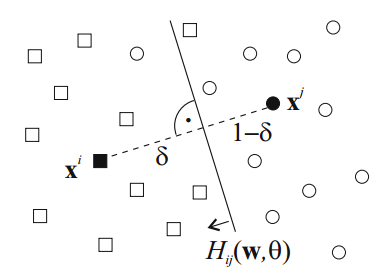

.. role:: raw(raw)
   :format: latex

.. |algo| replace:: *EEFTI*
.. |efti| replace:: *EFTI*
.. |eftis| replace:: *EFTIs*
.. |cop| replace:: *DTEEP*
.. |smae| replace:: *SMAE*
.. |SM| replace:: :math:`S_m`
.. |A| replace:: :math:`\mathbf{A}`
.. |a| replace:: :math:`\mathbf{a}`
.. |NA| replace:: :math:`N_{A}`
.. |NIass| replace:: :math:`N_{Iass}`
.. |AM| replace:: :math:`A_{m}`
.. |IM| replace:: :math:`I_m`
.. |na| replace:: :math:`\bar{n}`
.. |NI| replace:: :math:`N_{I}`
.. |DM| replace:: :math:`D_{M}`
.. |Da| replace:: :math:`\bar{D}`
.. |Nl| replace:: :math:`N_l`
.. |ACEM| replace:: :math:`ACE_m`
.. |NM| replace:: :math:`N_{M}`
.. |LM| replace:: :math:`L_{m}`
.. |Nc| replace:: :math:`N_{c}`
.. |NP| replace:: :math:`N_{P}`
.. |RA| replace:: :math:`R_{A}`
.. |alpha| replace:: :math:`{\alpha}`
.. |rho| replace:: :math:`{\rho}`
.. |WDTD| replace:: :math:`W_{DTD}`
.. |ne| replace:: :math:`n_e`
.. |Ths| replace:: :math:`T_{hs}`
.. |Tsw| replace:: :math:`T_{sw}`
.. |Tswmut| replace:: :math:`T_{sw\_mut}`
.. |Tswacc| replace:: :math:`T_{sw\_acc}`
.. |Thsmut| replace:: :math:`T_{hs\_mut}`
.. |Thsacc| replace:: :math:`T_{hs\_acc}`

====================
Elaborat za doktorat
====================

Predlog naslova doktorske disertacije
=====================================

"Hardverska akceleracija algoritama za formiranje celih stabala odluke i njihovih ansambala"

Predmet istraživanja i motivacija
=================================

.. _hdr-key-contributions:

Ključni očekivani doprinos - cilj istraživanja
----------------------------------------------

U ovoj sekciji nabrojani su ključni očekivani doprinosi u okviru rada na doktorskoj disertaciji. Uvod, motivacija i pregled stanja u oblasti je detaljnije izložen u narednim sekcijama. Osnovi cilj istraživanja koja se predlažu je razvoj algoritama za indukciju celih stabala odluke i njihova efikasna implementacija u "embedded" sistemima. Motivacija za ovakvo istraživanje je dvojaka. Algoritmi koji indukuju cela stabla odluke odjednom bi trebalo da proizvode stabla koja su kompaktnija od inkrementalnih algoritama za indukciju stabala odluke. U oblasti mašinskog učenja, kao i u večini ostalih naučnih disciplina, preferiraju se jednostavniji modeli procesa (princip Okamove oštrice :cite:`gauch2003scientific`). U slučaju hardverske akceleracije, jednostabnija stabla odluke zahtevaju manju količinu hardverskih resursa (funkcionalnih i memorijskih jedinica), što za posledicu ima efikasniju implementaciju u pogledu cene, potrošnje, veličine, itd. Ovo je od naročitog interesa u "embedded" aplikacijama, gde su ogrinačenja u pogledu raspoloživih hardverskih resursa još strožija.

Kao glavni ciljevi istraživanja, predlažu se:

1. **Razvoj novog evolutivnog algoritma za indukciju celih neortogonalnih stabala odluke, koji ne zahteva populaciju, tj. vrši indukciju na samo jednoj jedinki - pod nazivom EFTI (od eng. "Evolutionary Full Tree Induction")**. Algoritmi za indukciju celih stabala odluke su manje zastupljeni od inkrementalnih zbog svoje veće vremenske kompleksnosti, ali bi se hardverskom akceleracijom mogli učiniti atraktivnijima. Hardverska akceleracija predloženog algoritma je takođe u planu rada na doktorskoj disertaciji i opisana je u stavci 2. Algoritmi za indukciju stabala odluke bazirani na EA često koriste populaciju jedinki :cite:`bot2000application,krketowski2005global,llora2004mixed,papagelis2000ga`, što nije zgodno za hardversku akceleraciju, jer zahteva značajne hardverske resurse. Nama nije poznat ni jedan algoritam iz naučne literature koji indukuje celo stablo odluke uz pomoć samo jedne jedinke, odakle i motivacija za razvoj EFTI algoritma. Detaljnije o motivaciji za razvoj EFTI algoritma u :num:`Sekciji #hdr-algo-single-induction`, a o planu rada na EFTI algoritmu u :num:`Sekciji #hdr-efti`.

2. **Razvoj nove hardverske arhitekture za akceleraciju EFTI algoritma - pod nazivom EFTIP (od eng. "Evolutionary Full Tree Induction co-Processor").** Većina naučnih radova se fokusira na ubrzavanje već indukovanih stabala :cite:`struharik2009intellectual,li2011low,saqib2015pipelined`, dok se mali broj onih koji se bave treniranjem stabala odluke bazira na inkrementalnom pristupu indukciji :cite:`struharik2009evolving,chrysos2013hc`. Koliko je nama poznato, ne postoji ni jedan rad na temu hardverske akceleracije algoritama za indukciju celih stabala odluke, pa odatle i motivacija za rad na ovakvom akceleratoru u okviru doktorske disertacije. Detaljnije o motivaciji za razvoj EFTIP koprocesora u :num:`Sekciji #hdr-accel-single-induction`, a o planu rada na EFTIP koprocesoru u :num:`Sekciji #hdr-eftip`.

3. **Razvoj novog evolutivnog algoritma za indukciju ansambala neortogonalnih celih stabala odluke na bazi EFTI algoritma - pod nazivom EEFTI (od eng. "Ensembles Evolutionary Full Tree Induction").** Ansambli klasifikatora imaju veću tačnost predikcija i veću robustnost na šum u odnosu na pojedinačne klasifikatore, odakle i motivacija za razvoj algoritma za njihovu indukciju. Isti argumenti u vezi pogodnosti za hardversku akceleraciju navedeni u vezi EFTI algoritma u stavci 1, važe i za EEFTI algoritam. Detaljnije o motivaciji za razvoj EFTI algoritma u :num:`Sekciji #hdr-algo-ensemble-induction`, a o planu rada ne EEFIT algoritmu u :num:`Sekciji #hdr-eefti`.

4. **Razvoj hardverske arhitekture koja bi akcelerirala EEFTI algoritam - pod nazivom DTEEP (od eng. "DT Ensemble Evolution co-Processor").** Nama je poznat samo jedan rad :cite:`struharik2009evolving` na temu hardverske akceleracije algoritama za indukciju ansambala stabala odluke, ali u njemu se stabla odluke indukuju inkrementalno. Detaljnije o motivaciji za razvoj DTEEP koprocesora u :num:`Sekciji #hdr-accel-ensemble-induction`, a o planu rada na EFTIP koprocesoru u :num:`Sekciji #hdr-dteep`.

Uvod u mašinsko učenje
----------------------

Mašinsko učenje :cite:`flach2012machine,murphy2012machine` je grana istraživačke oblasti veštačke inteligencije. Ona se bavi razvojem algoritama koji "uče" izvlačeći obrazce iz ulaznih podataka i kao svoj izlaz daju sisteme konstruisane da prave predikcije nad novim podacima. Jedna od glavnih snaga sistema mašinksog učenja je moć generalizacije, koja im omogućava da ostvare dobre rezultate na novim, do sada neviđenim podacima, nakon što su prethodno bili izloženi skupu podataka za treniranje.

Razni sistemi mašinskog učenja su do sada predloženi u literaturi, uključujući: stabla odluke (DT od eng. *decision trees*) :cite:`rokach2007data,rokach2005top`, neuronske mreže (ANN od eng. "artificial neural networks") :cite:`haykin2009neural` i "support vector" mašine (SVM) :cite:`abe2005support`. Ovi sistemi se posebno široko primenjuju u oblasti vađenja podataka (eng. "data mining") (pogledati npr. :cite:`witten2005data`), sa DT, ANN i SVM-ovima kao najpopularnijima (npr. :cite:`rokach2007data,wu2009top,wang2006data`).

Proces učenja, tzv. indukcija sistema mašinskog učenja, može biti kako nadgledan tako i nenadgledan. Nadgledano učenje podrazumeva da je uz svaki ulazni podatak iz trening skupa dat i željeni odziv sistema na taj podatak. Sa druge strane, u slučaju kada se algoritmu za indukciju pruži samo trening skup podataka bez željenog odziva, reč je o nenadgledanom učenju. U tom slučaju, algoritam za indukciju mora sam da otkrije strukturu i obrasce u skupu ulaznih podataka, što samo po sebi može biti i cilj rešavanja nekog problema. Ulazni podaci koji se koriste za učenje se obično sastoje od skupa instanci problema koji se rešava sistemom mašinskog učenja i naziva se trening skup. Životni vek sistema mašinskog učenja obično ima dve faze: trening fazu (takođe poznatu kao indukciju ili obučavanje) i fazu korišćenja. Konstrukcija sistema se vrši u trening fazi uz pomoć trening skupa, dok se u fazi korišćenja indukovani sistem suočava sa novim, do sada neviđenim instancama i pokušava da da što bolji odziv, koristeći znanje izvučeno iz trening skupa.

.. _hdr-dt:

Stabla odluke
-------------

Sistemi mašinskog učenja mogu rešavati razne probleme, kao što su klasifikacija, regresija, klasterisanje, itd. Za rešavanje problema klasifikacije, za koji se često koriste stabla odluke, potrebno je rasporediti ulazne instance problema u neki diskretni skup klasa. Instance problema se najčešće modeluju vektorom atributa **A**, na osnovu kojih se vrši klasifikacija. Proces klasifikacije uz pomoć stabla odluke se može predstaviti dijagramom koji ima strukturu stabla, kao što se vidi na :num:`Slici #fig-dt-traversal`. Ovaj diagram predstavlja tok blizak toku ljudskog razmišljanja, te ga je lako razumeti, što čini stabla odluke popularnim izborom za rešavanja problema klasifikacije. Stabla odluke imaju i brojne druge prednosti u odnosu na ostale sisteme mašinskog učenja, između ostalog: visok stepen imunosti na šum, mogućnost klasifikacije instanci sa redudantnim ili atributima koji nedostaju, mogućnost klasifikovanja instanci kako sa kategoričkim, tako i sa numeričkim atributima itd.

Teoretski, stabla odluke mogu biti različitog stepena, ali se najčešće koriste binarna stabla, odnosno stabla u kojima svaki čvor ima po dva potomka. :num:`Slika #fig-dt-traversal`, prikazuje proces klasifikacije na binarnom stablu odluke. Stablo se sastoji od 4 čvora označenih krugovima numerisanim od 1 do 4. Stablo takođe ima 5 listova označenih kvadratima, pri čemu je svakom listu dodeljena jedna od klasa problema (:math:`C_{1}` do :math:`C_{5}` u ovom primeru). Klasifikacija se vrši tako što se pusti da se instanca kreće kroz stablo, počevši od korena (numerisanog brojem 1), sve dok ne stigne do nekog od listova. U zavisnosti od lista u kome instanca završi svoj put kroz stablo, njoj se pridružuje klasa dodeljena tom listu.

.. _fig-dt-traversal:

.. bdp:: images/dt_traversal.py

    Proces klasifikacije na binarnom stablu odluke.

Svakom čvoru stabla odluke pridružen je po jedan test (:math:`T_{1}` do :math:`T_{4}` u ovom primeru), koji na osnovu atributa instance odlučuje kroz koji potomak će se nastaviti put kroz stablo. U slučaju binarnih stabala, od testova se očekuje binarni odgovor. Konačna putanja instance kroz stablo će zavisiti od rezultata testova u svakom čvoru stabla na koji instanca naiđe u toku svog puta. Puštajući jednu po jednu instancu trening skupa, može se dobiti njegova potpuna klasifikacija.

Svaki problem čija se klasifikacija rešava pomoću stabala odluke, definisan je skupom svojih instanci. Pri definisanju problema, potrebno je izabrati koji atributi će činiti vektor atributa (**A**) instanci i jednoznačno predstavljati instance problema. Takođe je potrebno definisati domen svakog atributa, gde se najčešće javlja dva slučaja:

 - Kategorički atributi imaju diskretan i često konačan domen
 - Numerički atributi za domen imaju podskup skupa realnih brojeva

Skup svih mogućih vektora atributa predstavlja *n*-dimenzionalni prostor atributa, gde je *n* broj atributa kojima su instance opisane i ujedno i veličina vektora **A**. U kontekstu prostora atributa, svaki test binarnog stabla odluke deli ovaj prostor na dva regiona, čineći da je svakom čvoru i listu stabla asociran jedan pod-region prostora. Svaki čvor stabla na osnovu svog testa deli sebi asocirani pod-region na dva i dodeljuje svaki od njih po jednom svom potomku. Konačan rezultat ovog procesa je jasna particija prostora atributa na disjunktne regione asocirane klasama problema.

Na osnovu karakteristika funkcija kojima su implementirani testovi, stabla odluke se mogu podeliti na: ortogonalna, neortogonalna i nelinearna. Svoje nazive, ovi tipovi stabala odluka su dobila na osnovu izgleda površi kojom njihovi testovi dele prostor atributa. Tako ortogonalna stabla odluke dele prostor ortogonalnim hiperravnima, neortogonalna - neortogonalnim hiperravnima, a nelinearna - nelinearnih hiperpovršima.

U ovom radu, fokus će biti na neortogonalnim stablima odluke jer se željena tačnost na trening skupu sa njima može postići sa drastično manje čvorova u odnosu na ortogonalna stabla. Za sličnu tačnost na trening skupu, neortogonalna stabla često imaju bolju tačnost na novim instancama problema. Takođe, veličina stabala odluke je značajna u hardverskoj implementaciji, jer zahteva manji broj resursa. Što se tiče nelinearnih stabala odluke, ona su znatno složenija od neortogonalnih, pa i od ortogonalnih, a nemaju veću tačnost klasifikacije.

Neortogonalna stabla odluke
---------------------------

Kod neortogonalnih stabala odluke, testovi u čvorovima generišu neortogonalne hiperravni kojima dele prostor atributa. Neortogonalna hiperravan je jednoznačno određena sledećom jednačinom:

.. math:: \mathbf{a}\cdot \mathbf{A} = \sum_{i=1}^{n}a_{i}\cdot A_{i} < thr,
    :label: oblique_test

gde **a** predstavlja vektor koeficijenata testa a *thr* (skraćeno od eng. *threshold*) modeluje afini deo testa.

.. _fig-oblique-dt:

.. figure:: images/oblique_dt_traversal.pdf

    Primer neortogonalnog binarnog stabla odluke i jedne moguće putanje pri klasifikaciji instance prikazane crvenom linijom.

Svaka instanca počinje svoj prolazak kroz stablo na mestu korena i nastavlja sve dok ne stigne u neki od listova gde joj se dodeljuje klasa asocirana tom listu. U svakom novom čvoru u koji instanca stigne, računa se test definisan funkcijom :eq:`oblique_test` na osnovu vektora koeficijenata :math:`\mathbf{a}_{i}` (gde je *i* redni broj čvora u stablu), i vektora atributa **A** koji definiše instancu. Ako test vrati vrednost *tačno* (T), prolazak kroz stablo se nastavlja preko levog potomka *i*-tog čvora, dok se u suprotnom nastavlja preko njegovog desnog potomka. Na :num:`Slici #fig-oblique-dt`, jedna moguća putanja je prikazana crvenom linijom. U primeru sa slike, instanca je nakon prolaska kroz stablo klasifikovana u klasu :math:`C_{4}`.

.. _hdr-algo-single-induction:

Indukcija stabala odluke
------------------------

Načelno, stabla odluke se mogu indukovati na dva načina: inkrementalno (čvor po čvor) ili globalno indukujući celo stablo od jednom. Većina algoritama za indukciju neortogonalnih stabala odluke koriste neku vrstu heuristike u procesu optimizacije indukovanog stabla, koja je često neki tip evolutivnog algoritma (EA), jer je pronalaženje optimalnog stabla odluke NP-težak algoritamski problem :cite:`murthy1994system`. 

Inkrementalni pristup gradi stablo odluke počevši od korena i dodajući mu iterativno jedan po jedan čvor. Ovo je "greedy" pristup, u kome se parametri testa pridruženog čvoru, tj. vrednosti vektora koeficijenata **a** i vrednost praga *thr*, optimizuju na osnovu informacija o performansama indukovanog stabla, dostupnih u momentu kreiranja trenutnog čvora, tj. na osnovu "lokalnih" informacija. Nakon što je čvor dodat u stablo i algoritam nastavlja da kreira druge čvorove, situacija se promenila i dostupne su nove informacije, ali one neće biti iskorišćene za dodatnu optimizaciju čvorova koji su već dodati u stablo, te se kaže da je optimizacioni proces ostao zarobljen u lokalnom optimumu. Algoritam obično optimizuje parametre testa u procesu maksimizacije neke ciljne funkcije koja meri kvalitet podele instanci iz trening skupa koje u procesu klasifikacije uspevaju da stignu do čvora kome je pridružen test. Ovom podelom se dobijaju dva podskupa instanci, od kojih se svaki prosleđuje na obradu po jednom potomku čvora. Za svaki od ova dva podskupa se dalje proverava da li se sastoje od instanci koje pripadaju različitim klasama ili je pak podskup "čist", u smislu da sadrži instance samo jedne klase. U slučaju da je podskup čist, kao potomak se dodaje list i njemu se asocira klasa instanci iz podskupa. U suprotnom, proces indukcije stabla se nastavlja iterativno i kao potomak se dodaje novi čvor u cilju dalje deobe podskupa instanci na čiste podskupove. Prednost inkrementalnog pristupa je brzina, ali indukovana stabla su suboptimalna po veličini i kasnijim klasifikacionim rezultatima na novim instancama. Razni algoritmi za inkrementalnu indukciju stabala odluke su predloženi u literaturi :cite:`quinlan1986induction,islam2010explore,mahmood2010novel,yildiz2012univariate,lopez2013fisher,breiman1984classification,murthy1994system,cantu2003inducing,liu2011improved,manwani2012geometric,barros2014framework,struharik2014inducing`.

Drugi pristup za kreiranje stabala odluke je indukcija celog stabla odjednom. Ovde se u svakoj iteraciji algoritma manipuliše celim stablom, tako da su uvek na raspolaganju kompletne (globalne) informacije o performansama indukovanog stabla odluke. U procesu indukcije, prema nekom algoritmu, čvorovi se dodaju ili brišu i parametri njihovih testova se menjaju u cilju optimizacije stabla. Pošto se optimizacija vrši na osnovu globalnih informacija o performansama, ovaj postupaku načelno proizvodi kompaktnija, a često i tačnija stabla odluke u odnosu na inkrementalne algoritme. Sa druge strane, ovi algoritmi imaju veću vremensku kompleksnost od inkrementalnih, što rezultuje u dužim vremenima potrebnim za indukciju. Značajan broj algoritama za indukciju celih stabala je takođe predložen u literaturi :cite:`papagelis2000ga,bot2000application,llora2004mixed,krketowski2005global,otero2012inducing,boryczka2015enhancing`.

Kao što je rečeno, pronalaženje optimalnog stabla odluke je NP težak problem, ali čak i ako se koristi inkrementalni pristup indukciji, kada je reč o neortogonalnim stablima odluke, nalaženje optimalnog položaja jedne neortogonalne hiperravni :eq:`oblique_test` je NP-težak algoritamski problem :cite:`heath1993induction`. Iz ovog razloga, većina algoritama za indukciju neortogonalnih stabala odluke koriste neku vrstu heuristike u procesu optimizacije, koja je često neka vrsta evolutivnog algoritma (EA). :num:`Slika #fig-evolutionary-dt-algorithm-tree` prikazuje taksonomiju evolutivnih algoritama za indukciju stabala odluke predloženu u :cite:`barros2012survey`. 

.. _fig-evolutionary-dt-algorithm-tree:

.. figure:: images/taxonomy.pdf

    Taksonomija evolutivnih algoritama za indukciju stabala odluke.

Kao što je opisano u stavki 1. unutar :num:`Sekcije #hdr-key-contributions`, u okviru rada na doktorskoj disertaciji, predlaže se razvoj novog algoritma za indukciju celih neortogonalnih stabala odluke na bazi EA - EFTI algoritma. Zbog svoje manje vremenske kompleksnosti, inkrementalni algoritmi trenutno dominiraju u istraživačkom polju indukcije stabala odluke. Kada bi bio razvijen hardverski akcelerator za indukciju celih stabala odluke koji bi drastično skratio vreme potrebno za indukciju, ovaj pristup bi takođe dobio na atraktivnosti. Algoritmi za indukciju stabala odluke bazirani na EA često koriste populaciju jedinki :cite:`bot2000application,krketowski2005global,llora2004mixed,papagelis2000ga`, što nije zgodno za hardversku akceleraciju, jer zahteva značajne hardverske resurse. Iz ovog razloga se predlaže akceleracija algoritma baziranog na EA, koji za indukciju koristi samo jednu jedinku. Ovo bi otvorilo vrata svetu "embedded" sistema, gde ne postoji obilje resursa, kao što su memorija i procesorsko vreme. Nama nije poznat ni jedan algoritam iz naučne literature koji ispunjava ovaj uslov, te je plan da se takav algoritam razvije u okviru rada na doktorskoj disertaciji.

.. _hdr-accel-single-induction:

Algoritmi za formiranje celog stabla u hardveru
-----------------------------------------------

Faza indukcije u slučaju da se koristi algoritam za formiranje celog stabla odluke, može trajati satima ili čak danima za praktiče probleme. Ako bi se faza indukcije uspela ubrzati, moguće bi bilo koristiti veće trening skupove, što bi bilo od posebnog značaja u aplikacijama "vađenja podataka" :cite:`witten2005data`. Dalje, brži trening stabala odluke bi omogućio kraće dizajn cikluse i otvara mogućnost indukcije stabala odluke u realnom vremenu za primene koje zahtevaju tako brzo prilagođavanje, kao što su "web mining" :cite:`liu2007web,yu2013depth`, bioinformatika :cite:`lesk2013introduction,baldi2001bioinformatics`, mašinski vid :cite:`prince2012computer,ali2010hardware,tomasi2010fine`, "text mining" :cite:`weiss2010fundamentals,aggarwal2012mining`, itd.

Problemu akceleracije faze indukcije se može pristupiti na dva načina:

- Razvojem novih algoritamskih okvira ili novih softverskih alata, pri čemu je ovaj postupak dominantan u literaturi :cite:`bekkerman2011scaling,choudhary2011accelerating`.
- Razvojem novih hardverskih arhitektura, optimizovanih za ubrzano izvršavanje postojećih algoritama za indukciju.

U literaturi je predložen znatan broj različitih arhitektura za hardversku akceleraciju algoritama za mašinsko učenje. Arhitekture za hardversku akceleraciju algoritama za treniranje SVM-ova predložene su na primer u :cite:`anguita2003digital`, a algoritama za izvršenje SVM-ova u :cite:`papadonikolakis2012novel,anguita2011fpga,mahmoodi2011fpga,vranjkovic2011new`. Istraživanje na polju hardverske akceleracije ANN-ova je bilo prilično intenzivno, te su mnoge hardverske arhitekture za ubrzanje izvršenja istreniranih ANN-ova već predložene :cite:`savich2012scalable,vainbrand2011scalable,echanobe2014fpga`. Takođe, predložene su mnoge hardverske arhitekture na kojima je moguće implementirati algoritme za treniranje ANN-ova :cite:`misra2010artificial,omondi2006fpga,madokoro2013hardware`. 

Kao što je opisano u stavki 2. unutar :num:`Sekcije #hdr-key-contributions`, u okviru rada na doktorskoj disertaciji, predlaže se razvoj hardverske arhitekture koja bi akcelerirala EFTI algoritam za indukciju celih neortogonalnih stabala odluke, koji ne zahteva populaciju. Na planu hardverske akceleracije stabala odluka, većina naučnih radova se fokusira na ubrzavanje već indukovanih stabala :cite:`struharik2009intellectual,li2011low,saqib2015pipelined`, dok je hardverska akceleracija indukcije stabala odluke slabo prisutna. Koliko nam je poznato, postoje samo dva rada na temu hardverske akceleracije algoritama za indukciju stabala odluke :cite:`struharik2009evolving,chrysos2013hc`, ali oba koriste "greedy", "top-down", inkrementalni pristup. U :cite:`struharik2009evolving`, inkrementalni algoritam za indukciju stabala odluke je potpuno akceleriran u hardveru i EA je korišćen za izračunavanje optimalnih vektora koeficijenata testova čvor po čvor. U :cite:`chrysos2013hc`, HW/SW (skraćeno od eng. *HardWare/SoftWare*) kodizajn tehnika je korišćena za akceleraciju računski najzahtevnijih delova poznatog CART inkrementalnog algoritma za indukciju stabala odluke. Koliko je nama poznato, ne postoji ni jedan rad na temu hardverske akceleracije algoritama za indukciju celih stabala odluke, pa odatle i motivacija za rad na ovakvom akceleratoru u okviru doktorske disertacije.

.. _hdr-algo-ensemble-induction:

Algoritmi za formiranje ansambala
---------------------------------

Da bi se unapredile performanse klasifikatora, predloženo je korišćenje ansambala sistema za klasifikaciju :cite:`rokach2010ensemble` umesto jednog klasifikatora. Ansambl klasifikatora kombinuje predikcije nekoliko individualnih klasifikatora u cilju dobijanja boljih performansi. Treniranje ansambala zahteva indukciju skupa pojedinačnih klasifikatora, uglavnom stabala odluke ili ANN-ova, čije predikcije se onda kombinuju u fazi korišćenja ansambla u procesu klasifikacije novih instanci. Iako jednostavna, ova ideja se pokazala kao veoma efektivna, proizvodeći sisteme koji su precizniji od pojedinačnog klasifikatora.

Prilikom indukcije ansambla klasifikatora, potrebno je rešiti dva problema: 

- Kako obezbediti raznovrsnost članova ansambla, tj. raznovrsnost njihovih predikcija
- Koju proceduru upotrebiti za kombinovanje pojedinačnih predikcija svakog klasifikatora, tako da se pojača uticaj dobrih odluka a potisne uticaj loših.

Među najpopularnijim metodama koje obezbeđuju raznovrsnost članova ansambla su Brajmanov "bagging" algoritam :cite:`buhlmann2012bagging`, Šapirov "boosting" algoritam :cite:`buhlmann2012bagging`, AdaBoost :cite:`buhlmann2012bagging`, Wolpertov "stacked generalization" algoritam :cite:`ozay2008performance`, i mešavina eksperata :cite:`jacobs1991adaptive`. Najčešće korišćene procedure za kombinaciju predikcija su između ostalog: većinsko glasanje, ponderisano većinsko glasanje i "behavior knowledge spaces" :cite:`huang1993behavior`.

Glavna prednost ansambala klasifikatora u odnosu na pojedinačne klasifikatore je veća tačnost predikcija i veća robustnost na šum. Sa druge strane, u odnosu na pojedinačne klasifikatore, potrebne su velike količine memorije da bi se smestile definicije članova ansambla, a velika računarska moć da bi se izračunao odgovor ansambla, što sve vodi ka dužim i u pogledu resursa zahtevnijim fazama indukcije. Ovo je stoga što se ansambli obično sastoje od 30 i više pojedinačnih klasifikatora :cite:`buhlmann2012bagging`, te ako bi želeli iste performanse klasifikacije što se tiče brzine kao u slučaju pojedinačnih klasifikatora, bilo bi potrebno 30+ puta više memorije i računarske moći. 

Kao što je opisano u stavki 3. unutar :num:`Sekcije #hdr-key-contributions`, u okviru rada na doktorskoj disertaciji, predlaže se razvoj EEFTI algoritma - novog evolutivnog algoritma za indukciju ansambala neortogonalnih celih stabala odluke koji zahteva samo jednu jedinku po članu ansambla, na bazi EFTI algoritma. Isti argumenti u vezi pogodnosti za hardversku akceleraciju navedeni u vezi EFTI algoritma, važe i za algoritam za indukciju ansambala EEFTI. Dodatna motivacija za razvoj EEFTI algoritma je činjenica da ansambli imaju bolje performanse od pojedinačnih klasifikatora, kao što je već rečeno.

.. _hdr-accel-ensemble-induction:

Algoritmi za formiranje ansambala u hardveru
--------------------------------------------

Kao što je već rečeno u prethodnoj sekciji, algoritmi za formiranje ansambala imaju drastično veće potrebe za resursima u odnosu na algoritme za indukciju pojedinačnih klasifikatora. Još jednom, hardverska akceleracija ansambala klasifikatora pruža način da se omogući da trajanje indukcije ansambala bude uporedivo sa trajanjem indukcije pojedinačnog klasifikatora.

Što se tiče hardverske akceleracije ansambala sistema za klasifikaciju, prema našem znanju, većina se predloženih rešenja bavi hardverskom implementacijom ansambala klasifikatora koji su prethodno formirani u softveru :cite:`bermak2003compact,osman2009random,van2012accelerating,hussain2012adaptive,struharik2013hardware`. Poznat nam je samo jedan rad :cite:`struharik2009evolving` u kome je predložena arhitektura za hardversku evoluciju homogenih ansambala klasifikatora baziranih na stablima odluke, ali u ovom radu se članovi ansambla indukuju inkrementalno "greedy" algoritmom.

Kao što je opisano u stavki 4. unutar :num:`Sekcije #hdr-key-contributions`, u okviru rada na doktorskoj disertaciji, predlaže se razvoj hardverske arhitekture koja bi akcelerirala EEFTI algoritam.

Plan rada
=========

Ova sekcija sadrži plan rada na ciljevima pobrojanim u :num:`Sekciji #hdr-key-contributions`.

.. _hdr-efti:

Evolutivni algoritam za indukciju celih neortogonalnih stabala odluke - EFTI
-------------------------------------------------------------------

EFTI algoritam može biti baziran na HereBoy :cite:`levi2000hereboy` evolutivnom algoritmu kojem je potrebna samo jedna jedinka za funkcionisanje. EFTI može imati strukturu prikazanu u :num:`Algoritmu #fig-efti-algorithm-pca`, koju dele mnogi evolutivni algoritmi. Kao ulaz, EFTI algoritam dobija trening skup instanci (promenljiva *train_set* u pseudo-kodu) zajedno sa informacijama kojoj klasi pripada koja instanca, te je reč o nadgledanom učenju. Kao rezultat, EFTI algoritam treba da formira što optimalnije stablo odluke po pitanju tačnosti klasifikacije i veličine stabla.

.. _fig-efti-algorithm-pca:

.. literalinclude:: code/algorithm.py
    :caption: Struktura EFTI algoritma

Na samom početku indukcije, generiše se stablo od jednog čvora i inicijalizuje njegov - test promenljiva *dt* u pseudo-kodu. Inicijalizaciju testa treba vršiti na nasumičan način, ali ipak vođeno strukturom trening seta da bi se pospešila konvergencija evolutivnog algoritma. Jedan od pristupa za nasumičnu inicijalizaciju testa je baziran na nasumično izabranom dipolu i predložen u :cite:`krketowski2005global`. Kao što je prikazano na :num:`Slici #fig-dipol-hyperplane`, postupak se sastoji iz postavljanja hiperravni :math:`H_{ij}(\mathbf{w},\theta)` koja odgovara testu (gde je **w = a** vektor koeficijenata, a :math:`\theta=thr` prag testa) u prostoru atributa, normalno na duž koja spaja dve nasumično izabrane instance :math:`\mathbf{x}^i` i :math:`\mathbf{x}^j` koje pripadaju različitim klasama (prikazane kvadratima i krugovima na slici), na razdaljini definisanoj nasumično izabranim parametrom :math:`\delta`. Osnovna pretpostavka je da su instance u okviru iste klase na neki način grupisane u prostoru atributa, te se ovim postupkom povećava šansa da će iako nasumična inicijalizacija testa dovesti ipak do korisne deobe prostora atributa između ove dve klase.

.. _fig-dipol-hyperplane:

    Inicijalizacija testa bazirana na nasumično izabranom dipolu. :math:`H_{ij}(\mathbf{w},\theta)` je hiperravan koja odgovara testu, **w = a** je vektor koeficijenata, a :math:`\theta=thr` prag testa.

Nakon formiranja inicijalilnog testa, funkcija *fitness_eval()* računa početni fitnes novonastale jedinke - promenljiva *best_fit* u pseudo-kodu. Funkcija za računanje fitnesa uzima u obzir parametre jedinke koji su interesantni za optimizacioni proces, kombinuje ih na osnovu težina koju svaki parametar nosi (dodeljenih od strane korisnika u vidu konfiguracije algoritma) i vraća jedinstven broj koji predstavlja fitnes jedinke. Parametri stabla od najvećeg interesa za fazu korišćenja su svakako na prvom mestu njegova tačnost, zatim veličina, pa prisutnost svih klasa problema u listovim stabla, čistoća listova, balansiranost stabla, itd.

Ostatak algoritma pokušava da iterativno unapredi fitnes jedinke prolazeći u svakoj iteraciji kroz sledeće korake:

- Mutacija - funkcija *mutate()* na nasumičan način menja jedinku u nadi da će novonastala jedinka (promenljiva *dt_mut*) napredovati u pogledu fitnesa. Mogu se vršiti dve vrste mutacija: mutacija vektora koeficijenata testova u čvorovima ili oduzimanje/dodavanje novog čvora u stablo.
- Evaluacija fitnesa - funkcija *fitness_eval()* na već pomenut način proračunava fitness mutirane jedinke - promenljiva *cur_fit*
- Selekcija - implementirana poslednjim **if** blokom u petlji, u kojoj se proverava da li je ostvaren napredak u pogledu fitnesa, u kom slučaju se mutirana jedinka prihvata za trenutno najbolju. U suprotnom, da bi se omogućilo evolutivnom algoritmu da napusti lokalne optimume (i na taj način ima šansu da pronađe globalni optimum) ipak se daje šansa, obično mala, jedinki sa nižim fitnesom da bude prihvaćena. Nasumično, neke jedinke sa nižim fitnesom će biti prihvaćene, a ostale odbačene.

Nakon željenog broja iteracija (promenljiva *max_iter*), EFTI algoritam se završava i vraća trenutno najbolju jedinku.

.. _hdr-eftip:

Koprocesor za evolutivnu indukciju celih stabala odluke - EFTIP
---------------------------------------------------------------

Vremenski daleko najkompleksniji deo EFTI algoritma je računanje fitnesa jedinke, zato što je za njega potrebno izvršiti klasifikaciju celog trening skupa uz pomoć jedinke. Da bi se izvršila klasifikacija, potrebno je svaku instancu propustiti kroz stablo, pri čemu je potrebno izračunati onoliko testova, koliko je prosečan put instance kroz stablo. Svaki test se dalje sastoji od proračuna sume proizvoda nad svim atributima, te je kompleksnost računja fitnesa iz tog razloga:

.. math:: T(fitness\_eval) = O(N_{I}\cdot D\cdot n)
    :label: fitness_eval_tot

, gde je |NI| broj instanci u trening setu, *n* broj atributa i *D* prosečan broj testova koje se izvršavaju prilikom klasifikacije instanci pomoću datog stabla.

Jasno je da najviše prostora za ubrzanje ima unutar funkcije za računanje fitnesa, te se predlaže HW/SW kodizajn pristup, u kojem bi se najzahtevniji delovi funkcije za računanje fitnesa - računanje tačnosti klasifikacije jedinke - implementirali kao hardverski koprocesor - EFTIP, a ostatak EFTI algoritma ostavio u softveru da se izvršava na centralnoj procesorskoj jedinici (CPU od eng. *Central Processing Unit*). Dodatna prednost ovog pristupa je u tome što se onda EFTIP koprocesor može koristiti za razne druge algoritme za indukciju stabala odluke bazirane na EA :cite:`barros2012survey,bot2000application,krketowski2005global,llora2004mixed,papagelis2000ga`, akcelerirajući klasifikaciju trening skupa i proračun tačnosti stabla, korak koji je uvek prisutan prilikom računanja fitnesa.

Kao što je objašnjeno u :num:`Sekciji #hdr-dt`, klasifikacija instance se vrši tako što instanca počevši od korena prolazi kroz stablo odluke nivo po nivo na niže, gde je njen tačan put određen ishodima testova u čvorovima. Primetimo da se za svaku instancu vrši samo jedan test po nivou stabla, i da nezavisno od ishoda testa instanca biva prosleđena na jedan nivo ispod trenutnog. Iz ovih razloga, kao što je objašnjeno u :cite:`struharik2009intellectual`, algoritam klasifikacije uz pomoć stabla odluke je zgodan za protočnu obradu sa po jednom fazom protočne obrade za svaki nivo stabla. Na osnovu ove analize predlaže se struktura EFTIP koprocesora data na :num:`Slici #fig-eftip-architecture`.

.. _fig-eftip-architecture:

.. figure:: images/eftip_architecture.pdf

    Struktura EFTIP koprocesora i njegova integracija sa CPU.

EFTIP koprocesor bi se povezivao sa CPU preko AXI4 AMBA magistrale, koja je standardna na ARM arhitekturama, i omogućavao sledeći interfejs prema softveru:

- Spuštanje trening skupa na koprocesor
- Spuštanje opisa stabla odluke na koprocesor, kako njegove strukture, tako i koeficijenata svih testova
- Kontrola procesa proračuna tačnosti
- Iščitavanje rezultata

Glavne komponente EFTIP koprocesora, prikazane su na :num:`Slici #fig-eftip-architecture`:

- **Klasifikator** - Izvšava prolazak svake instance trening skupa kroz stablo odluke. Ovaj proces je implementiran u vidu protočne obrade korišćenjem određenog broja NTE modula (od eng. *Node Test Evaluator*), gde svaki od njih izračunava testove za po jedan nivo stabla odluke. Parametar |DM| predstavlja dubinu protočne obrade i samim tim maksimalnu dubinu stabla koje se može indukovati. Na svom izlazu, za svaku instancu trening skupa, Klasifikator daje broj klase u koju je instanca klasifikovana.

- **Memorija za Trening Skup** - Memorija u kojoj se čuvaju sve instance trening skupa i šalju Klasifikatoru na klasifikaciju.

- **Niz DT Memorija** - Niz memorija u kome se skladište opisi stabla odluke, sastoji se od modula :math:`L_{1}` do :math:`L_{D^{M}}`. Svaka faza protočne obrade u Klasifikatoru zahteva sopstvenu memoriju u kojoj se čuvaju opisi svih čvorova na nivou stabla za koji je data faza zadužena.

- **Kalkulator Tačnostii** - Na osnovu klasifikacija koje Klasifikator daje na svom izlazu, Kalkulator Tačnosti računa tačnost stabla odluke na trening skupu.

- **Kontrolna jedinica** - Predstavlja most između spoljašnjeg AXI4 interfejsa i unutrašnjih protokola. Takođe koordinira celokupnim procesom proračuna tačnosti.

.. _hdr-eefti:

Evolutivni algoritam za indukciju ansambala celih neortogonalnih stabala odluke - EEFTI
------------------------------------------------------------------------------

EEFTI je algoritam koji bi bio baziran na EFTI algoritmu iz :num:`Sekcije #hdr-efti`. Da bi EEFTI algoritam mogao da se izvršava u paraleli za svakog člana ansambla, zgodno je koristiti "Bagging" algoritam :cite:`buhlmann2012bagging` za indukciju ansambala. Ovaj algoritam predviđa podelu trening skupa na po jedan podskup za svakog člana ansambla koji se indukuje. Svaki od podskupova se onda koristi za indukciju isključivo svog odgovarajućeg člana ansambla. Načelno postoje dva načina za formiranje podskupova:

- **nasumično odabiranje bez ponavljanja** - formirani podskupovi se ne preklapaju i veličine su :math:`N_{Iens}=\frac{N_I}{n_e}`, i
- **nasumično odabiranje sa ponavljanjem** - formirani podskupovi su veličine :math:`N_{Iens} \leq N_I`, 

, gde je |NI| veličina trening skupe, a |ne| broj podskupova, tj. članova ansambla. 

Svaki pojedinačni član ansambla se onda indukuje uz pomoć algoritma sličnog EFTI-ju, uz pomoć svog podskupa trening seta. Pseudo-kod EEFTI algoritma je prikazan pod :num:`Algoritmom #fig-eefti-algorithm-pca`. EEFTI prvo deli trening skup na podskupove uz pomoć funkcije *divide_train_set()* i čuva ih u nizu *task_train_sets*. Niz koji će okupljati buduća indukovana stabla *res* se zatim formira uz pomoć funkcije *initialize_result_array()*. Nakon toga, po jedan EFTI proces se kreira za svakog člana ansambla i pokreće se njihov rad. Nakon što su svi EFTI procesi završili sa radom EEFTI algoritam je završen i niz indukovanih stabala se vraća kao rezultat. U ovakvoj konfiguraciji, EFTI procesi su potpuno nezavisni i mogu se izvršavati u paraleli bez potrebe za međusobnom komunikacijom.

.. _fig-eefti-algorithm-pca:
.. literalinclude:: code/eefti_algorithm.py
    :caption: Struktura EEFTI algoritma.

.. _hdr-dteep:

Koprocesor za evolutivnu indukciju ansambala celih stabala odluke - DTEEP
-------------------------------------------------------------------------

Kao što je objašnjeno u :num:`Sekciji #hdr-eftip`, vremenski najzahtveniji deo EFTI algoritma je proračun tačnosti stabala odluke, koji se bazira na klasifikaciji trening skupa od strane stabla. Slično bi i glavni zadatak DTEEP koprocesora bio da pruži akceleraciju proračuna tačnosti stabala odluke. Predložena arhitektura DTEEP koprocesora i njegova veza sa CPU-om se vidi na :num:`Slici #fig-dteep-architecture`.

.. _fig-dteep-architecture:

.. bdp:: images/dteep_architecture.py

    Struktura DTEEP koprocesora i njegova integracija sa CPU.

DTEEP koprocesor bi se povezivao sa CPU preko AXI4 AMBA magistrale, i omogućavao sledeći interfejs prema softveru:

- Spuštanje trening podskupova na koprocesor
- Spuštanje opisa stabala odluke na koprocesor, kako njihove strukture, tako i koeficijenata svih testova
- Kontrola procesa proračuna tačnosti za svaki od članova ansambla u paraleli 
- Iščitavanje rezultata

DTEEP se sastoji od niza modula koji računaju tačnost stabala odluke: od :math:`SMAE_1` (od eng. *Single Member Accuracy Evaluator*) do :math:`SMAE_{S^M}`, gde svaki od njih računa tačnost za po jednog člana ansambla. Parametar |SM| predstavlja ukupan broj *SMAE* modula u DTEEP koprocesoru i samim tim maksimalni broj članova ansambla koje koprocesor može da indukuje u paraleli. Takođe, DTEEP ima IRQ Status (od eng. "Interrupt ReQuest Status") modul, koji koordiniše radom *SMAE* komponenti i generiše odgovarajući signal prekida svaki puta kada neki od njih završi proračun tačnosti. 

Što se tiče softverske strane, zahvaljujući IRQ signalu iz DEET-a, EFTI procesi u softveru se mogu izvršavati u paraleli, tako što se svakom od njih ekskluzivno dodeli po jedan *SMAE* modul na korišćenje. Svaki od EFTI taskova (vidi :num:`Algoritam #fig-efti-algorithm-pca`) nakon mutacije svoje jedinke, istu šalje dodeljenom *SMAE* modulu na proračun tačnosti. EFTI proces tada vraća programsku kontrolu operativnom sistemu, čekajući na prekidni signal od strane DTEEP da je proračun tačnosti za njegovu jedinku završen i da rezultati mogu biti iščitani. U međuvremenu, procesorsko vreme se dodeljuje drugim EFTI procesima, koji ga koriste na identični, gore opisani način.

Metode
======

Prilikom razvoja algoritama EFTI i EEFTI, prve implementacije će biti urađene u programskom jeziku Matlab. Programski jezik Matlab je skriptni jezik visokog nivoa i kao takav omogućava da se brzo dođe do rezultata i ispita osnovna ispravnost ideje. Nakon toga, biće izvršena migracija na programski jezik C u cilju bržeg izvršavanja algoritma, kao i mogućnosti kompajliranja algoritma za "embedded" mikroprocesore.

Nakon toga, EFTI algoritam će biti poređen sa ostalim standardnim algoritmima za indukciju stabala odluke sa narednog spiska. Prvih sedam algoritama na spisku indukuju stabla inkrementalno "greedy" pristupom, a poslednja dva indukuju celo stablo odjednom: 

 - OC1-AP (od eng. *Oblique Classifier algorithm*) predložen u :cite:`murthy1994system`, ograničen na ortogonalne testove,
 - OC1 :cite:`murthy1994system`,
 - CART-LC :cite:`murthy1994system`,
 - OC1-SA :cite:`cantu2003inducing` - ekstenzija OC1 algoritma na bazi simuliranog kaljenja,
 - OC1-GA :cite:`cantu2003inducing` - ekstenzija OC1 algoritma na bazi genetičkih algoritama,
 - OC1-ES :cite:`cantu2003inducing` - ekstenzija OC1 algoritma na bazi evolutivnih strategija,
 - HBDT :cite:`struharik2014inducing` - koristi HereBoy algoritam za optimizaciju testova,
 - GaTree :cite:`papagelis2000ga` - vrši indukciju celih stabala,
 - GALE :cite:`llora2004mixed` - vrši indukciju celih stabala odjednom.

U oblasti mašinskog učenja, postoji baza standardnih ulaznih problema *UCI* (University of California, Irvine) :cite:`uciurl` koji mogu da se koriste za međusobno poređenje sistema za mašinsko učenje. U našem radu, koristiće se uobičajeni skupovi podataka za treniranje stabala odluke u cilju poređenja EFTI algoritma sa već postojećim programskim rešenjima. Indukovana stabla će se porediti po veličini i tačnosti klasifikacije, a radi dobijanja što vernijih rezultata, koristiće se tehnika krosvalidacije :cite:`plutowski1994cross,hjorth1993computer,weiss1991computer`. U slučaju *N*-tostruke krosvalidacije, skup podataka se deli na N podskupova približno iste veličine. Krosvalidacija se onda sastoji od *N* testova, gde se u svakom od njih trening skup za indukciju formira od *N-1* dobijenih podskupova, svaki put izostavljajući po jedan od njih redom. Nakon toga biće primenjeni ANOVA i "Tukey multiple comparison testovi" pomoću kojih će biti moguće otkriti da li je EFTI algoritam statistički značajno bolji od ostalih algoritama predloženih u literaturi.

Hardverski koprocesori EFTIP i DTEEP će biti modelovani na RTL (Register Transfer Level) nivou. Trenutno, to je preovlađujući pristup za razvoj digitalnih sistema. Samo modelovanje će biti urađeno u nekom od HDL (Hardware Description Language) jezika. Za prevođenje algoritma u RTL model koristićemo metode prikazane u :cite:`chu2006rtl`. Da bi prilikom projektovanja dobili što efikasniji sistem koristiće se i tehnike objašnjene u :cite:`micheli1994synthesis`.

HW/SW kodizajnovi sa EFTIP i DTEEP koprocesorima biće poređeni sa čistim softverskim implementacijama po brzini izvršavanja u cilju dobijanja stepena akceleracije koji su ova rešenja donela. Radi dobijanja što vernijih rezultata ponovo će se koristiti tehnika krosvalidacije. Softer će biti implementiran za dve različite platforme:

- Za procesor opšte namene (Intel, AMD), koji se tipično koristi u zajednici za mašinsko učenje, i
- Za savremeni "embedded" procesor - ARM, koji se koristi u većini "embedded" sistema.

.. bibliography:: hereboy.bib
	:style: unsrt
