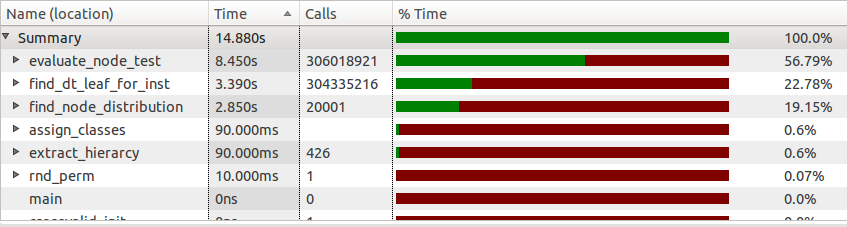

.. role:: raw(raw)
   :format: latex

.. |algo| replace:: *EEFTI*
.. |efti| replace:: *EFTI*
.. |eftis| replace:: *EFTIs*
.. |cop| replace:: *DTEEP*
.. |smae| replace:: *SMAE*
.. |SM| replace:: :math:`S_m`
.. |A| replace:: :math:`\mathbf{A}`
.. |a| replace:: :math:`\mathbf{a}`
.. |NA| replace:: :math:`N_{A}`
.. |NIass| replace:: :math:`N_{Iass}`
.. |AM| replace:: :math:`A_{m}`
.. |IM| replace:: :math:`I_m`
.. |na| replace:: :math:`\bar{n}`
.. |NI| replace:: :math:`N_{I}`
.. |Da| replace:: :math:`\bar{D}`
.. |Nl| replace:: :math:`N_l`
.. |ACEM| replace:: :math:`ACE_m`
.. |NM| replace:: :math:`N_{M}`
.. |LM| replace:: :math:`L_{m}`
.. |Nc| replace:: :math:`N_{c}`
.. |NP| replace:: :math:`N_{P}`
.. |RA| replace:: :math:`R_{A}`
.. |alpha| replace:: :math:`{\alpha}`
.. |rho| replace:: :math:`{\rho}`
.. |WDTD| replace:: :math:`W_{DTD}`
.. |ne| replace:: :math:`n_e`
.. |Ths| replace:: :math:`T_{hs}`
.. |Tsw| replace:: :math:`T_{sw}`
.. |Tswmut| replace:: :math:`T_{sw\_mut}`
.. |Tswacc| replace:: :math:`T_{sw\_acc}`
.. |Thsmut| replace:: :math:`T_{hs\_mut}`
.. |Thsacc| replace:: :math:`T_{hs\_acc}`

======================================
Co-Processor for DT Ensemble Evolution
======================================

Introduction
============

Machine learning :cite:`flach2012machine,murphy2012machine` is a branch of artificial intelligence that develops algorithms that "learn" from input data and construct systems that make predictions on the data. One of the main features of machine learning systems is the power of generalization, allowing them to perform well on new, unseen data instances, after having experienced a learning data set.

Different machine learning systems have been proposed in the open literature, including decision trees (DTs) :cite:`rokach2007data,rokach2005top`, artificial neural networks (ANNs) :cite:`haykin2009neural` and support vector machines (SVMs) :cite:`abe2005support`. They have been especially widely used in the field of data mining (see e,g. :cite:`witten2005data`), with DTs, ANNs and SVMs being the most popular (e.g. :cite:`rokach2007data,wu2009top,wang2006data`).

The learning process, i.e. induction of machine learning system, can either be supervised or unsupervised. When the desired output is supplied together with the input data to the machine learning induction algorithm, the learning is called supervised. On the other hand, when only the input data is available to the inducer, the learning is called unsupervised. In this case the inducer needs to discover the structure and patterns in the input data on its own, which can be a goal in itself. The input data used for learning usually consists of a set of instances (called a training set) of the problem being solved by the machine learning system. The lifetime of a machine learning system usually consists of two phases: training (induction or learning) and deployment. The system is built during the training phase using a training set. During the deployment phase, the constructed system will be faced with new, previously unseen instances and it will provide the output using the knowledge extracted from the training set.

Machine learning systems are often employed to perform classification of the input data instances into the set of classes. For this task, the DT is widely used classifier. The DT classifier operation can be represented by a flowchart with a tree structure, as shown in the :num:`Figure #fig-oblique-dt`. This flowchart resembles human reasoning and is thus easily understood, which makes DT a popular choice for classification model representations. Additional advantages of DTs over other machine learning algorithms comprise: robustness to noise, ability to deal with redundant or missing attributes, ability to handle both numerical and categorical data, etc.

Oblique binary classification DTs are the focus of this paper. The classes of the problem are represented by the DT leaves. The instance is classified by traversing the DT, starting from the root, until it reaches one of the leaves. The traversal path is determined by the tests performed on the instance in each non-leaf (also called a node in the paper) which it encounters during the traversal. Given that the instance is defined by its attribute vector - **A**, the tests performed by the oblique DT in each node are of the following form:

.. math:: \mathbf{a}\cdot \mathbf{A} = \sum_{i=1}^{n}a_{i}\cdot A_{i} < thr, 
    :label: oblique_test

where **a** represents the test coefficient vector and *thr* (abbreviated from threshold) models the afine part of the test.

.. _fig-oblique-dt:

.. bdp:: images/dt_traversal.py
    
    An example of the oblique binary DT with one possible traversal path shown in red. 

The DT traversal for each instance begins at the DT root node and continues until a leaf is reached, when the instance is assigned the class associated with that leaf. Whenever a node is reached during the traversal, the test associated with the node (given by equation :eq:`oblique_test`) is evaluated. If the test yields the value **true**, the DT traversal is continued via the node's left child, otherwise it is continued via the node's right child. In the :num:`Figure #fig-oblique-dt`, one possible traversal path is shown with the red line. In this example, the instance is classified into the class :math:`C_{4}` after the tree traversal.

In general, DT can be induced in two ways: incrementally (node-by-node) or the whole tree at once. Most of oblique DT induction algorithms use some kind of heuristic for the optimization process, which is often some sort of evolutionary algorithm (EA), since the finding of the optimal oblique DT is a hard algorithmic problem :cite:`barros2012survey`. The greedy top-down recursive partitioning strategy is the computationally least demanding approach for the DT induction, hence most DT induction algorithms use this approach. Naturally, this approach suffers from inability of escaping local optima. Better results, especially if the DT size is considered, can be obtained by the inducers that work on full DT, with the cost of higher computational complexity :cite:`struharik2014inducing`.

The DT induction phase of full DT inference algorithms can be very computationally demanding and can last for hours or even days for practical problems. By accelerating the DT induction phase larger training sets could be used, which is of particular interest in the data mining applications :cite:`witten2005data`. Furthermore, faster DT training allows for shorter design cycles and opens the possibility of DT induction in real-time for the applications that require such rapid adapting, such as web mining :cite:`liu2007web,yu2013depth`, bioinformatics :cite:`lesk2013introduction,baldi2001bioinformatics`, machine vision :cite:`prince2012computer,ali2010hardware,tomasi2010fine`, text mining :cite:`weiss2010fundamentals,aggarwal2012mining`, etc.

Two approaches can be used to achieve DT induction phase acceleration:

- Development new algorithmic frameworks or new software tools, which is the dominant approach :cite:`bekkerman2011scaling,choudhary2011accelerating`. 
- Development new hardware architectures optimized for accelerating selected machine learning systems

In the open literature a significant number of different architectures for the hardware acceleration of machine learning algorithms have been also proposed. Architectures for the hardware acceleration of SVM learning algorithms have been proposed in :cite:`anguita2003digital`, while architectures for the acceleration of previously created SVMs have been proposed in :cite:`papadonikolakis2012novel,anguita2011fpga,mahmoodi2011fpga,vranjkovic2011new`. Research in the hardware acceleration of ANNs has been particularly intensive. Numerous hardware architectures for the acceleration of already learned ANNs have been proposed :cite:`savich2012scalable,vainbrand2011scalable,echanobe2014fpga`. Also, a large number of hardware architectures capable of implementing ANN learning algorithms in hardware have been proposed :cite:`misra2010artificial,omondi2006fpga,madokoro2013hardware`. On the other hand, in the field of hardware acceleration of DTs majority of papers focus on the acceleration of already created DTs :cite:`struharik2009intellectual,li2011low,saqib2015pipelined`, while hardware acceleration of DT inference is scarcely covered. Reconfigurale hardware accelerator, proposed in :cite:`vranjkovic2015reconfigurable`, is particularly interesting since it is capable of accelerating DTs, SVMs and ANNs. This is the only architecture, known to the authors, that is capable of accelerating different types of machine learning classifiers. As far as authors are currently aware, there are only two papers on the topic of hardware acceleration of DT induction algorithms :cite:`struharik2009evolving,chrysos2013hc`. However, in these papers the algorithms using greedy top-down DT induction approach have been accelerated. In :cite:`struharik2009evolving` incremental DT induction algorithm is completely accelerated in hardware, and EA is used to calculate the optimal coefficient vector one node at a time. In :cite:`chrysos2013hc` a HW/SW approach was used to accelerate the computationally most demanding part of the well known CART incremental DT induction algorithm.

To further improve the classification performance, ensemble classifier systems :cite:`rokach2010ensemble` have been proposed instead of the single classifier systems. Ensemble classifier combines predictions from several individual classifiers in order to obtain a classifier that outperforms every one of them. Ensemble learning requires creation of a set of individually trained classifiers, typically DTs or ANNs, whose predictions are then combined during the process of classification of previously unseen instances. Although simple, this idea has proved to be effective, producing systems that are more accurate than a single classifier.

In the process of creation of ensemble classifiers, two problems have to be solved: ensuring the diversity of ensemble members and devising a procedure for combining individual member predictions in order to amplify correct decisions and suppress the wrong ones. Some of the most popular methods for ensuring ensemble's diversity are Breiman's bagging :cite:`buhlmann2012bagging`, Shapire's boosting :cite:`buhlmann2012bagging`, AdaBoost :cite:`buhlmann2012bagging`, Wolpert's stacked generalization :cite:`ozay2008performance`, and mixture of experts :cite:`jacobs1991adaptive`. Most commonly used combination rules include : majority voting, weighted majority voting and behavior knowledge spaces :cite:`huang1993behavior`.

The main advantage of ensemble classifier over single classifier systems is the higher accuracy and greater robustness of ensemble classifier systems. However, large amounts of memory are needed to store the ensemble classifier and high computing power is required to calculate the ensemble's output, when compared with the single classifier solutions, leading to much longer ensemble inference and instance classification times. This is because ensemble classifiers typically combine 30 or more individual classifiers :cite:`buhlmann2012bagging` so, if we want to get the same performance as with the single classifier system, 30+ times more memory and computing power would be required. Once more, hardware acceleration of ensemble classifier offers a way of achieving this goal. 

Concerning the hardware acceleration of ensemble classifier systems, according to our best knowledge, most of the proposed solutions are related to the hardware implementation of ensemble classifiers that were previously inferred in the software. Most of the proposed solutions are concerned with the hardware acceleration of homogeneous ensemble classifiers :cite:`bermak2003compact,osman2009random,van2012accelerating,hussain2012adaptive,struharik2013hardware`. As far as the authors are aware, there is only one proposed solution to the hardware implementation of heterogeneous ensemble classifiers :cite:`shi2008committee`. Please notice, that all these solutions are only capable of implementing ensemble classifiers systems that were previously inferred in software, running on some general purpose processor. Authors are aware of only one paper :cite:`struharik2009evolving`, that proposes an architecture for the hardware evolution of homogeneous ensemble classifier systems based on the DTs. This solution uses the DT inference algorithm that incrementally creates DTs that are members of the ensemble classifier system.

However, in the hardware implementation the main concern is the number of required hardware resources, mainly memory, necessary to implement a DT ensemble classifier. Smaller DTs are preferred because they require less hardware resources for the implementation and lead to ensembles with the smaller hardware footprint. Therefore, algorithms for DT ensemble classifier induction that generate small, but still accurate, DTs are of great interest when the hardware implementation of DT ensemble classifiers is considered. This requirement puts the full DT induction algorithms into focus.

In this paper, a co-processor called |cop| (DT Ensemble Evolution co-Processor) is presented. It is shown how DTEEP can be used for hardware acceleration of |algo|, a full DT ensemble evolutionary induction algorithm based on Bootstrap Aggregation, also known as Bagging. The Bagging algorithm was chosen since it makes the induction of the individual ensemble members completely decoupled from each other, making it very well suited for the parallelization and hence hardware acceleration. The |algo| algorithm uses |efti| :cite:`efti` (Evolutionary Full Tree Induction) algorithm that performs the induction of the full oblique classification DTs. The |efti| algorithm was chosen as the ensemble member inducer since it provides smaller DTs with similar or better classification accuracy than the other well-known DT inference algorithms, both incremental and full DTs :cite:`efti`. However, |efti| is more computationally demanding than the incremental inducers, hence |algo| could merit greatly from the hardware acceleration, making it more attractive. In this paper, |cop| co-processor is proposed to accelerate parts of the |algo| that are most computationally intensive, with the remaining parts of the algorithm running on the CPU. The |cop| co-processor architecture benefits also from the fact that the |efti| algorithm evolves the DT using only one individual, in contrast to many other algorithms based on the EA that require populations :cite:`bot2000application,krketowski2005global,llora2004mixed,papagelis2000ga`. The architecture can thus be simplified with hardware resources allocated only for a single individual per ensemble member. Furthermore, by using the HW/SW co-design approach, proposed |cop| co-processor can be used to accelerate DT ensemble inducers based on the Bagging algorithm which rely on a variety of other EA-based DT induction algorithms :cite:`barros2012survey,bot2000application,krketowski2005global,llora2004mixed,papagelis2000ga`. As far as the authors are aware, this is the first paper concerned with the hardware acceleration of full DT ensemble induction algorithm based on bagging.

|algo| algorithm
================

In this section, the |algo| algorithm for the induction of DT ensembles using the full DT induction approach based on the EA is described. Only one individual per ensemble member is required for the induction by the |algo| algorithm. Each individual represents the best DT evolved up to the current iteration for its corresponding ensemble member. Because |efti| uses supervised learning, the training set used to induce the ensemble consists of the problem instances together with their corresponding class memberships. Since the |algo| uses the Bagging algorithm, one subset of the training set is generated for each ensemble member which will be used to induce it. Two common ways of forming the subsets are:

- **random sampling without replacement** - formed subsets are disjoint sets of size :math:`N_{Iass}=\frac{N_I}{n_e}`, and
- **random sampling with replacement** - formed subsets are of size :math:`N_{Iass} \leq N_I`, 

where |NI| is the size of the training set and |ne| the number of subsets, i.e. ensemble members. Each ensemble member starts off as a randomly generated one-node DT and the algorithm iteratively tries to improve on it. DT is slightly changed, i.e. mutated, in each iteration, and let to perform classification of its corresponding subset of the training set. The known training set classification is then used to calculate the quality of the classification results. When the newly mutated DT performs better at the classification than its predecessor, it is promoted to the new current best individual for its ensemble member and will become the base for the mutations in the following iterations, until a better one is found. After the desired number of iterations, the algorithm exits and returns the set of best DT individuals, one for each ensemble member. 

.. _fig-algorithm-pca:
.. literalinclude:: code/algorithm.py
    :caption: Overview of the |algo| algorithm

The :num:`Algorithm #fig-algorithm-pca` shows the |algo| algorithm. Please note that all algorithms in this paper are described in the Python language style and that many details have been omitted for the sake of clarity. The |efti| algorithm is used for the induction of each ensemble member since it is suitable for the hardware acceleration (it uses only one individual for the induction and creates smaller DTs with no loss of accuracy compared to many other well-known algorithms :cite:`efti`). It was decided to implement the Bagging algorithm for the |algo|, since the induction process of one ensemble member is then uninfluenced by the induction processes of other ensemble members in any way, hence they can be performed in separate tasks, created by a successive calls to the *create_task* function in the :num:`Algorithm #fig-algorithm-pca`. These tasks implement the |efti| algorithm whose pseudo-code is shown in the :num:`Algorithm #fig-task-pca`. The |algo| first divides the training set in the subsets using the *divide_train_set()* function and stores them in the array *task_train_sets*. The result array is then created using the *initialize_result_array()* function and stored in the *res* variable. The *res* array contains one item for each ensemble member, to which the corresponding |efti| will output induced DTs and various miscellaneous corresponding statistical data. Next, the |efti| tasks are created, assigned their corresponding *task_train_sets* and *res* items, and started. The |algo| waits for the completion of all |efti| tasks and returns the *res* array populated by them.

.. _fig-task-pca:
.. literalinclude:: code/task.py
    :caption: Overview of the |efti| algorithm for full DT induction

The :num:`Algorithm #fig-task-pca` shows the algorithmic framework for each of the |efti| tasks. The current best DT individual is called *dt* in the pseudo-code. Initially, each individual starts of as a single node DT. In order to generate the node test coefficients, two instances with different class associations are selected at random from the training set. Each instance with its attribute vector, forms a point and each node test with its node coefficients forms a plane in the |NA|-dimensional space, where |NA| equals the size of the instance attribute vector (|A|) and node test coefficient vector (|a|). The node test coefficients of the root node are then calculated in such a way to form a plane perpendicular to the line connecting the points representing the two selected training set instances. The consequence of the way the node test is devised is that when the DT is let to classify the training set, at least two selected instances (selected to have different classes) will be split by the node test, i.e. they will take different paths. The splitting of the instances is fundamental for building a classifier. Furthermore, it is expected that the instances of the same class are grouped in same regions of the attribute vector space, thus it is likely that the node test will also split many other instances that share classes with the two selected ones. All this is implemented in the *initialize()* function. Additionally, this function will be called each time a new node is added to the DT.

Once the DT individual is initialized, the |efti| iteratively performs three main operations:

- **DT Mutation** - implemented in the *mutate()* function of which there are two types:

	- **Node test coefficients mutation**, and 
	- **DT topology mutation**. 
	
- **Fitness Evaluation** - implemented in the *fitness_eval()* function
- **Individual Selection** - given by the last **if** statement of the :num:`Algorithm #fig-task-pca`.

Node test coefficient is mutated by switching the value of one of its bits at random position. Only a small fraction (|alpha|) of the node test coefficients are mutated in each iteration, in order not to generate large shifts in the search space. The node tests determine the paths the instances will take during the classification, i.e. determine their classification, hence these mutation are done with the hope of obtaining better classification results. Parameter |alpha| changes dynamically between the iterations. At the end of the iteration, if there was an improvement to the DT fitness, i.e. new best individual is found, |alpha| is reset to some initial value. However, in each iteration there was no improvement |alpha| is gradually increased, in order to allow for bigger steps in the search space.

Topology mutations represent even larger steps in the search space and are thus employed even less often, only every few iterations. Parameter |rho| defines the probability a single node will be either removed from the DT individual or added to it. In case a new node is to be added, first one leaf node is selected at random to be replaced by the new non-leaf node. Next, the test coefficients for the new node are calculated using the *initialize()* function described above and two leaf nodes are generated as its children. This way, a new test is introduced into the DT where instances of different classes might separate, take different paths through the DT and eventually finish being classified as different, thus increasing the DT accuracy and its fitness. 

On the other hand, when node is to be removed, it is selected at random from all non-leaf DT nodes. The selected non-leaf node is deleted along with the whole sub-tree of nodes rooted at it. The removal of the node is done in the hope of removing an unnecessary test and making the DT smaller, since the size of the DT, besides the accuracy, influences the DT fitness as well.

.. _fig-fitness-eval-pca:
.. literalinclude:: code/fitness_eval.py
    :caption: The pseudo-code of the fitness evaluation task.

After the DT individual is mutated, its fitness is calculated using the algorithm given in the :num:`Algorithm #fig-fitness-eval-pca` as weighted sum of two values: DT accuracy and DT oversize. The input parameter *dt* is the current DT individual and *train_set* is the associated training set. DT oversize negatively influences the fitness and is calculated as the relative difference between the number of leaves in the DT (|Nl|) and the total number of classes in the training set (|Nc|). This means that once |Nl| becomes bigger than |Nc|, the DT individual starts to suffer penalties to its fitness. The threshold is set to |Nc| since DT needs to have at least one leaf for each of the training set classes in order to have a chance of classifying correctly the instances belonging to each of the training set classes. DT accuracy influences positively the fitness and is calculated by letting the DT individual classify all the training set instances and is described in more details in the next paragraphs. The fitness evaluation task performs the following:

- finds the distribution of the classes over the leaves of the DT - implemented by the first **for** loop
- finds the dominant class for each leaf - implemented by the second **for** loop
- calculates the fitness as a weighted sum of the DT accuracy and DT oversize.

The class distribution is obtained from the classification results of the training set, calculated by the DT individual. The :math:`d_{i,j}` element of the distribution matrix contains the number of instances of the class *j* that finished in the leaf node with the ID *i* after the DT traversal. In order to populate the matrix, the *find_dt_leaf_for_inst()* function is called (whose pseudo-code is given in the :num:`Algorithm #fig-find-dt-leaf-for-inst-pca`) for each training set instance, to perform the DT traversal in the manner depicted in the :num:`Figure #fig-oblique-dt`, where the red line shows one possible traversal path. During the DT traversal, the *evaluate_node_test()* function is iteratively used to perform the node test evaluation given by the equation :eq:`oblique_test`, to determine in which direction the traversal should continue. The function returns the ID of a leaf (variable *leaf_id* in the :num:`Algorithm #fig-fitness-eval-pca`) in which the instance finished the traversal. Using the leaf ID and being that the class of the instance is known from the training set (variable *instance_class* in the :num:`Algorithm #fig-fitness-eval-pca`), the corresponding element *distribution[leaf_id][instance_class]* of the distribution matrix is incremented for each instance. After all instances from the training set traverse the DT, this matrix contains the distribution of classes among the leaf nodes.

.. _fig-find-dt-leaf-for-inst-pca:
.. literalinclude:: code/find_dt_leaf_for_inst.py
    :caption: The pseudo-code of the procedure for determining the end-leaf for an instance.

Second, dominant class is calculated by the next loop of the *fitness_eval()* function. Dominant class for a leaf node is the class having the largest percentage of instances finishing the traversal in that leaf node. Formally, the dominant class *k* of the leaf node with the ID *i* is:

.. math:: k | (d_{i,k} = \max_{j}(d_{i,j}))
    :label: dominant_class

The maximum classification accuracy over the training set is attained when all leaf nodes are assigned their corresponding dominant classes. Therefore, when an instance finishes in the leaf node whose dominant class is the same as the class of the instance, the instance classification is qualified as a hit, otherwise it is qualified as a miss. The *hits* variable of the :num:`Algorithm #fig-fitness-eval-pca` counts the instance classification hits. The DT accuracy is then calculated as a percentage of the classification hits over the total number of instances in the training set.

Finally, upon acquiring the fitness of the newly mutated DT, :num:`Algorithm #fig-task-pca` performs the individual selection. The most basic individual selection is presented here for the sake of the brevity, where new individual is selected only if it has a better fitness value then the current best individual. However, the more complex procedure is implemented in the |efti| algorithm which allows, with some probability, for an individual with worse fitness to be selected. In that case, the algorithm continues as if the worse fitness individual were a current best. Nevertheless, the best overall individual is always memorized and there is an increasing chance that it will be selected again if the algorithm makes no progress in fitness. 

EEFTI algorithm profiling results
---------------------------------

In order to decide which part of the |algo| algorithm should be accelerated in the hardware, the profiling was performed on the |algo| algorithm software implementation. The software implementation of the |algo| algorithm was realized in the C programming language, with many optimization techniques employed:

- node test evaluation loop (within *evaluate_node_test()* function in :num:`Algorithm #fig-find-dt-leaf-for-inst-pca`) has been unfold
- all arithmetic operation were performed using 64-bit operands (optimized for the 64-bit CPU which was used for profiling),
- compiler optimization settings were set to maximum for speed, etc.

To perform the experiments, 18 datasets, presented in the :num:`Table #tbl-uci-datasets`, were selected from the UCI benchmark datasets database :cite:`newman1998uci`. UCI database is commonly used database in the machine learning community to estimate and compare performance of different machine learning algorithms.

.. tabularcolumns:: l p{30pt} p{40pt} p{40pt} p{40pt}
.. _tbl-uci-datasets:
.. list-table:: Characteristics of the UCI datasets used in the experiments
    :header-rows: 1 
    
    * - Dataset Name
      - Short Name
      - No. of attributes
      - No. of instances
      - No. of classes
    * - Adult
      - adult
      - 14
      - 48842
      - 2
    * - Bank Marketing
      - bank
      - 16
      - 45211
      - 2
    * - Bach Choral Harmony
      - bch
      - 16
      - 5665
      - 60
    * - Clave Vectors Firm Teacher Model
      - cvf
      - 15
      - 10800
      - 7
    * - Tamilnadu Electricity Board Hourly Readings
      - eb
      - 4
      - 45781
      - 31
    * - EEG Eye State
      - eye
      - 14
      - 14980
      - 2
    * - Japanese Vowels
      - jvow
      - 14
      - 4274
      - 9
    * - White King and Rook against Black King
      - kpt
      - 6
      - 28056
      - 18
    * - Letter Recognition
      - ltr
      - 16
      - 20000
      - 26
    * - MAGIC Gamma Telescope
      - magic
      - 10
      - 19020
      - 2
    * - Mushroom
      - msh
      - 22
      - 8124
      - 2
    * - Nursery
      - nrs
      - 8
      - 12960
      - 5
    * - Page Block Classification
      - page
      - 10
      - 5473
      - 5
    * - Pen Based Recognition of Handwritten Digits
      - pen
      - 16
      - 10992
      - 10
    * - Statlog Shuttle
      - sht
      - 9
      - 58000
      - 7
    * - Waveform Database Generator
      - w21
      - 21
      - 5000
      - 3
    * - Wall Following Robot Navigation
      - wfr
      - 24
      - 5456
      - 4    
    * - Wine Quality
      - wine
      - 11
      - 4898
      - 7

GCC 4.8.2 compiler was used to compile the software implementation of the |algo| algorithm and GProf to profile it on each of the UCI datasets listed in the :num:`Table #tbl-uci-datasets`. It was run on the AMD Phenom(tm) II X4 965 (3.4 GHz) based computer and the results obtained by the profiling are shown in the :num:`Figure #fig-profiling-plot`. All tests were performed by inducing a single member ensemble, since the results obtained in this way are then convenient for conducting the calculation of the arbitrary size ensemble induction performance as discussed in the `Theoretical estimation of the acheivable speedup of the proposed HW/SW system`_. The figure shows percentage of the total execution time spent in the *fitness_eval()* function and its subfuctions for each dataset. On average, |algo| spent 98.9% of time calculating the fitness of the individuals.

.. _fig-profiling-plot:
.. plot:: images/profiling_plot.py
    :width: 100%
    
    Percentage of time spent in the *fitness_eval()* function and its subfuctions for each dataset listed in the :num:`Table #tbl-uci-datasets`

The results for one example profiling experiment on the *magic* dataset are given in the :num:`Figure #fig-profiling`. Each row in the table provides the profiling data for one function with the following data:

- **Name** - The name of the function
- **Time** - Total amount of time spent in the function  
- **Calls** - Total number of calls to the function
- **% Time** - Percentage of time spent in the function relative to the total execution time.

.. _fig-profiling:

    
    Profiling results of the |algo| algorithm's C implementation.

Fitness evaluation task comprises the following functions from the table : *evaluate node test()*, *find_dt_leaf_for_inst()* and *find_node_distribution()*. The percentage of execution time spent in the fitness evaluation task can be obtained by summing the execution times of these three functions, which adds up to 98.7% of total time for this particular dataset. 

The certain candidate for the hardware acceleration is thus the fitness evaluation operation, since it takes 98.9% of the total computational time on average. All other operations (DT initialization, DT mutation and individual selection) were decided to be left in the software, since they require significantly less amount of time to complete. On the other hand, by leaving these operations in the software the design remains flexible for experimenting with different algorithms for DT mutation, Bagging and individual selection. Furthermore, many other algorithms based on the EA like: Simulated Annealing (SA), Genetic Algorithms (GA), Genetic Programming (GP) etc., can be employed to perform the DT induction instead of the |efti| algorithm and still benefit from the co-processor performing the fitness evaluation operation, which significantly expands the scope of use of the proposed |cop| co-processor.

Co-processor for the DT ensemble induction - |cop|
==================================================

.. _fig-system-bd:
.. bdp:: images/system_bd.py
    :width: 70%
    
    The |cop| co-processor structure and integration with the host CPU

Proposed |cop| co-processor performs the task of determining the accuracies of the DT individuals for the fitness evaluation tasks used in the DT ensemble induction. The |cop| can calculate DT accuracies, i.e. the number of hits accumulated in the *hits* variable of the :num:`Algorithm #fig-fitness-eval-pca`, for all ensemble members in parallel. The co-processor is connected to the CPU via the AXI4 AMBA bus, which can be used by the software to completely control the |cop| operation:

- Download of the training sets for each ensemble member
- Download of DT descriptions, including structural organization and coefficient values for all node tests present in the DTs
- Start of the accuracy evaluation process for each of the ensemble members individually
- Read-out of the vector of combined statuses of the accuracy evaluation processes for all ensemble members 
- Read-out of the classification performance results for each of the ensemble members

The |cop| co-processor structure and integration with the host CPU is depicted in the :num:`Figure #fig-system-bd`. The |cop| consists of an array of DT accuracy evaluators: :math:`SMAE_1` (Single Member Accuracy Evaluator) to :math:`SMAE_{S^M}`, each of which can be used to evaluate the accuracy of the DT for a single ensemble member. Parameter |SM| represents the total number of |smae| units in the |cop| and thus the maximal number of ensemble member accuracy evaluations that can be performed in parallel. Furthermore, the co-processor features the IRQ Status block that allows the user to read-out the operation status of all |smae|.

Single Member Accuracy Evaluator
--------------------------------

.. _fig-eftip:
.. bdp:: images/eftip.py
    
    The |smae| module structure

The |smae| block evaluates the accuracy of the single DT individual. The major components of the |smae| block and their connections are depicted in the :num:`Figure #fig-eftip`:

- **Control Unit**: Provides AXI4 interface for the user to access the |smae| block. It acts as a gateway and demultiplexes and relays the read and write operations to the internal modules of the |smae| block. Furthermore, it implements the control logic of the accuracy evaluation flow and contains control registers for starting, stopping and restarting the accuracy evaluation process, as well as reading out the current evaluation status. When instructed by the user via the AXI4 interface to initiate the accuracy evaluation process, it signals the Training Set Memory to start to output the instances to the Classifier, waits for the instance classification to finish and the accuracy to be calculated by the Accuracy Calculator block, then generates the pulse on the *IRQ* output and stores the accuracy result for user to read it.
- **Classifier**: Implements the *find_dt_leaf_for_inst()* function from the :num:`Algorithm #fig-find-dt-leaf-for-inst-pca`, i.e. performs the DT traversal for each training set instance. Classifier comprises an array of *TLE* (Tree Level Evaluator) modules, which calculate instance traversal paths in parallel by pipelining the process. Each pipeline stage calculates the node test given by the equation :eq:`oblique_test` for one level of the DT, since the instance can only visit one node per level during the DT traversal. Based on the node test calculation result, it then passes the instance to the next *TLE* stage, i.e. next DT level, and informs the stage whether the traversal is to be continued via the right or the left child. The block for the node test calculation inside *TLE* is once again pipelined using the multipliers in parallel and the tree of adders. Maximum supported depth of the induced DT depends on the number of pipeline stages (|LM|). At the end of the pipeline, Classifier outputs for each instance the ID assigned to the leaf (variable *leaf_id* from the :num:`Algorithm #fig-fitness-eval-pca`) in which the instance finished the DT traversal (please refer to *fitness_eval()* function from the :num:`Algorithm #fig-fitness-eval-pca`).
- **Training Set Memory**: The memory for storing all training set instances that participate in the classification accuracy estimation for the single ensemble member. The memory is accessible via the AXI4 bus for the user to upload the training set to the |smae|.
- **DT Memory Array**: Comprises the array of memories, :math:`DTD_{1}` (DT Description) through :math:`DTD_{L_m}`, one per each DT level, i.e. one per each Classifier pipeline stage, to hold the description of the DT. Each Classifier pipeline stage requires its own *DTD* memory that holds the description of all nodes at the DT level the stage is associated with, since all calculations are performed in parallel.
- **Accuracy Calculator**: Implements the calculation of the class distribution matrix, dominant class and accuracy calculations described by the :num:`Algorithm #fig-fitness-eval-pca`. The *leaf_id* is received from the Classifier together with the known target class (variable *instance_class* from the the :num:`Algorithm #fig-fitness-eval-pca`) for each instance in the training set. Accuracy Calculator module comprises an array of *ACEs* (Accuracy Calculator Elements) with each of them associated to the specific leaf. Each *ACE* updates the part of the distribution matrix for the corresponding leaf and calculates its dominant class. After all instances are classified, the number of hits is calculated as the sum of the dominant classes hits calculated by the individual *ACEs*, and the result is sent to the Control Unit.

IRQ Status module
-----------------

IRQ Status module has been implemented in order to provide the user with the means of reading the statuses of all |smae| units with only one AXI4 read operation and thus optimize the AXI bus traffic. Each |smae| unit comprises an *IRQ* (interrupt request) signal used to inform the IRQ Status block that the |smae| unit has finished the accuracy evaluation. The IRQ Status block comprises an array of IRQ Status Word Registers which can all be read in a single burst via the AXI bus. Each IRQ Status Word is a 32-bit register (since |cop| was optimized for 32-bit AXI) packed from the bits representing the statuses of up to 32 |smae| units. Each bit is called :math:`SMAE_i` Status Bit, where *i* denotes the ID of the |smae| unit whose status the bit is tracking, as shown in the :num:`Figure #fig-irq-status`. The figure shows IRQ Status register space for one specific |SM| value, but there are no limitations on the number of |smae| units that can be connected to the IRQ Status block. The bits of the IRQ Status Word Register are sticky, i.e. set each time the *IRQ* is signaled from the corresponding |smae| and cleared when the register is read by the user.

.. _fig-irq-status:
.. bdp:: images/irq_status.py
    
    IRQ Status register space

Required Hardware Resources and Performance
-------------------------------------------

The |cop| co-processor is implemented as an IP core with many customization parameters that can be configured at the design phase and are given in the :num:`Table #tbl-cop-params`. These parameters mainly impose constraints on the maximum number of ensemble members that can be induced in parallel, the maximum size of the DT individual and the maximum size of the training set that can be used. 

.. tabularcolumns:: c p{0.4\linewidth} p{0.4\linewidth}

.. _tbl-cop-params:

.. list-table:: Customization parameters that can be configured at the design phase of the |cop| co-processor
    :header-rows: 1 
    :widths: 15 30 30
    
    * - Parameter
      - Description
      - Constraint
    * - |SM|
      - The number of |smae| units
      - The maximum number of ensemble members that can be induced in parallel
    * - |LM|
      - The number of *TLEs* in the |smae| block
      - The maximum depth of the induced DT 
    * - |AM|
      - Determines: Training Set Memory width, :raw:`\newline` 
        *DTD* width, :raw:`\newline` 
        *TLE* multipliers count and adder tree size.
      - The maximum number of attributes training set can have
    * - :math:`R_A`
      - Determines: Training Set Memory width, :raw:`\newline` 
        *DTD* memory width, :raw:`\newline` 
        *TLE* adder tree size.
      - Resolution of induced DT coefficients
    * - :math:`R_C`
      - Parameter must be at least :math:`log_{2}(C_m)`
      - Resolution of the class ID
    * - :math:`C_m`
      - Accuracy Calculator memory depth
      - The maximum number of training set and induced DT classes
    * - |ACEM|
      - Number of Accuracy Calculator Elements
      - The maximum number of leaves of the induced DT 
    * - |IM|
      - Training Set Memory depth
      - The number of training set instances that can be stored in |cop| co-processor
    * - :math:`N_{lm}`
      - *DTD* memory depth
      - The maximum number of nodes per level of the induced DT 

The amount of hardware resources required to implement the |cop| co-processor is a function of the customization parameters given in the :num:`Table #tbl-cop-params` and is given in the :num:`Table #tbl-req-res` for various types of hardware resources. The :math:`N_{P}=\left \lceil log_{2}(\AM) + 2 \right \rceil` is the length of the *TLE* pipeline.

.. tabularcolumns:: p{0.2\linewidth} p{0.2\linewidth} p{0.5\linewidth}

.. _tbl-req-res:

.. list-table:: Required hardware resources for the |cop| architecture implementation
    :header-rows: 1 
    
    * - Resource Type
      - Module
      - Quantity
    * - RAMs
      - Training Set Memory
      - :math:`\SM\cdot\IM\cdot (R_A*\AM + R_C)`
    * - (total number of bits)
      - *DTD* memory
      - :math:`\SM\cdot\LM\cdot N_{lm} \cdot (R_{A}\cdot(\AM + 1) + 2\cdot\LM + 2\cdot\left \lceil log_{2}(N_{lm}) \right \rceil)`
    * - 
      - Accuracy Calculator
      - :math:`\SM\cdot ACE_m \cdot C_{m}\cdot \left \lceil log_{2}(\IM) \right \rceil`
    * - 
      - *TLE*
      - :math:`\SM\cdot\LM\cdot N_P\cdot (R_{A}\cdot\AM + R_{C}) +` :raw:`\newline`
        :math:`\SM\cdot\LM\cdot N_P\cdot (R_{A} + 2\cdot\LM + 2\cdot\left \lceil log_{2}(N_{lm}) \right \rceil`
    * - Multipliers
      - *TLE*
      - :math:`\SM\cdot\LM\cdot \AM`
    * - Adders
      - *TLE*
      - :math:`\SM\cdot\LM \left \lceil log_{2}(\AM)  \right \rceil`
    * - Incrementers
      - Accuracy Calculator
      - :math:`\SM\cdot ACE_m`

As for the the number of clock cycles required to determine the accuracy for the single DT ensemble member, the Classifier has a throughput of one instance per clock cycle with the initial latency equal to the length of the pipeline :math:`N_{P}` and the Accuracy Calculator post-processing latency equals :math:`N_{C} + N_{l}`, i.e.:

.. math:: accuracy\_evaluation\_time = N_{Iass} + N_{P} + N_{C} + N_{l} \ clock\ cycles,

where, |NIass| designates the number of instances in the training set associated with the single DT ensemble member, |Nc| the total number of classes in the training set and |Nl| the number of leaves in the DT. Therefore, the accuracy evaluation time is dependent on the training set size.

Theoretical estimation of the acheivable speedup of the proposed HW/SW system
-----------------------------------------------------------------------------

In this section the speedup of the HW/SW implementation over the pure software implementation of the |algo| algorithm will be calculated as a function of the number of the ensemble members, |ne|:

.. math:: speedup(n_e) = \frac{\Tsw(n_e)}{\Ths(n_e)}
    :label: m-speedup-function
    
where |Tsw| and |Ths| denote the run times of the pure software and HW/SW implementations respectively. As discussed in the previous section, the good candidate for the hardware acceleration of the |algo| algorithm is the accuracy calculation task, while leaving the mutation to be implemented in the software. Hence, we will observe separately the contributions of these two parts to the total algorithm runtime. Furthermore, the hardware accelerator for the accuracy calculation task can be easily made to calculate the accuracy for each ensemble member in parallel, since there is no coupling between different members' induction processes. Runtime of the pure software implementation can be calculated as:

.. math:: \Tsw(n_e) = \Tswmut + \Tswacc
    :label: m-tsw-breakdown

where |Tswmut| and |Tswacc| denote the amount of time pure software implementation spends on the mutation and accuracy calculation tasks respectively. |Tswmut| is a linear function of |ne|, since the mutation is performed once per iteration per ensemble member. Hence, if the number of iterations is kept constant, we obtain:

.. math:: \Tswmut(n_e) = \Tswmut(1) \cdot n_e
    :label: m-tswmut-func
    
In this paper, the |algo| algorithm uses random sampling without replacement to generate the training sets for individual ensemble members. Hence, |Tswacc| is constant with respect to the |ne|, since the training set is divided amongst ensemble members, making the number of instances being classified and thus the amount of computation, constant. For the HW/SW implementation we obtain:

.. math:: \Ths(n_e) = \Thsmut(1) \cdot n_e + \Thsacc
    :label: m-ths-breakdown

where |Thsmut| and |Thsacc| denote the amount of the time HW/SW implementation spends on the mutation and accuracy calculation tasks respectively. |Thsmut| is implemented in the software and is a linear function of |ne| for the same reasons given for the |Tswmut|. Please observe that the |Thsmut| is somewhat greater than the |Tswmut| (:math:`\Thsmut = \Tswmut + \Delta_t`) since it also comprises the latency of the hardware accelerator interface operations, which is not present in the pure software implementation. 

Because the HW/SW accuracy calculation is performed in parallel for all ensemble members, the calculation time is proportional to the size of the training set allocated for each ensemble member. Since the training set is divided equally among the ensemble members (using the DTEEP co-processor), |Thsacc| is inversely proportional to the |ne|:

.. math:: \Thsacc(n_e) = \frac{\Thsacc(1)}{n_e}
    :label: m-thsacc-func
    
By substituting equations :eq:`m-tsw-breakdown`, :eq:`m-tswmut-func`, :eq:`m-ths-breakdown` and :eq:`m-thsacc-func` into the :eq:`m-speedup-function`, we obtain:

.. math:: speedup(n_e) = \frac{\Tswmut(1) \cdot n_e + \Tswacc}{\Thsmut(1) \cdot n_e + \frac{\Thsacc(1)}{n_e}} = \frac{\Tswmut(1) \cdot n_e^{2} + \Tswacc \cdot n_e}{\Thsmut(1) \cdot n_e^{2} + \Thsacc(1)}
    :label: m-speedup-func-subst

|Tswacc| term was shown in the `EEFTI algorithm profiling results`_ section to take almost all of the computational time. This parameter is heavily influenced by the amount of the computation needed to calculate the instance traversal (:num:`Algorithm #fig-find-dt-leaf-for-inst-pca`). Time needed to perform the DT traversal for all instances is proportional to the number of instances in the training set (|NI|), number of attributes |A| (equation :eq:`oblique_test`) and the depth of the DT. Depth of the DT is determined by the complexity of the training set data, but the larger training sets with higher |Nc| and |A| tend to require larger trees. The datasets that can be of interest to run DT ensemble induction on using the |cop| are the ones that require significant time to execute in the software on the CPU. For these datasets :math:`\Tswacc \gg \Tswmut` and thus :math:`\Tswacc \gg \Thsmut`. By using the hardware acceleration and massive parallelism, :math:`\Tswacc \gg \Thsacc` is accomplished as well. By taking these parameter relationships into the account, :math:`speedup(n_e)` function given by the equation :eq:`m-speedup-func-subst` takes shape depicted in the :num:`Figure #fig-speedup-func-plot`.

.. _fig-speedup-func-plot:
.. plot:: images/speedup_func_plot.py
    :width: 100%
    
    The shape of the :math:`speedup(n_e)` function given by the equation :eq:`m-speedup-func-subst`.

The plot in the :num:`Figure #fig-speedup-func-plot` suggests that accelerating the |algo| by a co-processor that performs the DT accuracy calculation in parallel for all ensemble members, will in the beginning provide increase in the speedup as the number of ensemble members increase. Then, after a speedup maximum has been reached, it will slowly degrade, but continue to offer a substantial speedup for all reasonable ensemble sizes. The maximum of the speedup can be found by seeking the maximum of the function given by the equation :eq:`m-speedup-func-subst`. By taking into the account parameter relationships, the point of the maximum of the :math:`speedup(n_e)` function can be expressed as follows:

.. math:: max(speedup(n_e))\approx\frac{\Tswacc}{2\sqrt{\Thsacc(1)\Thsmut(1)}}\ at\ n_e \approx \sqrt{\frac{\Thsacc(1)}{\Thsmut(1)}}
	:label: m-speedup-maximum
	
Furthermore, the :num:`Figure #fig-speedup-func-plot` shows that even though the speedup starts declining after reaching its maximum value for certain |ne|, the downslope is slowly flattening, and the significant speedup is achieved even for large ensemble sizes.

Software for the |cop| assisted DT ensemble induction
=====================================================

As it was described in the previous chapters, |cop| co-processor can perform accuracy evaluation task in parallel for as many ensemble members as there are |smae| units within. Hence, in the HW/SW implementation of the |algo| algorithm, each of the |efti| tasks is assigned one |smae| unit to use exclusively for the acceleration of the accuracy evaluation for its DT individual. Since there is a single AXI bus connecting the CPU to the |cop| co-processor, no two |efti| tasks can access it in the same time. Hence, a Scheduler task is needed to manage the access rights by using semaphores of the underlying operating system to signal that the access to the |cop| has been granted to some task. The |algo| top level pseudo-code with added instantiation of the synchronization mechanism in the form of the Scheduler task and the semaphores is presented in the :num:`Algorithm #fig-co-design-sw-pca`.

.. _fig-co-design-sw-pca:
.. literalinclude:: code/co_design_sw.py
    :caption: The pseudo-code of the |algo| algorithm using the |cop| co-processor 

Furthermore, each of the tasks is assigned a unique ID (variable *smae_id* in the :num:`Algorithm #fig-co-design-efti-pca`), which serves as a handle to the semaphore and the |smae| unit of the |cop| co-processor assigned to the task. Please notice that the hardware interface function pseudo-codes were omitted for brevity.

First let us show how each |efti| task (shown in the :num:`Algorithm #fig-algorithm-pca`) needs to be changed in order to support the use of the |cop| co-processor. New |efti| pseudo-code for the HW/SW co-design is given by the :num:`Algorithm #fig-co-design-efti-pca`. Because the |cop|'s memory space is mapped to the main CPU's memory space via the AXI4 bus, the *hw_load_training_set()* function simply copies all instances of the training set to the Training Set Memory address space of the assigned |smae| unit. The *smae_id* is used by all hardware interface functions to select the correct address space, i.e. to calculate the hardware addresses belonging to the assigned |smae| unit. 

First, the training set needs to be loaded into the |smae| unit, since it will be needed to perform the accuracy calculation. Each time the DT individual is mutated its description needs to be reloaded into the DT Memory Array of the assigned |smae| unit. Since only small parts of the DT individuals are mutated in each iteration, only the changed parts can be loaded to the co-processor in order to optimize the AXI-bus traffic. Hence, the *mutate()* function is slightly changed to return the list of all changes it made to the DT individual into the *dt_diff* variable. The function *hw_load_dt_diff()* is then called to copy only these changes to the appropriate DT Memory Array locations of the assigned |smae| unit. Furthermore, if the new DT individual does not get selected for a new current best, the mutations need to be discarded. This is executed by the *hw_revert_dt_diff()* function, which undoes all the changes applied by the *hw_load_dt_diff()* function.

.. _fig-co-design-efti-pca:
.. literalinclude:: code/co_design_efti.py
    :caption: The pseudo-code of the modified |efti| task algorithm used in the HW/SW co-design implementation 

The pseudo-code for the *fitness_eval()* function used in the HW/SW co-design implementation is shown in the :num:`Algorithm #fig-co-design-fitness-eval-pca`. With the training set and the DT description readily loaded into the co-processor, signal is sent to the the assigned |smae| unit to start the accuracy evaluation. After that, the task waits for the semaphore signal from the Scheduler task to indicate that the accuracy has been calculated and the access to the |cop| has been granted to it. The call is issued to the function for waiting on semaphores of the underlying operating system, which suspends the task and performs the task switch to some other |efti| task which is ready for execution.

.. _fig-co-design-fitness-eval-pca:
.. literalinclude:: code/co_design_fitness_eval.py
    :caption: The pseudo-code of the fitness evaluation function used in the HW/SW co-design implementation

The pseudo-code of the Scheduler task is given in the :num:`Algorithm #fig-co-design-scheduler-pca`. The main function of the scheduler task is to monitor the IRQ Status Registers of the |cop| co-processor and, based on its value, signal the semaphores assigned to the corresponding |efti| tasks. The Scheduler task reads the |cop| co-processor status via the *hw_get_status()* function into the variable *status*. It then iterates over all bits of the variable *status* that correspond to the SMAE Status Bits, and checks which of them have the value of 1, meaning the corresponding |smae| unit has reported the end of the accuracy evaluation process. The corresponding |efti| task is then invoked by signaling the appropriate semaphore.

.. _fig-co-design-scheduler-pca:
.. literalinclude:: code/co_design_scheduler.py
    :caption: The pseudo-code of the Scheduler task used in the HW/SW co-design implementation

Experiments
===========

To estimate the DT ensemble induction speedup of the HW/SW over the pure software implementation of the |algo| algorithm, the datasets listed in the :num:`Table #tbl-uci-datasets` were used and the results are given in this section. Ensembles of up to 25 members were induced from the datasets in the experiments.

Required Hardware Resources for the |cop| co-processor
------------------------------------------------------

For the experiments, five different instances of the |cop| co-processor were generated, one for each of the ensemble sizes used in the experiments: 2, 4, 8, 16 and 25. The values of the customization parameters, given in the :num:`Table #tbl-exp-params`, were chosen so that the generated co-processors could support the DT ensemble induction from all datasets of the :num:`Table #tbl-uci-datasets`. The datasets *mushroom*, *w21* and *wfr* were preprocessed using the PCA (Principal Component Analysis) to reduce their number of attributes to 16. This was done so that all datasets could fit in the |cop| co-processor with parameter |AM| set to 16, in order to have smaller |cop| footprint for the experiments.

.. tabularcolumns:: p{0.4\linewidth} *{5}{R{0.08\linewidth}}
.. _tbl-exp-params:
.. list-table:: Values of the customization parameters of the |cop| co-processor instances, one for each of the ensemble sizes used in the experiments.
    :header-rows: 1 
    
    * - Parameter
      - |SM| = 2
      - |SM| = 4
      - |SM| = 8
      - |SM| = 16
      - |SM| = 25
    * - DT max. depth (|LM|)
      - 5
      - 5
      - 5
      - 5
      - 5
    * - Max. attributes num. (|AM|)
      - 16
      - 16
      - 16
      - 16
      - 16
    * - Attribute encoding resolution (:math:`R_{A}`)
      - 16
      - 16
      - 16
      - 16
      - 16
    * - Class encoding resolution (:math:`R_{C}`)
      - 8
      - 8
      - 8
      - 8
      - 8
    * - Max. training set classes (:math:`C_{M}`)
      - 64
      - 64
      - 64
      - 64
      - 64
    * - Max. number of leaves (|ACEM|)
      - 16
      - 16
      - 16
      - 16
      - 16
    * - Max. number of training set instances (|IM|)
      - 24000
      - 12000
      - 6000
      - 4096
      - 2048
    * - Max. number of nodes per level (:math:`N_{lm}`)
      - 16
      - 16
      - 16
      - 16
      - 16

The VHDL language has been used to model the |cop| co-processor and it was implemented using the Xilinx Vivado Design Suite 2015.2 software for the logic synthesis and implementation with the default synthesis and P&R options. From the implementation report files, device utilization data has been analyzed for the |cop| co-processor instance with |SM| = 25 (:num:`Table #tbl-exp-params`), which has the largest footprint. The information about the number of used slices, BRAMs and DSP blocks has been extracted, and is presented in the :num:`Table #tbl-utilization`, for different target FPGA devices. The operating frequency of 100 MHz of the system clock frequency was attained for all the implemented |cop| co-processor instances from the :num:`Table #tbl-exp-params`.

.. tabularcolumns:: p{0.3\linewidth} *{3}{p{0.2\linewidth}}
.. _tbl-utilization:
.. list-table:: FPGA resources required to implement the |cop| co-processor with 25 |smae| units and the configuration given in the :numref:`tbl-exp-params`.
    :header-rows: 1 
    
    * - FPGA Device
      - Slices/CLBs
      - BRAMs
      - DSPs
    * - xc7z100
      - 62091 (89%)
      - 412.5 (55%)
      - 2000 (99%)
    * - xcku115
      - 33231 (40%)
      - 412.5 (19%)
      - 2000 (36%)
    * - xc7vx690
      - 63885 (59%)
      - 412.5 (28%)
      - 2000 (56%)

Given in the brackets along with each resource utilization number is a percentage of used resources from the total resources available in the corresponding FPGA devices. :num:`Table #tbl-utilization` shows that the implemented |cop| co-processor fits into xc7z100 Xilinx FPGA device of the Zynq series, and into mid- to high-level Virtex7 and UltraScale Kintex7 Xilinx FPGA devices (xc7vx690 and xcku115).

Estimation of the Induction Speedup
-----------------------------------

For the experiments, the |algo| algorithm was implemented for three platforms (all software was written in the C programming language):

- **SW-PC**: Pure software implementation for the PC
- **SW-ARM**: Pure software implementation for the ARM Cortex-A9 processor
- **HW/SW**: The |cop| co-processor implemented in the FPGA was used for the fitness evaluation, while all other tasks of the |algo| algorithm (shown in the :num:`Algorithm #fig-co-design-sw-pca`) were implemented in software for the ARM Cortex-A9 processor.

For the software implementations of the |algo| algorithm on the ARM platform, at first the FreeRTOS was used as the operating system since it has a port for the ARM Cortex-A9 and it is open source. However, experiments showed that it has rather high task switching latency, which degraded the execution speed of the HW/SW implementation. In lack of other open source RTOSes ported for the ARM Cortex-A9 that we could find, we developed a simple cooperative scheduler to be used for the SW-ARM and HW/SW implementations.

For the PC implementation, AMD Phenom(tm) II X4 965 (3.4 GHz) platform was used and the software was built using the GCC 4.8.2 compiler. For the SW-ARM and HW/SW implementations, ARM Cortex-A9 was used running at 667MHz. The software was built using the Sourcery CodeBench Lite ARM EABI 4.9.1 compiler (from within the Xilinx SDK 2015.2) and the |cop| co-processor was built using the Xilinx Vivado Design Suite 2015.2.

Many optimization techniques were used for writing the software as described in the Section `EEFTI algorithm profiling results`_ in order to create the fastest possible software implementation and have a fair comparison with the HW/SW solution.

For all three |algo| algorithm implementations, experiments were carried out on all datasets from the :num:`Table #tbl-uci-datasets`. For each of the datasets, five experiments were performed in which the ensembles were induced with: 2, 4, 8, 16 and 25 members. For each of these experiments five 5-fold cross-validations has been carried out and the DT ensemble classifier induction times have been measured.

The results of the experiments are presented in the :num:`Table #tbl-results`. The table contains the speedups of the HW/SW implementation over the SW-ARM and SW-PC implementations for each dataset and the ensemble size. At the bottom of the table, the average speedups are given for each ensemble size.

.. tabularcolumns:: l || *{5}{R{0.07\linewidth}} || *{5}{R{0.07\linewidth}}
.. _tbl-results:
.. csv-table:: The speedups of the HW/SW implementation over the SW-ARM and SW-PC implementations for each dataset and ensemble size.
    :header-rows: 1
    :file: scripts/results.csv

:num:`Table #tbl-results` indicates that the average speedup of the HW/SW implementation is between 65 and 130 times over the SW-ARM and between 5 and 10 times over the SW-PC implementation, depending on the number of the ensemble members induced. It can be seen that the speedups follow the theoretical curve from the :num:`Figure #fig-speedup-func-plot` shown in the Section `Theoretical estimation of the acheivable speedup of the proposed HW/SW system`_, which is also visible in the :num:`Figure #fig-speedup`. In the :num:`Figure #fig-speedup` each bar represents the speedup for one ensemble size, hence the envelope of the bar graph for each dataset correlates with the theoretical speedup curve. It should be noted that the envelopes appear distorted, since ensemble sizes for which the speedups are drown as bars are not equidistant, but follow the exponential function. By observing the speedup of the HW/SW implementation over the pure software implementations shown in the :num:`Table #tbl-results` for each dataset and the datasets' characteristics given in the :num:`Table #tbl-uci-datasets`, it can be seen that more speedup is gained for datasets with larger |NI|, |NA| and |Nc|.

.. _fig-speedup:
.. plot:: images/speedup_plot.py
    :width: 100%
    
    Speedup of the HW/SW implementation over a) SW-ARM implementation and b) SW-PC implementation, given for each dataset listed in the :num:`Table #tbl-uci-datasets`. Each bar represents a speedup for one ensemble size.

:num:`Figure #fig-speedup` and :num:`Table #tbl-results` suggest that the HW/SW implementation using |cop| co-processor offers a substantial speedup in comparison to pure software implementations for both PC and ARM. Furthermore, |cop| implementation used in the experiments operates at much lower frequency (100MHz) than both ARM (667MHz) and PC(3.4GHz) platforms. If |cop| co-processor were implemented in ASIC, the operating frequency would be increased by an order of magnitude, and the DT induction speedup would increase accordingly.

Conclusion
==========

In this paper a parameterizable co-processor is proposed which can be used for the hardware aided induction of decision tree (DT) ensembles using EA. The algorithm for the induction of full oblique DT ensembles using EA (|algo|) has been chosen to be accelerated since it uses only one individaul per ensemble member for the induction and generates smaller ensemble members with the same or better accuracy then the other well-known DT induction algorithms. Furthermore, it is based on the Bagging algorithm, making it suitable for parallelization. It was shown in the paper that the |algo| algorithm spends most of the execution time in DT accuracy evaluation process, hence the |cop| co-processor was developped to accelerate that task. The |algo| algorithm has been implemented in the software and modified to use the |cop| co-processor implemented in the FPGA as a co-processor. Comparison of the HW/SW implementation of the |algo| algorithm with the pure software implementations suggests that the proposed HW/SW architecture offers substantial speedups for all tests performed on selected UCI datasets.

Acknowledgment
==============

This work was supported by the Serbian MNTR grant no. TR32016.

.. bibliography:: hereboy.bib
	:style: unsrt
