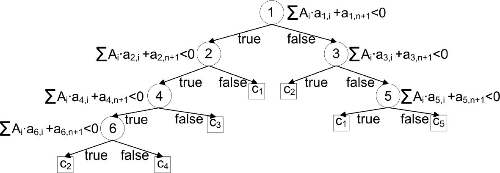
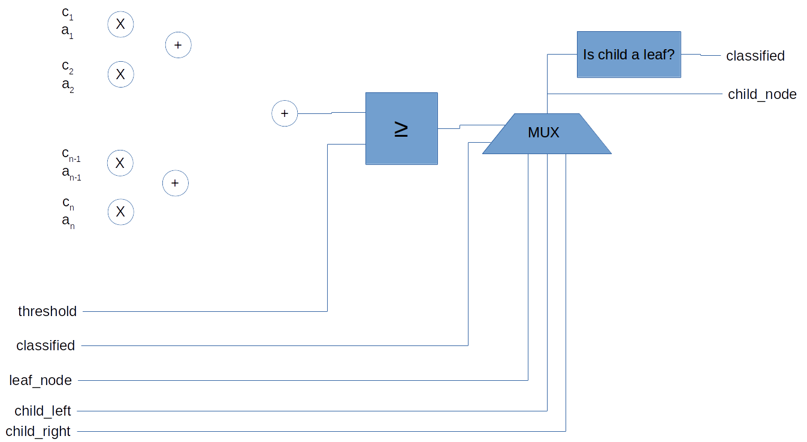
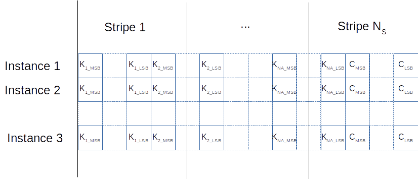

.. |algo| replace:: *FTEI*
.. |cop| replace:: *FTEIP*
.. |A| replace:: :math:`\mathbf{A}`
.. |a| replace:: :math:`\mathbf{a}`
.. |NA| replace:: :math:`\left | \mathbf{A} \right |`
.. |na| replace:: :math:`\bar{n}`
.. |NI| replace:: :math:`N_{I}`
.. |Da| replace:: :math:`\bar{D}`
.. |Nl| replace:: :math:`\bar{l}`
.. |NM| replace:: :math:`N_{M}`
.. |Nc| replace:: :math:`N_{c}`
.. |RA| replace:: :math:`R_{A}`
.. |alpha| replace:: :math:`{\alpha}`
.. |rho| replace:: :math:`{\rho}`

=========================================================================
A Co-Processor for Evolutionary Full Tree Oblique Decision Tree Induction
=========================================================================

Introduction
============

As a branch of artificial intelligence Machine learning :cite:`flach2012machine,murphy2012machine` comprises set of procedures/algorithms for construction of systems by adapting to the input data i.e. by "learning" from the data. Important feature of machine learning systems is that they can be built to perform well on previously unseen data instances (generalization property). 

In the open literature, a range of machine learning predictive models have been introduced, including decision trees (DTs) :cite:`rokach2007data,rokach2005top`, support vector machines (SVMs) :cite:`abe2005support` and artificial neural networks (ANNs) :cite:`haykin2009neural`. Data mining is a field where machine learning predictive models have been widely used (see e,g. :cite:`witten2005data`), among which DTs, ANNs and SVMs are most popular (e.g. :cite:`rokach2007data,wu2009top,wang2006data`).

Machine learning systems can be constructed by supervised learning, unsupervised learning or any combination of the two. Supervised learning implies using the desired responses to various input data to construct the system, while unsupervised learning implies constructing the system based only on input data. When the supervised learning is used, the lifetime of a machine learning system usually comprises two phases: training (induction or learning) and deployment. During the training phase the training set is used to create the system. The training set comprises various input data and the desired system responses to it. Once constructed, the system is ready for deployment, where new, previously unseen data will arrive and the system must provide the responses using the patterns extracted from the training set.

Machine learning systems can perform various tasks from the output point of view: classification, regression, clustering, etc. Classification implies categorizing objects given the list of their attributes.

Widely used to represent classification models is a decision tree (DT) classifier, which can be depicted in a flowchart-like tree structure. Due to its comprehensible nature that resembles the human reasoning, DT's have been widely used to represent classification models. Amongst other learning algorithms, DT have several advantages, such as robustness to noise, ability to deal with redundant attributes, ability to handle both numerical and categorical data and facility of understanding the computation process.

Computationally least demanding approach for DT induction is a greedy top-down recursive partitioning strategy for the tree growth, hence most DT induction algorithms use this approach. Naturally, this approach suffers from inability of escaping local optima. Better results are obtained by the inducers that work on full DT, with cost of higher computational complexity. Either way, inducers operate with highly unpredictable data, hence Evolutionary Algorithms (EAs) have been increasingly used for inducing DTs. The :num:`Figure #fig-evolutionary-dt-algorithm-tree` shows the taxonomy of EA for decision tree induction given in :cite:`RCB12`.

.. _fig-evolutionary-dt-algorithm-tree:

.. graphviz::
    :caption: Taxonomy of evolutionary algorithms for DT induction.
    
    digraph foo {
        node [ shape=box ]
        nodesep=0.5
        margin = 0.3
        ranksep = "0.3 equally"
        fontsize = 10
        "Evolutionary\n Decision Trees" -> "Full Tree"
        "Evolutionary\n Decision Trees" -> "Components"
        "Full Tree" -> "Classification"
        "Full Tree" -> "Regression"
        "Classification" -> "Axis-\n Parallel"
        "Classification" -> "Oblique"
        "Regression" -> "Regression\n Trees"
        "Regression" -> "Model\n Trees"
        "Components" -> "Hyperplanes"
        "Components" -> "Pruning"
        "Components" -> "Other"
    }

The algorithm implemented by the proposed co-processor is used for full tree classification oblique binary DT induction by EA, thus we call the implemented algorithm |algo| (Full Tree Evolutionary Induction), and the co-processor |cop| (Full Tree Evolutionary Induction co-Processor).

The :num:`Figure #fig-oblique-dt` shows an example of the oblique binary DT produced by the |algo| algorithm.

.. _fig-oblique-dt:

    
    An example of the oblique binary DT.

The leaves of the DT represent the classes of the problem. The non-leaves contain the tests which are performed on the problem instances in order to determine their path through the DT until they reach the DT leaves. Each instance of the problem is defined by its attribute vector - **A**. The tests performed by the oblique DT are then of the following form:

.. math:: \sum_{i=1}^{n}a_{i}\cdot A_{i} + a_{n+1} < 0, 
    :label: oblique_test

where **a** represents the coefficient vector, which defines the test at each node. The node test coefficient vector **a** contains additional element :math:`a_{n+1}` called the threshold, which models the afine part of the test.

Each instance is input to the DT root and traverses the DT in order to be assigned the class. If the test condition :eq:`oblique_test` is **true** in certain node, the DT traversal is continued e.g. on the left child, otherwise it is continued on the right child. Depending on the leaf the instance ended up at, it is classified in the corresponding class.

Related work
------------

The only work on the topic of hardware acceleration of DT induction using EAs that the authors are currently aware of is :cite:`struharik2009evolving`. However, this work focuses on greedy top-down approach where EA is used to calculate optimal coefficient vector one node at a time. Furthermore, the work has been done on accelerating SVMs (**where?**) and ANNs (**where?**).

The |algo| algorithm was chosen for acceleration since it proved in our experiments to provide smaller DTs without affecting the classification accuracy (**referenca ka internal reportu**). **sa kojim algoritmima je poredjeno** 

Being that the EAs are iterative by nature and computationally extensive, |algo| would surely benefit from hardware acceleration. 

|algo| algorithm
================

This section describes the |algo| algorithm, gives the block diagram and a pseudo-code for its software implementation. The DT is induced from the training set. Since the algorithm is performing suprovized learning, the training set consists of the problem instances which have the known class. The algorithm iteratively improves on the DT, so that the classification results calculated by the DT fit as good as possible to the known classification of the training set. Once the DT is formed, it will be used to classify new problem instances.

The :num:`Figure #fig-algorithm-pca` shows the algorithmic framework for the |algo|, which is similar for all EAs. The algorithm operates only on one DT individual, that is called *dt* in the pseudo-code.

.. include:: algorithm_pca.rst

There are three main tasks performed by the |algo|:

- DT Mutation - implemented in mutate() function
- Fitness evaluation - implemented in fitness_eval() function
- Individual selection

The complexity of the |algo| can be observed from the algorithm pseudo-code. Since individual selection is performed in constant time, the complexity can be computed as:

.. math:: max\_iter\cdot(O(mutate) + O(fitness\_eval))
    :label: cplx_algo_tot_components

Subsequent chapters provide details on DT mutation and Fitness evaluation tasks, as well as on their complexities.

DT Mutation
-----------

There are two types of mutations performed on the DT individual:

- Node test coefficients mutation
- DT topology mutation

During each iteration of |algo|, a small portion |alpha| of DT node test coefficients is mutated at random. Every change in node test influences the classification, as the instances take different paths through the DT. Usually one coefficient per several nodes is mutated in order for classification to change in small steps. Otherwise the algorithm would resemble the random search.  

On the other hand, topology mutations represent very large moves in the search space, so they are performed even less often. Every iteration there is a small chance |rho| that the node will either be added to the DT or removed from it. This change either adds an additional test for the classification, or removes one or whole subtree of tests. By adding a test, a new point is created where during classification instances from different classes might separate and take different paths through the DT and eventually be classified as different. This increases the accuracy of the DT. On the other hand, by removing the unnecessary test the DT is made smaller and the size of the DT also influences its fitness.

Lets calculate the complexity of the DT Mutation task. Let |Da| be the average DT depth. The average number of nodes in DT, denoted by |na| is then:

.. math:: \bar{n}=2^{\bar{D}}

Each node in DT has |NA| + 1 coefficients, and the portion |alpha| is mutated each iteration, so the complexity of mutating coefficients is:

.. math:: O(\alpha \cdot \bar{n} \cdot \left | \mathbf{A} \right |)

The topology can be mutated by either adding or removing the node from the DT. When the node is removed, only a pointer to the removed child is altered so the complexity is:

.. math:: O(1)

When the node is added, the new set of node test coefficients are calculated at radnom, hence the complexity of:

.. math:: O(\left | \mathbf{A} \right |)

Since :math:`\rho\ll\alpha\cdot\bar{n}` The complexity of the whole DT Mutation task sums to:

.. math:: O(\alpha \cdot \bar{n} \cdot \left | \mathbf{A} \right | + \rho (O(1)+O(\left | \mathbf{A} \right |))) = O(\alpha \cdot \bar{n} \cdot \left | \mathbf{A} \right |)
    :label: cplx_mutation

Fitness Evaluation
------------------

The fitness of a mutated individual (DT) is evaluated using the training set. The DT is let to classify all the problem instances and the results are then compared to the known classification given in the training set. The pseudo-code for this task is given in :num:`Figure #fig-fitness-eval-pca`. The input parameter **dt** is the current decision tree individual.

.. include:: fitness_eval_pca.rst

The fitness evaluation task performs the following:

- It finds the distribution of the classes over the leaves
- It finds the dominant class for each leaf
- It calculates the fitness as the percentage of classification hits

Let |NI| be the number of instances in the training set, |Nl| the average number of leaves and |Nc| the total number of classes in the classification problem. The number of leaves in DT can be approximated by:

.. math:: \bar{l} = 2^{\bar{D} - 1}

The complexity of the fitness_eval() function is then as follows:

.. math:: O(N_{I})\cdot (O(find\_dt\_leaf\_for\_inst) + O(1)) + O(\bar{l}\cdot (N_{c} + 1))
    :label: fitness_eval

First, the classes distribution is determined by letting all the instances from the training set traverse the DT, i.e. by calling the find_dt_leaf_for_inst() function whose pseudo-code is given in :num:`Figure #fig-find-dt-leaf-for-inst-pca`. This function returns the ID of a leaf node in which the instance ended-up. The traversal is performed in the manner depicted in the :num:`Figure #fig-oblique-dt`.

.. include:: find_dt_leaf_for_inst_pca.rst

The complexity of the find_dt_leaf_for_inst() function is then:

.. math:: O(\bar{D})\cdot O(evaluate\_node\_test)
    :label: find_dt_leaf

The evaluate_node_test() function performs the node test evaluation given by equation :eq:`oblique_test`. The pseudo-code of this function is given in :num:`Figure #fig-evaluate-node-test-pca`.

.. include:: evaluate_node_test_pca.rst

The complexity of the node test evaluation is:

.. math:: O(\left | \mathbf{A} \right |)
    :label: node_test_eval

The classes of all the instances from the training set are known and stored in *instance_class* variable (from the fitness_eval() function) for each instance. Based on the leaf nodes' IDs returned by find_dt_leaf_for_inst() and the *instance_class* variable value, the *distribution* matrix is updated. The :math:`d_{i,j}` element of the *distribution* matrix contains the number of instances of class *j* than ended up in the leaf node with ID *i* after traversal. After all the instances from training set traverse the DT, this matrix contains the distribution of classes among the leaf nodes.

Second, the next loop of the fitness_eval() finds the dominant class for each leaf node, i.e. the class with largest number of its instances that have ended up in that leaf node after traversal. If we were to do a classification run with current DT over the training set, the maximum accuracy would be attained if all the leaf nodes were assigned their corresponding dominant class calculated in this way. Thus, we could qualify as a hit each instance that ended up in a certain leaf node if it is of the node's dominant class, otherwise we could qualify it as a miss.

Therefore, the fitness assigned to the current DT individual (returned via the *fitness* variable of the fitness_eval() function in :num:`Figure #fig-fitness-eval-pca`) equals the accuracy of the DT over the training set if it's leaf nodes were assigned their corresponding dominant classes.

Algorithm complexity
--------------------

By inserting equation :eq:`node_test_eval` into the equation :eq:`find_dt_leaf`, and then both of them into the equation :eq:`fitness_eval`, we obtain the complexity for the fitness_eval() function:

.. math:: O(N_{I}\cdot (\bar{D}\cdot \left | \mathbf{A} \right | + 1) + \bar{l}\cdot (N_{c} + 1)) = O(N_{I}\cdot\bar{D}\cdot N_{A} + \bar{l}\cdot N_{c})
    :label: fitness_eval_tot

By inserting equations :eq:`fitness_eval_tot` and :eq:`cplx_mutation` into the equation :eq:`cplx_algo_tot_components`, we obtain:

.. math:: max\_iter\cdot(N_{I}\cdot\bar{D}\cdot \left | \mathbf{A} \right | + \bar{l}\cdot N_{c} + \alpha \cdot \bar{n} \cdot \left | \mathbf{A} \right |)

Since :math:`\alpha\cdot\bar{n} \ll N_{I}\cdot\bar{D}`, we finally obtain that algorithm complexity is dominated by the fitness evaluation complexity, and sums up to:

.. math:: O(max\_iter\cdot(N_{I}\cdot\bar{D}\cdot N_{A} + \bar{l}\cdot N_{c}))

Profiling results
-----------------

The |algo| was implemented in C using many optimization techniques:

- Arithmetic operation on 64-bit operands only (optimized for 64-bit CPUs)
- Loop unfolding for node test evaluation loop :num:`Figure #fig-evaluate-node-test-pca`
- Maximum compiler optimization settings

It was compiled using GCC 4.8.2 compiler and run on AMD Phenom(tm) II X4 965 computer.
After the profiling with GProf tool, thre results on :num:`Figure #fig-profiling` were obtained. The results were consistent with the algorithm complexity analysis performed in the previous chapter.

.. _fig-profiling:

.. figure:: images/profiling.png
    
    Profiling results.

Conclusion
----------

The |algo| has obvious computational bottleneck in the fitness calculation task, which takes almost 100% of computational time in the example run shown in :num:`Figure #fig-profiling`. So the fitness calculation is clear candidate for hardware optimization. Since the DT mutation task takes insignificant amount of time to perform, it was decided for it to be left in software. Major advantage of leaving the mutation in software is the ease of changing and experimenting with this task.

Co-processor for DT induction - |cop|
=====================================

The |cop| performs the task of fitness evaluation (:num:`Figure #fig-fitness-eval-pca`) within the |algo| algorithm. The block diagram of the |cop| system is given in :num:`Figure #fig-system-bd`

.. _fig-system-bd:

.. figure:: images/system_bd.py
    :width: 100%
    
    System

The co-processor connects to the CPU via AXI4 AMBA bus. The major parts and their connections are depicted in the :num:`Figure #fig-system-bd`:

- **Control Unit**: Acts as a bridge between the AXI4 and internal protocols and controls the fitness evaluation process.
- **Training Set Memory**: The memory for storing all training set instances
- **Classifier**: Performs the DT traversal for each instance, i.e. implements the find_dt_leaf_for_inst() function on :num:`Figure #fig-find-dt-leaf-for-inst-pca`. The classification process is pipelined with the stages :math:`L_{0}` through :math:`L_{D-1}` separated by dotted lines in Classifier block in figure. For each instance in training set, the Classifier outputs the ID assigned to the leaf into which the instance was classified after traversal (please refer to fitness_eval() function :num:`Figure #fig-fitness-eval-pca`).
- **DT Memory Array**: The array of memories used to store the DT description. The Classifier calculates node test for each DT level in parallel. Each Classifier pipeline stage requires its own memory that holds description of all nodes on the DT level it is associated with.
- **Fitness Calculator**: Calculates the accuracy of the DT based on the classification data received from the Classifier. For each instance of the training set, the Classifier supplies the ID of the leaf into which the instance was classified. Based on this information, the Fitness Calculator forms the distribution matrix and calculates the DT accuracy which is sent to the Control Unit and stored in the memory-maped register, ready to be read by the user.

Classifier
----------

Classifier performs the classification of an arbitrary set of instances on an arbitrary oblique DT. The Classifier was implemented after the design described in :cite:`RS09`. The original architecture from :cite:`RS09` was designed to perform the classification using already induced DTs, so it was adapted to support the DT induction as well, and is shown in :num:`Figure #fig-dt-classifier-bd`:

.. _fig-dt-classifier-bd:

.. figure:: images/classifier.py
    
    Classifier architecture used in the induction mode.

The Classifier performs the DT traversal for each instance (:num:`Figure #fig-oblique-dt`), i.e. implements the find_dt_leaf_for_inst() function on :num:`Figure #fig-find-dt-leaf-for-inst-pca`. The instance traversal path is determined by the outcome of the node tests :eq:`oblique_test`, of which there is only one per DT level. Hence, this process is suitable for pipelining with one stage per DT level. The number of stages in the pipeline determines the maximum depth of the DT that can be induced, and is specified by the user during the design phase.

Each pipeline stage can perform node test calculation for any DT node of the corresponding DT level. First stage always processes the root DT node, however which nodes are processed by other stages, depends on the path of traversal for each individual instance. Every stage has one DT Memory associated that holds the descriptions of all the nodes on that DT level.

Each pipeline stage has two main blocks:

- Node Test Evaluator - NTE
- Instance Queue

For each instance received at the Classifier input, the first NTE block processes the calculation given by equation :eq:`oblique_test` for the attributes of received instance |A| and root node coefficients |a|. It then decides on how to proceed with DT traversal: via left or via right child, which can be either a leaf or a non-leaf node. If the child is a non-leaf node, its ID is output to the next pipeline stage where the traversal is continued. On the other hand, if the child is a leaf, the classification is done, the ID of a leaf node is output to next pipeline stage informing it that no further calculation need to be done for this instance. Each NTE operation corresponds to one iteration of the find_dt_elaf_for_inst() function loop (:num:`Figure #fig-find-dt-leaf-for-inst-pca`), and its output to the *cur_node_id* variable. The instance is also passed to the next stage along with the child node ID, since next stage will perform the calculation on it as well, i.e. the instance traverses to the next DT level.

All subsequent stages operate in similar manner, except that in addition they also receive the calculation results from their predecessors. If NTE receives the ID of the leaf node, meaning that the instance is already classified, it simply passes this information onward and performs no computation. On the other hand, if ID of the non-leaf node is received, the following is performed:

1. The node coefficients |a| are fetched from the DT Memory using ID as the index
2. Node test calculation is performed
3. The ID of the child is calculated and passed along with the instance to the next stage

The NTE operation is again pipelined for maximal throughput, which makes the use of the Instance Queue necessary. The Instance Queue delays the passing of the instance to the next Classifier pipeline stage until its corresponding calculation is done, i.e. all the NTE internal pipeline stages are passed. Block diagram in the :num:`Figure #fig-dt-test-eval-bd` shows the architecture of the NTE.

.. _fig-dt-test-eval-bd:

    
    DT test evaluation block architecture

The test evaluation block performs the sum of products given by :eq:`oblique_test`. By using only binary multipliers and adders, the computation is parallelized and pipelined as much as possible. The multiplications are performed in parallel for all |NA| coefficient and attribute pairs. Since there are only binary adders at disposal and the |NA|-rnary sum is needed, the tree of binary adders is formed. The tree needs to be :math:`\left \lceil log_{2}(N_{A})  \right \rceil` deep. 

Each calculation step is pipelined so that maximum speed of execution is achieved. Finally, the total number of pipeline stages needed equals the depth of the adder tree, plus a multiplication stage :math:`\left \lceil log_{2}(N_{A}) + 1 \right \rceil`.

The result of the calculation is than compared with the node test threshold to determine if the traversal will continue to the left or right child. Along with node test coefficients |a| in the DT Memory, the IDs of the child nodes are stored in the fields: *child_left_id*, *child_right_id*, *leaf_left_id* and *leaf_right_id*. If the left child is a non-leaf node, the *child_left_id* contains the ID of the child node in the next DT level, i.e. index of the child node in the next node's DT Memory, and the *leaf_left_id* is empty, i.e. equals 0. On the other hand, if left child is a leaf node, *leaf_left_id* is non-zero value representing the leaf node ID, while *child_left_id* is disregarded. The right child IDs are interpreted analogously. Depending on the decision to continue with the traversal to the left or right, *child_left_id* or *child_right_id* is output to the *child_id_out* and *leaf_left_id* or *leaf_right_id* is output to the *class_id_in* for the next NTE. When NTE receives the non-zero value for the *class_id*, the calculation result is disregarded (it is performed nevertheless in order to simplify the design) and the *class_id_in* is simply passed to the *class_id_out*.

The value of the threshold, child ID fields and the *class_id_in* are delayed by the queue for the same reasons the Instance Queue was introduced, i.e. in order for them to be ready once the corresponding calculation is finished and the traversal choice is made.

Training Set Memory
-------------------

This is the memory that holds all training set instances. The memory organization is shown in :num:`Figure #fig-inst-mem-org`. It is comprised of 32-bit wide stripes in order to be accessed by the CPU via 32-bit AXI. Each instance description comprises the following fields:

- Array of instance attribute values: :math:`\mathbf{A}_{1}` to :math:`\mathbf{A}_{\left | \mathbf{A} \right |}`.
- Instance class: *C*

Whole training set instance can span multiple stripes, depending on the number of attributes, and attribute and class encoding resolution :math:`R_{A}*\left | \mathbf{A} \right | + R_{C}`.

.. _fig-inst-mem-org:

    
    Training set memory organization

Instance attributes can be encoded using arbitrary fixed point format. However, the same format has to be used for all instances attribute encodings.

Training set memory can be accessed via two ports:

- Port A: 32-bit R/W port accessed by the CPU via AXI interface
- Port B: Port for parallel read-out of the whole instance

DT Memory Array
---------------

This is the memory that holds the DT description. For each pipeline stage shown in :num:`Figure #fig-dt-classifier-bd`, there is one DT Memory array element that holds the description of all nodes on the corresponding DT level as shown in :num:`Figure #fig-dt-classifier-bd`. 

.. _fig-dt-mem-array-org:

    
    DT memory organization

Each DT memory array element contains a list of node descriptions as shown in :num:`Figure #fig-dt-mem-array-org`, comprising the following fields:

- Array of node test coefficients: :math:`\mathbf{a}_{1}` to :math:`\mathbf{a}_{\left | \mathbf{A} \right |}`.
- The node test threshold: *threshold*
- ID of the left child if it is leaf: *leaf_left_id*
- ID of the left child if it is non-leaf: *child_left_id* 
- ID of the right child if it is leaf: *leaf_right_id*
- ID of the right child if it is non-leaf: *child_right_id* 
- Instance class: *C*

As it was already described in the Chapter `Classifier`_, for both left and right child IDs, if the leaf ID field has non-zero value, the child is interpreted as a leaf and the field value represents the leaf node ID and the child ID field value is ignored. On the other hand, if the leaf ID field value is zero, the child ID field value represents the index in the next DT Memory Array element at which the child description located.

The memory elements are implemented as 32-bit wide stripes in order to be accessed by the CPU via 32-bit AXI. Node descriptions can span multiple stripes, depending on the number of attributes, and the attribute, child IDs and class encoding resolutions :math:`R_{A}*\left | \mathbf{A} \right | + R_{threshold} + 2*R_{leaf ID} + 2*R{child ID} + R_{C}`.

DT memory array element can be accessed via two ports:

- Port A: 32-bit R/W port accessed by the CPU via AXI interface
- Port B: Port for parallel read-out of the whole node description

Fitness calculator
------------------

This module calculates the accuracy of the DT via *distribution* matrix as described in `Fitness Evaluation`_ chapter. It monitors the output of the Classifier module, i.e the training set classification, and for each instance in the training set, based its class (*C*) and the node into which it was classified (*leaf_id*), appropriate cell of the *distribution* matrix is incremented.

In order to speed up the dominant class calculation (second loop of the fitness_eval() function in :num:`Figure #fig-fitness-eval-pca`), the fitness calculator is implemented as an array of calculators, whose each element keeps track of the distribution for the single leaf node. Hence, the dominant class calculation (*dominant_class_cnt*) can be done in parallel for each leaf node. Each calculator comprises:

- **Memory** for keeping track of the class distribution of corresponding leaf node
- **Incrementer**: Updates the memory based on the Classifier output
- **The dominant class calculator**: For each training set class, calculates how many instances of that class were classified in the corresponding leaf node. It then finds which class had the highest number of classifications in the corresponding leaf node (dominant class), and outputs that number (*dominant_class_cnt*). If the instance's class equals the dominant class of the leaf node it was classified into, it is considered a hit, otherwise it is considered a miss. Hence, *dominant_class_cnt* represents the number of hits for the corresponding leaf node.

Fitness calculator then sums the hits for all leaf node calculators and outputs the sum as number of hits for whole DT. The number is then stored in the register of the Control Unit from where it can be read-out by the CPU.

Required Hardware Resources and Induction Throughput
----------------------------------------------------

The number of Classifier pipeline stages equals the maximum supported DT size :math:`D_{M}`. Since each NTE is also pipelined internally, the total number of pipeline stages is:

.. math:: N_{P} = D_{M}\cdot (\left\lceil log_{2}(\left | \mathbf{A^{M}} \right |) \right\rceil + 2)
    :label: pip_stg_cnt

.. tabularcolumns:: l l l

.. list-table:: Required hardware resources for the |cop| architecture implementation
    :header-rows: 1 
    
    * - Resource Type
      - Module
      - Quantity
    * - RAMs (total number of bits)
      - Training Set Memory
      - :math:`N^{M}_{I}\cdot (R_{A}*\left | \mathbf{A} \right | + R_{C})`
    * - 
      - DT Memory Array
      - :math:`(2^{D^{M}} - 1) N^{M}_{nl}\cdot (R_{A}*\left | \mathbf{A} \right | + R_{threshold} + 2*R_{leaf ID} + 2*R{child ID} + R_{C})`
    * - 
      - Fitness Calculator
      - :math:`(2^{D^{M} - 1})\cdot C^{M}\cdot \left \lceil log_{2}(N^{M}_{I})  \right \rceil`
    * - 
      - Classifier
      - :math:`D\cdot N_{P}\cdot (2*R_{A}*\left | \mathbf{A} \right | + R_{C} + R_{threshold} + 2*R_{leaf ID} + 2*R{child ID} + R_{C})`
    * - Multipliers
      - Classifier
      - :math:`\left | \mathbf{A^{M}} \right |`
    * - Adders
      - Classifier
      - :math:`\left \lceil log_{2}(N_{A})  \right \rceil`
    * - Incrementers
      - Fitness Calculator
      - :math:`2^{D^{M} - 1}`

Second, the number of clock cycles required to determine the DT accuracy will be discussed. The Classifier has a throughput of one instance per clock cycle, however there is an initial latency equal to the length of the pipeline :math:`N_{P}`. The fitness calculator needs extra time after the classification has finished in order to determine the dominant class which is equal to the total number of classes in the training set *C*. This sums up to:

.. math:: N_{C} = N_{I} + N_{P} + C,

and is thus dependent on the training set.

Software for |cop| assisted DT induction
========================================

With |cop| performing fitness evaluation task, remaining functionality of the |algo| (:num:`Figure #fig-algorithm-pca`) can be implemented in software. Furthermore, software needs to implement procedures for interfacing the co-processor as well. The pseudo-code for software used in the co-design is given

.. include:: co_design_sw_pca.rst

All functions whose name starts with "hw" are the interface functions for the co-processor.

Experiments
===========

In this section the results of the experiments designed to estimate DT induction speedup of the |algo| hardware implementation over its software implementation are given.

Table 3 shows 21 datasets, selected from the UCI benchmark datasets database :cite:`newman1998uci`, that were used in the speed-up estimation experiments.

.. tabularcolumns:: l p{30pt} p{40pt} p{40pt} p{40pt}

.. list-table:: Characteristics of the UCI datasets used in the experiments
    :header-rows: 1 
    
    * - Dataset Name
      - Short Name
      - No. of attributes
      - No. of instances
      - No. of classes
    * - Australian Credit Approval
      - ausc
      - 14Error
      - 690
      - 2
    * - Credit Approval
      - ca
      - 15
      - 699
      - 2
    * - Car Evaluation
      - car
      - 6
      - 1728
      - 4
    * - Contraceptive Method Choice
      - cmc
      - 9
      - 1473
      - 3
    * - Cardiotocography
      - ctg
      - 21
      - 2126
      - 10
    * - German Credit Data
      - ger
      - 24
      - 1000
      - 2
    * - Japanese Vowels
      - jvow
      - 14
      - 4274
      - 9
    * - Page Block Classification
      - page
      - 10
      - 5473
      - 5
    * - Pima Indians Diabetes
      - pid
      - 8
      - 768
      - 2
    * - Parkinson Speech
      - psd
      - 27
      - 1040
      - 2
    * - Seismic Bumps
      - sb
      - 18
      - 2584
      - 2
    * - Image Segmentation
      - seg
      - 18
      - 2310
      - 7
    * - Sick
      - sick
      - 29
      - 3722
      - 2
    * - SPECT Heart
      - spect
      - 22
      - 267
      - 2
    * - Stell Plates Faults
      - spf
      - 21
      - 1941
      - 7
    * - Thyroid Disease
      - thy
      - 29
      - 3722
      - 4
    * - Vehicle Silhouettes
      - veh
      - 18
      - 846
      - 4
    * - Congressional Voting Records
      - vote
      - 16
      - 435
      - 2
    * - Vowel Recognition
      - vow
      - 10
      - 990
      - 11
    * - Waveform Database Generator
      - w21
      - 21
      - 5000
      - 3
    * - Wall Following Robot Navigation
      - wfr
      - 24
      - 5456
      - 4

Required Hardware Resources and Scalability
-------------------------------------------

The parameters of the |cop| architecture have been set to support all training sets from Table 3. 

.. tabularcolumns:: c c 

.. list-table:: Characteristics of the UCI datasets used in the experiments
    :header-rows: 1 
    
    * - Parameter
      - Value
    * - DT Max. Depth (:math:`D^{M}`)
      - 6
    * - Max. Attributes Num. (:math:`\left | \mathbf{A^{M}} \right |`)
      - 32
    * - Attribute Encoding Resolution (:math:`R_{A}`)
      - 16
    * - Class Encoding Resolution
      - 8
    * - Max. Training Set Classes
      - 16

The |cop| has been implemented using the Xilinx Vivado Design Suite 2014.4 software for logic synthesis and implementation with default synthesis and P&R options. From the implementation report files, device utilization data has been analyzed and information about the number of used slices, BRAMs and DSP blocks has been extracted, and is presented in Table 4. The maximum operating frequency of 133 MHz of system clock frequency for the implemented |cop| architecture was attained.

.. tabularcolumns:: c c c c

.. list-table:: FPGA resources required to implement |cop| architecture for DT induction with selected UCI datasets
    :header-rows: 1 
    
    * - FPGA Device
      - Slices
      - BRAMs
      - DSPs
    * - XC7Z020
      - 6587
      - 65
      - 192

Estimation of Induction Speed-up
--------------------------------

The software was implemented in C language and run on two platforms:

- AMD Phenom(tm) II X4 965, built by GCC 4.8.2 compiler
- ARM Cortex-A9 667MHz (Xilinx XC7Z020-1CLG484C Zynq-7000), built by Sourcery CodeBench Lite ARM EABI 4.8.3 compiler (from within Xilinx SDK 2014.4)

Care was taken in writing the software and many optimization techniques were employed as described in chapter `Profiling results`_.

For each of datasets from Table 3, an experiment consisting of five 10-fold cross-validations has been performed. Using test set, average instance classification time has been measured for both software and hardware implementations. Software timing was extracted differently for two implementations

- For PC implementation, the <time.h> C library was used and timing was output to the console
- For ARM implementation, TTC hardware timer was used and timing was output via UART

All test sets from Table 3 were compiled together with the source code and were readily available in the memory, thus there was no loading overhead on the DT induction timings. As for the hardware implementation test sets needed to be loaded from the CPU memory via AXI bus, so this operation was excluded from timing analysis.

Average classification speed-up gain of hardware implementation over the software implementation has been estimated based on the measured instance classification times for every dataset from Table 3. This procedure has been repeated for all ten types of ensemble classifiers and the results are presented in Table 5.

.. tabularcolumns:: l r r r

.. csv-table:: Characteristics of the UCI datasets used in the experiments
    :header-rows: 1
    :file: results.csv

Table 5 suggests that hardware architecture offers a substantial speed-up in comparison to software for all

Conclusion
==========

In this paper a universal 

.. bibliography:: hereboy.bib
	:style: unsrt

