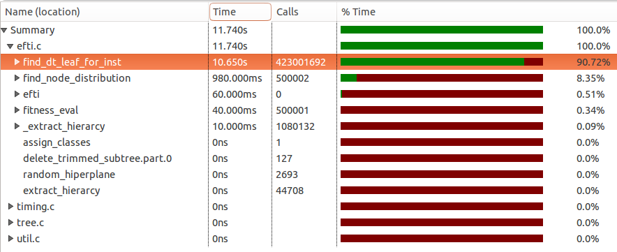

.. |algo| replace:: *EFTI*
.. |cop| replace:: *EFTIP*
.. |A| replace:: :math:`\mathbf{A}`
.. |a| replace:: :math:`\mathbf{a}`
.. |NA| replace:: :math:`N_{A}`
.. |NAM| replace:: :math:`N^{M}_{A}`
.. |NIM| replace:: :math:`N^{M}_{I}`
.. |na| replace:: :math:`\bar{n}`
.. |NI| replace:: :math:`N_{I}`
.. |Da| replace:: :math:`\bar{D}`
.. |Nl| replace:: :math:`N_l`
.. |NlM| replace:: :math:`N^{M}_{l}`
.. |NnM_l| replace:: :math:`N^{M}_{n}(l)`
.. |NM| replace:: :math:`N_{M}`
.. |DM| replace:: :math:`D^{M}`
.. |Nc| replace:: :math:`N_{c}`
.. |NP| replace:: :math:`N_{P}`
.. |RA| replace:: :math:`R_{A}`
.. |alpha| replace:: :math:`{\alpha}`
.. |rho| replace:: :math:`{\rho}`
.. |ChLi| replace:: :math:`ChL_{i}`
.. |LfLi| replace:: :math:`LfL_{i}`
.. |ChRi| replace:: :math:`ChR_{i}`
.. |LfRi| replace:: :math:`LfR_{i}`

.. role:: raw(raw)
   :format: latex

==========================================================
Co-Processor for Evolutionary Full Decision Tree Induction
==========================================================

Introduction
============

As a branch of artificial intelligence, machine learning :cite:`flach2012machine,murphy2012machine` comprises a set of procedures/algorithms for the construction of the systems that adapt their behavior to the input data, i.e. by "learning" from the data. An important feature of the machine learning systems is that they can be built with little knowledge of input data and can perform well on previously unseen data instances (generalization property).

In the open literature, a range of machine learning systems have been introduced, including decision trees (DTs) :cite:`rokach2007data,rokach2005top`, support vector machines (SVMs) :cite:`abe2005support` and artificial neural networks (ANNs) :cite:`haykin2009neural`. Data mining is a field where machine learning systems have been widely used :cite:`witten2005data`, among which DTs, ANNs and SVMs are the most popular :cite:`rokach2007data,wu2009top,wang2006data`.

The machine learning systems can be constructed using supervised learning, unsupervised learning or any combination of the two techniques :cite:`flach2012machine,murphy2012machine`.  Supervised learning implies using the desired responses to various input data to construct the system, while unsupervised learning implies constructing the system based on the input data only. When the supervised learning is used, the lifetime of a machine learning system usually comprises two phases: the training (induction or learning) and the deployment. During the training phase, a training set is used to build the system. The training set comprises input data and the desired system responses to that data. Once constructed, the system is ready to be used, where new, previously unseen data, will arrive and the system must provide the responses using the knowledge extracted from the training set.

The machine learning systems can perform various tasks, such as classification, regression, clustering, etc. The classification implies categorizing objects given the list of their attributes. Widely used to represent classification models is a DT classifier, which can be depicted in a flowchart-like tree structure. Due to their comprehensible nature, that resembles the human reasoning, DTs have been widely used to represent classification models. Amongst other machine learning algorithms DTs have several advantages, such as the robustness to noise, the ability to deal with redundant or missing attributes, the ability to handle both numerical and categorical data and the facility of understanding the computation process.

This paper focuses on oblique binary classification DTs. The leaves of the DT represent the classes of the problem. The non-leaves contain the tests which are performed on the problem instances in order to determine their path through the DT until they reach DT leaves. Each instance of the problem is defined by its attribute vector - **A**. The tests performed by oblique DT in each node have the following form:

.. math:: \mathbf{a}\cdot \mathbf{A} = \sum_{i=1}^{N_A}a_{i}\cdot A_{i} < thr,
    :label: oblique_test

where **a** represents the coefficient vector, |NA| equals the size of the attribute and the coefficient vectors and *thr* models the afine part of the test. The :num:`Figure #fig-oblique-dt` shows an example of the oblique binary DT.

.. _fig-oblique-dt:

.. figure:: images/dt_traversal.py

    An example of the oblique binary DT with one possible traversal path shown in red.

Each instance starts from the DT root node and traverses the DT in order to be assigned a class. If the test condition given by the equation :eq:`oblique_test` is **true**, the DT traversal is continued via the left child, otherwise it is continued via the right child. Depending on the leaf in which the instance finishes after DT traversal, it is classified into the class assigned to that leaf. One possible traversal path is shown in the :num:`Figure #fig-oblique-dt` in red. After the traversal, the instance will be classified into the class :math:`C_{4}`.

There are two general approaches to DT induction: incremental (node-by-node) and full tree induction. Furthermore, the process of finding the optimal oblique DT is a hard algorithmic problem :cite:`heath1993induction`, therefore most of the oblique DT induction algorithms use some kind of heuristic for the optimization process, which is often some sort of evolutionary algorithm (EA). The :num:`Figure #fig-evolutionary-dt-algorithm-tree` shows the taxonomy of EAs for the DT induction as presented in :cite:`barros2012survey`. Computationally least demanding approach for the DT induction is a greedy top-down recursive partitioning strategy for the tree growth, hence most of the DT induction algorithms use this approach. Naturally, this approach suffers from the inability of escaping the local optima. Better results, especially if the DT size is considered, could be obtained by the inducers that work on full DT, with cost of the higher computational complexity :cite:`struharik2014inducing`.

The DT induction phase can be very computationally demanding and can last for hours or even days for practical problems. This is certainly true for the full DT inference algorithms. By accelerating this task, the machine learning systems could be trained faster, allowing for shorter design cycles, or could process large amounts of data, which is of particular interest if the DTs are used in the data mining applications :cite:`witten2005data`. This might also allow the DT learning systems to be rebuilt in real-time, for the applications that require such rapid adapting, such as: machine vision :cite:`prince2012computer,challa2011fundamentals`, bioinformatics :cite:`lesk2013introduction,baldi2001bioinformatics`, web mining :cite:`liu2007web,russell2013mining`, text mining :cite:`weiss2010fundamentals,aggarwal2012mining`, etc.

.. _fig-evolutionary-dt-algorithm-tree:

.. figure:: images/taxonomy.pdf

    The taxonomy of evolutionary algorithms for DT induction.

In order to accelerate the DT induction phase, two general approaches can be used. First approach focuses on developing new algorithmic frameworks or new software tools, and is the dominant way of meeting this requirement :cite:`bekkerman2011scaling,choudhary2011accelerating`. Second approach focuses on the hardware acceleration of machine learning algorithms, by developing new hardware architectures optimized for accelerating the selected machine learning systems.

Proposed co-processor is used for the acceleration of a new DT induction algorithm, called |algo|. |algo| (Evolutionary Full Tree Induction) is an algorithm for full oblique classification DT induction using EA. In the remaining of the paper, the proposed co-processor will be called |cop| (Evolutionary Full Tree Induction co-Processor).

The hardware acceleration of the machine learning algorithms receives a significant attention in the scientific community. A wide range of solutions have been suggested in the open literature for various predictive models. The authors are aware of the work that has been done on accelerating SVMs and ANNs, where hardware architectures for the acceleration of both learning and deployment phases have been proposed. The architectures for the hardware acceleration of SVM learning algorithms have been proposed in :cite:`anguita2003digital`, while the architectures for the acceleration of previously created SVMs have been proposed in :cite:`papadonikolakis2012novel,anguita2011fpga,mahmoodi2011fpga,vranjkovic2011new`. The research in the hardware acceleration of ANNs has been particularly intensive. Numerous hardware architectures for the acceleration of already learned ANNs have been proposed :cite:`savich2012scalable,vainbrand2011scalable,echanobe2014fpga`. Also, a large number of hardware architectures capable of implementing ANN learning algorithms in hardware have been proposed :cite:`misra2010artificial,omondi2006fpga,madokoro2013hardware`. However, in the field of hardware acceleration of the DTs, the majority of the papers focus on the acceleration of already created DTs :cite:`struharik2009intellectual,li2011low,saqib2015pipelined`. Hardware acceleration of DT induction phase is scarcely covered. The authors are currently aware of only two papers on the topic of hardware acceleration of the DT induction algorithms :cite:`struharik2009evolving,chrysos2013hc`. However, both of these results focus on accelerating greedy top-down DT induction approaches. In :cite:`struharik2009evolving` the incremental DT induction algorithm, where EA is used to calculate the optimal coefficient vector one node at a time, is completely accelerated in hardware. In :cite:`chrysos2013hc` a HW/SW approach was used to accelerate the computationally most demanding part of the well known CART incremental DT induction algorithm.

This paper is concerned with the hardware acceleration of a novel full DT evolutionary induction algorithm, called |algo|. |algo| is an algorithm for full oblique classification DT induction using EA :cite:`efti`. As mentioned earlier, full DT induction algorithms typically build better DTs (smaller and more accurate) when compared with the incremental DT induction algorithms. However, full DT induction algorithms are more computationally demanding, requiring much more time to build a DT. This is one of the reasons why incremental DT induction algorithms are currently dominating the DT field. Developing a hardware accelerator for full DT induction algorithm should significantly decrease the DT inference time, and therefore make it more attractive. As far as the authors are aware, this is the first paper concerned with the hardware acceleration of full DT induction algorithm.

The |algo| algorithm was chosen to be accelerated by hardware, since it does not use the population of individuals as most of EA-based DT algorithms do :cite:`bot2000application,krketowski2005global,llora2004mixed,papagelis2000ga`. As far as authors are aware, this is the first full DT building algorithm that operates on a single-individual population. This makes the |algo| algorithm particularly interesting to be used in embedded applications, where memory and processing resources are tightly constrained. The |algo| algorithm proved to provide smaller DTs with similar or better classification accuracy than other well-known DT inference algorithms, both incremental and full DT :cite:`vukobratovic2015evolving`. Being that the EAs are iterative by nature and extensively perform simple computations on the data, the |algo| algorithm should benefit from the hardware acceleration, as would any other DT induction algorithm based on the EAs. This paper proposes |cop| co-processor to accelerate only the most computationally intensive part of the |algo| algorithm, leaving the remaining parts of the algorithm in software. In the paper, it is shown that the most critical part of the |algo| algorithm is the training set classification step from the fitness evaluation phase. |cop| has been designed to accelerate this step in hardware. Another advantage of this HW/SW co-design approach is that the proposed |cop| co-processor can be used with a wide variety of other EA-based DT induction algorithms :cite:`barros2012survey,bot2000application,krketowski2005global,llora2004mixed,papagelis2000ga` to accelerate the training set classification step that is always present during the fitness evaluation phase.

|algo| algorithm
================

This section describes the |algo| algorithm for full DT induction based on EA. This algorithm requires only one individual for DT induction, which represents the best DT evolved up to the current iteration. The DT is induced from the training set. Since the algorithm performs supervised learning, the training set consists of the problem instances which have the known class membership. The |algo| algorithm starts from the randomly generated one-node DT and iteratively tries to improve on it. In each iteration DT is slightly changed, i.e. mutated, and let to perform the classification of the training set instances. The classification results are then compared with the known classification given in the training set. If the newly mutated DT provides better classification results than its predecessor, it is taken as the new current best individual, i.e. in the next iteration it will become the base for the mutation. This process is repeated for the desired number of iterations, after which the algorithm exits and the best DT individual is returned. Once the DT is formed in this way, it can be used to classify new instances of the problem.

The :num:`Algorithm #fig-algorithm-pca` shows the algorithmic framework for the |algo| algorithm, which is similar for all algorithms using EAs. During *max_iter* iterations |algo| algorithm tries to improve upon the current best DT individual, called *dt* in the pseudo-code,  by mutating it. Please note that all algorithms in this paper are described in Python language style and that many details have been omitted for the sake of clarity.

.. _fig-algorithm-pca:

.. literalinclude:: code/algorithm.py
    :caption: Overview of the |algo| algorithm
    :language: none

The initial DT contains only one non-leaf node (root) and two leaves. The  root test coefficients are obtained by selecting two instances with different classes from the training set at random, and adjusting the coefficients in such a way that these two instances take different paths after the root test. This is performed by the *initialize()* function.

There are three main tasks performed by the |algo| algorithm:

- **DT Mutation** - Implemented by the *mutate()* function.
- **Fitness Evaluation** - Implemented by the *fitness_eval()* function.
- **Individual Selection** - Given by the last **if** statement of the :num:`Algorithm #fig-algorithm-pca`. It represents the most basic way of selecting individuals, by comparing the fitness of the currently best individual (*dt*) with the fitness of the newly mutated individual (*dt_mut*) and taking *dt_mut* as the new current best if it has better fitness. Please note that the |algo| algorithm implements a more complex procedure for individual selection, which allows, with some probability, for an individual with worse fitness to be selected. However, this was omitted from the :num:`Algorithm #fig-algorithm-pca` for the sake of brevity.

Next, the details on the DT mutation and the fitness evaluation tasks will be provided. |algo| performs two types of mutations on the DT individual:

- Node test coefficients mutation
- DT topology mutation

During each iteration of the |algo| algorithm, a small portion (|alpha|) of DT nodes' test coefficients is mutated at random. To improve the convergence of the DT optimization procedure, higher probability of being mutated is assigned to the nodes whose sub-trees contain leaves with higher impurity (the variable *impurity* in the :num:`Algorithm #fig-algorithm-pca`), which is calculated by the *fitness_eval()* function. Please notice that every DT leaf has a class assigned to it, as shown in the :num:`Figure #fig-oblique-dt`, and not all training set instances that finish in a leaf must belong to its class. The impurity measures the percentage of the training set instances that finished in a leaf, but belong to a different class than that of the leaf. The nodes whose subtrees contain leaves with high impurity values are good candidates for further optimizations that could lead to significant improvements in the evolved DT accuracy, thus improving the convergence of the |algo| algorithm.

When the node test coefficients mutation is performed, the selected coefficient is mutated by flipping one of its bits at random position. Every change in the node test influences the classification, as the instances take different paths through the DT, hence being classified differently. Usually, one coefficient per several nodes (dictated by the parameter |alpha|) is mutated in each iteration, in order for the classification result to change in small steps. The parameter |alpha| is adapted dynamically from one iteration to the other, depending on the speed at which the DT fitness is improving, in a manner that |alpha| is increased in each iteration when there is no improvement, and reset to default minimal value when a new individual is selected as the current best.

On the other hand, the topology mutations represent very large moves in the search space, so they are performed even less often. In every iteration, there is a small chance (|rho|) that a node will either be added to the DT or removed from it. This change either adds an additional test for the classification, or removes one or whole subtree of tests. The node is always added in place of an existing leaf, i.e. never in place of an internal non-leaf node. The leaves with higher impurity have higher probability of being selected for this mutation. The test coefficients of the newly added non-leaf node are calculated in the same way as are the root test coefficients during the DT initialization. On the other hand, if a node is to be removed, it is always one of the non-leaf nodes. By adding a test, a new point is created, where during the classification, instances from different classes might separate and take different paths through the DT and eventually be classified as different, which can increase the accuracy of the DT. On the other hand, by removing unnecessary tests, the DT is made smaller. The size of the DT is also an important factor in the fitness calculation in the |algo| algorithm.

.. _fig-fitness-eval-pca:

.. literalinclude:: code/fitness_eval.py
    :caption: The pseudo-code of the fitness evaluation task.
    :language: none

The fitness of a mutated individual (DT) is evaluated using the training set. The DT is let to classify all problem instances and the classification results are then compared to the desired classifications, specified in the training set. The pseudo-code for this task is given in the :num:`Algorithm #fig-fitness-eval-pca`. The input parameter *dt* is the current DT individual and *train_set* is the training set.

The fitness evaluation task performs the following:

- Finding the distribution of the classes over the leaves of the DT - implemented by the first **for** loop
- Finding the dominant class and the impurity for each leaf, and creating a list of classes that were assigned as dominant to at least one leaf in the current DT - implemented by the second **for** loop
- Calculating the fitness as a combination of different factors: the DT accuracy, the DT oversize and the percentage of missing classes, i.e. the classes that were not assigned to a leaf in the current DT - implemented by the last five statements.

First, the class distribution is determined, by letting all instances from the training set traverse the DT, i.e. by calling the *find_dt_leaf_for_inst()* function whose pseudo-code is given in the :num:`Algorithm #fig-find-dt-leaf-for-inst-pca`. This function determines the instance traversal path, and returns the ID of a leaf node in which the instance finished the traversal. The traversal is performed in the manner depicted in the :num:`Figure #fig-oblique-dt`, where one possible path is given by the red line.

Please notice that the DT mutations alter only a small portion of the DT in each iteration. Hence, majority of instances will travel along identical paths from iteration to iteration, meaning that all related computations will remain the same. Recomputation is thus only necessary for the instances whose paths contain a mutated node. Please also notice that even when the mutated node test coefficients change, only corresponding elements of the vector scalar product sum (given in the equation :eq:`oblique_test`) must be recomputed, while the computation of all other elements can be skipped.

To implement the optimizations mentioned above, the |algo| algorithm memorizes, for each instance, the traversal path and the vector scalar products of the node tests along the path. In the subsequent iterations, this data is used to eliminate the unnecessary node test evaluations in the following way:

- As long as an instance stays on the same path as it took in the iteration before, the node tests are not evaluated and the path information is retrieved from the memory by calling the *get_next_node_from_stored_path()* function.
- When an instance reaches the node that has been mutated, the vector scalar product can be updated based on the memorized value from the iteration before. By updating only those elements of the vector scalar product sum whose node test coefficients were changed by the mutation, the multiplication and addition operations for all other elements can be skipped. This is performed by calling the *update_node_test_sum()* function. If the newly calculated sum causes the instance to change its traversal path, variable *path_diverged* is set to *True* indicating that the remainder of the traversal path has to be completely recalculated.
The *calculate_node_test_sum()* function is used to recalculate and store the vector scalar product of the subsequent node tests, while the *update_instance_path()* function updates the stored instance traversal path.

.. _fig-find-dt-leaf-for-inst-pca:

.. literalinclude:: code/find_dt_leaf_for_inst.py
    :caption: The pseudo-code of the procedure for determining the end-leaf for an instance.
    :language: none

Next step in the fitness evaluation process (the :num:`Algorithm #fig-fitness-eval-pca`) is to calculate the class distribution matrix. The classes of all instances from the training set are known and read for each instance into the *instance_class* variable (from the *fitness_eval()* function). Based on the leaf nodes' IDs, returned by the *find_dt_leaf_for_inst()* function and the *instance_class* variable value, the distribution matrix is updated. The :math:`d_{i,j}` element of the distribution matrix contains the number of instances of the class *j* that finished in the leaf node with the ID *i* after the DT traversal. After all the instances from the training set traverse the DT, this matrix contains the distribution of classes among the leaf nodes.

Second, the next loop of the *fitness_eval()* function finds the dominant class and the impurity for each leaf node. The dominant class for a leaf node is the class having the largest percentage of instances finishing the traversal in that leaf node. Formally, the dominant class *k* of the leaf node with the ID *i* is:

.. math:: k | (d_{i,k} = \max_{j}(d_{i,j}))
    :label: dominant_class

If we were to do a classification run with the current DT individual over the training set, the maximum accuracy would be attained if all leaf nodes were assigned their corresponding dominant classes. Thus, each instance which finishes in a certain leaf node, that corresponds to the node's dominant class, is added to the number of classification hits (the *hits* variable of the :num:`Algorithm #fig-fitness-eval-pca`), otherwise it is qualified as a miss. The impurity of that leaf is hence the percentage of the instances of non-dominant classes to the total number of instances that finished the traversal in the leaf, i.e. the percentage of classifications errors for the leaf.

Fitness is calculated as a combination of different factors:

- **The DT accuracy** - calculated as the percentage of classification hits,
- **The DT oversize** - calculated as the relative difference between the number of leaves in the DT and the total number of classes in the training set (obtained via the *class_cnt()* function). In order to be able to classify correctly all training set instances, after the DT induction, the DT needs to have at least one leaf for each class occurring in the training set. Therefore, the DT starts to suffer penalties to the fitness only when the number of the DT leaves exceeds the total number of classes in the training set.
- **The percentage of missing classes** - calculated as the percentage of the classes for which the DT does not have a leaf, to the total number of classes in the training set.

Complexity of the |algo| algorithm
----------------------------------

The computational complexity of the |algo| algorithm can be calculated using the algorithm pseudo-code. The computational complexity will be given in the big O notation. Since the individual selection is performed in constant time it can be omitted, and the total complexity can be computed as:

.. math:: T(EFTI) = max\_iter\cdot(O(mutate) + O(fitness\_eval))
    :label: cplx_algo_tot_components

Let *n* be the number of non-leaf nodes in the DT. In the worst case, the depth of the DT equals the number of non-leaf nodes:

.. math:: D=n
	:label: depth

Let |NA| equal the size of attribute (|A|) and coefficient (|a|) vectors. Each non-leaf node in the DT has |NA| + 1 (*thr*) coefficients, and the portion |alpha| is mutated each iteration, so the complexity of mutating coefficients is:

.. math:: T(coefficient\ mutation) = O(\alpha \cdot n \cdot \NA)
	:label: cplx_mut_coef

The topology can be mutated by either adding or removing the node from the DT. When the node is removed, only a pointer to the removed child is altered so the complexity is:

.. math:: T(node\ removal) = O(1)
	:label: cplx_rem_node

When the node is added, the new set of node test coefficients needs to be calculated, hence the complexity is:

.. math:: T(node\ addition) = O(\NA)
	:label: cplx_add_node

Since :math:`\rho\ll\alpha\cdot n`, the complexity of the whole DT Mutation task sums to:

.. math:: T(mutation) = O(\alpha \cdot n \cdot \NA + \rho (O(1)+O(\NA))) = O(\alpha \cdot n \cdot \NA)
    :label: cplx_mutation

Let |NI| be the number of instances in the training set, |Nl| the number of leaves and |Nc| the total number of classes in the classification problem. The number of leaves in binary DT is:

.. math:: N_l = n + 1
    :label: leaves_cnt

Once the number of hits is determined, the fitness can be calculated in constant time :math:`O(1)`, hence the complexity of the whole *fitness_eval()* function is:

.. math:: T(fitness\_eval) = N_I\cdot O(find\_dt\_leaf\_for\_inst) + O(N_l\cdot N_c) + O(1)
    :label: fitness_eval

As for the *find_dt_leaf_for_inst()* function, the complexity can be calculated as:

.. math:: T(find\_dt\_leaf\_for\_inst) = D\cdot O(calculate\_node\_test\_sum),
    :label: find_dt_leaf

and the complexity of the node test evaluation is:

.. math:: T(calculate\_node\_test\_sum) = O(\NA)
    :label: node_test_eval

By inserting the equation :eq:`node_test_eval` into the equation :eq:`find_dt_leaf`, and then both of them into the equation :eq:`fitness_eval`, we obtain the complexity for the *fitness_eval()* function:

.. math:: T(fitness\_eval) = O(N_{I}\cdot D\cdot\NA + \Nl\cdot N_c)
    :label: fitness_eval_tot

By inserting the equations :eq:`fitness_eval_tot`, :eq:`cplx_mutation`, :eq:`leaves_cnt` and :eq:`depth` into the equation :eq:`cplx_algo_tot_components`, we obtain the total complexity of the |algo| algorithm:

.. math:: T(EFTI) = max\_iter\cdot(N_I\cdot n\cdot\NA + n\cdot N_c + \alpha \cdot n \cdot \NA)
    :label: cplx_all_together

Since :math:`\alpha\cdot n \ll N_I\cdot n` the mutation insignificantly influences the complexity and can be disregarded. We finally obtain that complexity of the |algo| algorithm is dominated by the fitness evaluation task complexity, and sums up to:

.. math:: T(EFTI) = O(max\_iter\cdot(N_I\cdot n\cdot\NA + n\cdot N_c))
    :label: cplx_final

It is clear from the equation :eq:`cplx_final` that the *fitness_eval()* function is a good candidate for the hardware acceleration, while the mutation tasks can be left in the software since they insignificantly influence the complexity of the |algo| algorithm.

Profiling results
-----------------

To confirm the results obtained by the computational complexity analysis, the software profiling was performed on the |algo| algorithm's C implementation. The software implementation was developed using many optimization techniques:

- arithmetic operation on 64-bit operands only (optimized for the 64-bit CPU),
- loop unfolding for the node test evaluation loop,
- maximum compiler optimization settings, etc.

To perform the experiments 21 datasets, presented in the :num:`Table #tbl-uci-datasets`, were selected from the UCI benchmark datasets database :cite:`newman1998uci`. The UCI database is commonly used in the machine learning community to estimate and compare the performance of different machine learning algorithms.

.. tabularcolumns:: l p{30pt} p{40pt} p{40pt} p{40pt}

.. _tbl-uci-datasets:

.. list-table:: Characteristics of the UCI datasets used in the experiments
    :header-rows: 1

    * - Dataset Name
      - Short Name
      - No. of attributes
      - No. of instances
      - No. of classes
    * - Australian Credit Approval
      - ausc
      - 14
      - 690
      - 2
    * - Credit Approval
      - ca
      - 15
      - 699
      - 2
    * - Car Evaluation
      - car
      - 6
      - 1728
      - 4
    * - Contraceptive Method Choice
      - cmc
      - 9
      - 1473
      - 3
    * - Cardiotocography
      - ctg
      - 21
      - 2126
      - 10
    * - German Credit Data
      - ger
      - 24
      - 1000
      - 2
    * - Japanese Vowels
      - jvow
      - 14
      - 4274
      - 9
    * - Page Block Classification
      - page
      - 10
      - 5473
      - 5
    * - Pima Indians Diabetes
      - pid
      - 8
      - 768
      - 2
    * - Parkinson Speech
      - psd
      - 27
      - 1040
      - 2
    * - Seismic Bumps
      - sb
      - 18
      - 2584
      - 2
    * - Image Segmentation
      - seg
      - 18
      - 2310
      - 7
    * - Sick
      - sick
      - 29
      - 3722
      - 2
    * - SPECT Heart
      - spect
      - 22
      - 267
      - 2
    * - Steel Plates Faults
      - spf
      - 21
      - 1941
      - 7
    * - Thyroid Disease
      - thy
      - 29
      - 3722
      - 4
    * - Vehicle Silhouettes
      - veh
      - 18
      - 846
      - 4
    * - Congressional Voting Records
      - vote
      - 16
      - 435
      - 2
    * - Vowel Recognition
      - vow
      - 10
      - 990
      - 11
    * - Waveform Database Generator
      - w21
      - 21
      - 5000
      - 3
    * - Wall Following Robot Navigation
      - wfr
      - 24
      - 5456
      - 4

The software implementation of the |algo| algorithm was compiled using the GCC 4.8.2 compiler, run on the AMD Phenom(tm) II X4 965 (3.4 GHz) computer and profiled using the GProf performance analysis tool for each of the tests listed in the :num:`Table #tbl-uci-datasets`. The results obtained by profiling were consistent with the algorithm complexity analysis performed in the previous chapter and are shown in the :num:`Figure #fig-profiling-plot`. The :num:`Figure #fig-profiling-plot` shows the percentage of time spent in the *fitness_eval()* function and its subfuctions for each dataset. On average, |algo| spent 99.0% of time calculating the fitness of the individual.

.. _fig-profiling-plot:

.. plot:: images/profiling_plot.py
    :width: 100%

    The percentage of time spent in the *fitness_eval()* function and its subfuctions for each dataset listed in the :num:`Table #tbl-uci-datasets`

The results of one example profiling experiment on the *veh* dataset are shown in the :num:`Figure #fig-profiling`. The results are given in tabular fashion, with each row providing the profiling data for one function. The following data are given for each function:

- **Name** - The name of the function.
- **Time** - Total amount of time spent in the function.
- **Calls** - Total number of calls to the function.
- **% Time** - Percentage of time spent in the function relative to the total execution time.

.. _fig-profiling:

    The profiling results of the |algo| algorithm's C implementation.

The execution times shown for the functions represent only self times, i.e. the execution times of its subfunctions are subtracted from their total execution time. The functions *fitness_eval()*, *find_dt_leaf_for_inst()* and *find_node_distribution()* from the table in the :num:`Figure #fig-profiling` (which was sorted by the execution times) belong to the fitness evaluation task. By summing the execution times of these four functions, we obtain that the fitness evaluation task takes about 99.41% of the total time for this particular test.

Hence, the |algo| algorithm has obvious computational bottleneck in the fitness evaluation task, which takes 99.0% of the computational time on average, which makes it an undoubtful candidate for the hardware acceleration. Since the DT mutation task takes insignificant amount of time to perform, it was decided to be left in software. Further advantage of leaving the mutation task in software, is the ease of changing and experimenting with this task. Many other evolutionary algorithms for optimizing the DT structure can then be implemented in software and make use of the hardware accelerated fitness evaluation task, like: Genetic Algorithms (GA), Genetic Programming (GP), Simulated Annealing (SA), etc. This fact significantly expands the potential field of use for the proposed EFTIP co-processor core.

Co-processor for the DT induction - the |cop|
=============================================

The proposed |cop| co-processor performs the task of determining the accuracy of the DT individual for the fitness evaluation task of the DT induction (more precisely it calculates the number of classification hits - the *hits* variable of the :num:`Algorithm #fig-fitness-eval-pca`), it provides the information about the leaf impurity (the variable *impurity*) and about which training set classes were not assigned to any DT leaf and which have (the variable *dt_classes*). The co-processor is connected to the host CPU via the AXI4 AMBA bus, which can be used by the software to completely control the |cop| operation:

- Download of the training set
- Download of the DT description, including the structural organization and the coefficient values for all node tests present in the DT
- Start of the accuracy evaluation process
- Read-out of the classification performance results

.. _fig-system-bd:

.. figure:: images/system_bd.py
    :width: 100%

    The |cop| co-processor structure and integration with the host CPU

The major components of the |cop| co-processor and their connections are depicted in the :num:`Figure #fig-system-bd`:

- **Classifier** - Performs the DT traversal for each training set instance, i.e. implements the *find_dt_leaf_for_inst()* function from the :num:`Algorithm #fig-find-dt-leaf-for-inst-pca`. The classification process is pipelined using a number of Node Test Evaluator modules (NTEs), with each NTE performing the DT node test calculations for one DT level. The parameter |DM| is the number of pipeline stages and thus the maximum supported depth of the induced DT. For each instance in the training set, the Classifier outputs the ID assigned to the leaf in which the instance finished the traversal (please refer to the *fitness_eval()* function from the :num:`Algorithm #fig-fitness-eval-pca`).
- **Training Set Memory** - The memory for storing all training set instances that should be processed by the |cop| co-processor.
- **DT Memory Array** - The array of memories used for storing the DT description, composed of sub-modules :math:`L_{1}` through :math:`L_{D^{M}}`. Each Classifier pipeline stage requires its own memory that holds the description of all nodes at the DT level it is associated with. Each DT Memory sub-module is further divided into two parts: the CM (Coefficient Memory - memory for the node test coefficients) and the SM (Structural Memory - memory for the DT structural information).
- **Accuracy Calculator** - Based on the classification data received from the Classifier, calculates the accuracy and the impurity of the DT and keeps track of which training set classes were found as dominant for at least one DT leaf. For each instance of the training set, the Classifier supplies the ID of the leaf in which the instance finished the DT traversal. Based on this information, the Accuracy Calculator updates the distribution matrix, calculates the results, which are then forwarded to the Control Unit, ready to be read by the user.
- **Control Unit** - Acts as a bridge between the AXI4 interface and the internal protocols. It also controls the accuracy evaluation process.

Classifier
----------

The classifier module performs the classification of an arbitrary set of instances on an arbitrary binary oblique DT. The Classifier was implemented by modifying the design described in :cite:`struharik2009intellectual`. The original architecture from :cite:`struharik2009intellectual` was designed to perform the classification using already induced DTs, hence it was adapted so that it could be used with the |algo| algorithm for the DT induction as well, and is shown in the :num:`Figure #fig-dt-classifier-bd`.

.. _fig-dt-classifier-bd:

.. figure:: images/classifier.py

    The Classifier architecture.

The Classifier performs the DT traversal for each instance, i.e. implements the *find_dt_leaf_for_inst()* function from the :num:`Algorithm #fig-find-dt-leaf-for-inst-pca`. The traversal of an instance starts at the root node of the DT and continues until a leaf is reached. Please notice that during each traversal, only one node per DT level is visited, so there is only one node test performed per DT level at any time. Hence, this process is suitable for pipelining, with one stage per DT level. The Classifier module therefore consists of a chain of NTEs whose number, |DM|, determines the maximum depth of the DT that can be induced by the current hardware instance of the |cop| co-processor. The |DM| value can be specified by the user during the design phase of the |cop| co-processor.

Each NTE can perform the node test calculation for any DT node of the corresponding DT level. The :math:`NTE_1` always processes the root DT node, however, which nodes are processed by other stages, depends on the path of the traversal for each individual instance. Every stage has one sub-module of the DT Memory Array associated to it, that holds the descriptions of all the nodes at that DT level.

The inter-NTE interface comprises the following buses:

- **Instance bus** - Passes the instance description to the next NTE, as the instance traverses the DT.
- **Node ID bus** - Passes to the next NTE either the ID of a non-leaf node, through which the traversal is to be continued, or the ID of a leaf node into which the instance has already been classified in some of the previous pipeline stages. The leaf and the non-leaf IDs are distinguished by the value of the node ID's MSB. If the value of the MSB is zero, the node ID is a non-leaf ID, otherwise it is a leaf ID.

For each instance, received at the Classifier input, the first NTE block processes the calculation given by the equation :eq:`oblique_test` using the attributes of received instance |A| and the root node coefficients |a|. Based on the result, it then decides on how to proceed with the DT traversal: via the left or via the right child. The ID of the selected child node, which can either be a leaf or a non-leaf, is output via the *Node ID* output port. If the selected child is a leaf node, the classification is done and the next stages will perform no further calculations, but only pass forward the ID of the leaf into which the instance has been classified. On the other hand, if the selected child is a non-leaf node, the next stage will continue the traversal through the selected child by calculating the node test associated to it. The calculation of each NTE corresponds to one iteration of the *find_dt_leaf_for_inst()* function loop (:num:`Algorithm #fig-find-dt-leaf-for-inst-pca`), and NTE output *Node ID* corresponds to the *cur_node_id* variable. The instance is also passed to the next stage, using the *Instance Output* port, since the next stage will perform the calculation on it as well, i.e. the instance traverses to the next DT level.

All subsequent stages operate in a similar manner, except that in addition, they also receive the calculation results from their predecessor stage. Somewhere along the NTE chain, all instances will have finished into some leaf. This information is output from the Classifier module via the *Node ID Output* port to the Accuracy Calculator module (together with the corresponding instance description via the *Instance Output* port) in order to update the distribution matrix and calculate the final number of classification hits.

The NTE operation is again pipelined internally for the maximal throughput. The block diagram in the :num:`Figure #fig-dt-test-eval-bd` shows the architecture of the NTE module. If the value received at the *Node ID Input* contains a non-leaf node ID, the following is performed:

1. the node coefficients |a| are fetched from the CM part of the DT Memory Array sub-module, by using the value received from the *Node ID Input* port to calculate the address and pass it via the *CM addr* port,
2. the node test calculation is performed according to the equation :eq:`oblique_test`, and
3. the information about the node's children is retrieved from the SM part of the DT Memory Array sub-module, by using the *Node ID* value,
4. the decision on where to proceed with the DT traversal is made, and the result is output to the next NTE via the *Node ID Output* port, along with the training set instance.

.. _fig-dt-test-eval-bd:

.. figure:: images/evaluator.py

    The NTE (Node Test Evaluator) block architecture

The NTE module's main task is the calculation of the sum of products given by the equation :eq:`oblique_test`. The maximum supported number of attributes per instance - |NAM|, is the value which can be specified by the user, during the design phase of the |cop|. If the instances have less than |NAM| number of attributes, the surplus attributes should be set to zero, in order not to affect the calculation of the sum.

By using only two input multipliers and adders, this computation is parallelized and pipelined as much as possible. The multiplications are performed in parallel, for all |NAM| coefficient and attribute pairs. Since, usually, two input adders are used in hardware design, and the |NAM|-rnary sum is needed, the tree of two input adders is necessary, that is :math:`\left \lceil log_{2}(\NAM)  \right \rceil` deep. The output of each of the adders is registered to form the pipeline. The value of the sum output by each adder is 1 bit larger than the value of its operands, hence the registers increase in size, by 1 bit per pipeline stage. After the final addition, the value of the sum is truncated to the width of |RA| bits, i.e. to the size of the threshold value. The total number of pipeline stages needed (|NP|), equals to the depth of the adder tree, plus a DT Memory fetch and the multiplication stage:

.. math:: N_{P}=\left \lceil log_{2}(\NAM) + 2 \right \rceil
	:label: np

The Instance Queue and the Node Queue delay lines are necessary due to the pipelining. The instance Queue delays the output of the instance to the next NTE module until all calculations of the current NTE module are finished.

The Node Queue is necessary for preserving the *Node ID* value (which is the value received from the *Node ID Input* port). This value will be used to calculate the address of the node's structural description, stored in the SM part of the DT Memory Array sub-module, that will be passed via the *SM addr* port. For each node, three values are stored in the SM memory: the ID of the left child - :math:`ChL`, the ID of the right child - :math:`ChR` and the node test threshold value - *thr*. These values are needed in the last pipeline stage, where a decision on how to continue the traversal will be made.

At the last pipeline stage, the result of the calculation is compared with the node test threshold, to determine if the traversal will continue to the left or to the right child, whose ID will be output to the *Node ID Output* port.

However, if the value received at the *Node ID Input* port contains a leaf node ID, this value will simply be passed forward to the *Node ID Output* port, disregarding the result of the node test calculation. Since leaf ID's MSB value is always 1 and non-leaf node ID's MSB value is always 0, this information can be used to select the correct value to be passed to the *Node ID Output* port, using the MUX2 multiplexer from the :num:`Figure #fig-dt-test-eval-bd`.

Training Set Memory
-------------------

This is the memory that holds all the training set instances that should be processed by the |cop| co-processor. It is a two-port memory with ports of different widths and is shown in the :num:`Figure #fig-inst-mem-org`. It is comprised of the 32-bit wide stripes, in order to be accessed by the host CPU via the 32-bit AXI interface. Each instance description, spanning multiple stripes, comprises the following fields:

- Array of instance attribute values: :math:`A_{i,1}` to :math:`A_{i,\NAM}`, each :math:`R_A` bits wide (parameter specified by the user at design time),
- Instance class: :math:`C_{i}`, which is :math:`R_C` bits wide (parameter specified by the user at design time)

The training set memory can be accessed via two ports:

- **User Port** - Read/Write port accessed by the CPU via the AXI interface, 32-bit wide.
- **NTE Port** - Read port for the parallel read-out of the whole instance, :math:`R_{A}\cdot\NAM + R_{C}` bits wide.

The width of the NTE Port is determined at the design phase of the |cop|, and corresponds to the maximal size of the instance, i.e. the instance with the |NAM| number of attributes, that can be processed. When the co-processor is used for solving a problem with less attributes, the Training Set Memory fields of unused attributes need to be filled with zeros in order to obtain the correct calculation.

.. _fig-inst-mem-org:

.. figure:: images/inst_mem.py
    :width: 80%

    The Training set memory organization

The instance attributes are encoded using an arbitrary fixed point number format, specified by the user. However, the same number format has to be used for all instances' attribute encodings. The total maximum number of instances (|NIM|), i.e. the size of the Training Set Memory, is selected by the user at the design phase of the |cop|, and determines the maximum possible training set size that can be stored inside the |cop| co-processor.

DT Memory Array
---------------

DT Memory Array is composed of |DM| sub-modules, that are used for storing the DT description, including the structural information and the coefficient values for every node test of the DT. Each sub-module of the DT Memory Array is a three-port memory with ports of different widths (as shown in the :num:`Figure #fig-dt-mem-array-org`) and is comprised of 32-bit wide stripes in order to be accessed by the host CPU via the 32-bit AXI interface.

.. _fig-dt-mem-array-org:

.. figure:: images/dt_mem.py

    The DT memory organization

Each DT Memory Array sub-module contains a list of node descriptions as shown in the :num:`Figure #fig-dt-mem-array-org`, and has two parts. The CM part of the memory comprises the array of the node test coefficients: :math:`a_{i,1}` to :math:`a_{i,\NAM}`, each :math:`R_A` bits wide. The SM part of the memory contains the following fields:

- The node test threshold: :math:`thr_{i}`, which is :math:`R_A` bits wide
- The ID of the left child: :math:`ChL_{i}`, which is :math:`R_{Node\ ID}` bits wide
- The ID of the right child: :math:`ChR_{i}`, which is :math:`R_{Node\ ID}` bits wide

An array of parameters, :math:`N^{M}_{n}(l), l \in (1, D^M)`, that can be specified by the user at the design stage, is used to control the size of the individual DT Memory Array sub-modules. These parameters impose a constraint on the maximum number of nodes that the induced DT can have on each level. The size of each DT Memory Array sub-module is configured separately, since the first DT level can only have one node (which is the root node). At the worst case, possible number of nodes per DT level increases exponentially with the depth of the DT level. However, in practice, the induced DTs are never full binary trees, hence the increase of the sub-modules' size with the corresponding DT level depth saturates quickly. To make the addressing of the DT Memory Array sub-modules of different size easier, every sub-module is given the address space of an identical size and it is up to the user to take care of how many DT node descriptions are actually available in each sub-module.

Since the fields :math:`ChL_{i}` and :math:`ChR_{i}` can either contain a leaf or a non-leaf ID, and the ID's MSB is used to discern the ID type, with their width of :math:`R_{Node\ ID}`, they can encode :math:`2^{R_{Node\ ID} - 1}` IDs. The value of the parameter :math:`R_{Node\ ID}` is calculated at the design time so that the fields :math:`ChL_{i}` and :math:`ChR_{i}` can encode both the the maximum number of nodes per any DT level and the maximum number of leaves the induced DT can have, i.e.:

.. math:: R_{Node\ ID} = 1 + \left \lceil ld(max(N^{M}_{n}(1), ..., N^{M}_{n}(D^M), N^{M}_{l})) \right \rceil
	:label: r_node_id_constraint

DT Memory Array sub-module can be accessed via three ports:

- **User Port** - The read/write port, accessed by the CPU via the AXI interface, 32-bit wide.
- **CM Port** - The read port for the parallel read-out of all node test coefficients for the addressed node, :math:`R_{A}\cdot\NAM` bit wide.
- **SM Port** - The read port for the parallel read-out of the node structural information for the addressed node, :math:`R_{A} + 2\cdot R_{Node\ ID}` bit wide.

Accuracy Calculator
-------------------

This module calculates the accuracy of the DT via the distribution matrix, as described by the :num:`Algorithm #fig-fitness-eval-pca`. It monitors the output of the Classifier module, i.e the training set classification, and for each instance in the training set, based on its class (*C*) and the leaf in which it finished the traversal (*Leaf ID*), the appropriate element of the distribution matrix is incremented. The Accuracy Calculator block is shown in the :num:`Figure #fig-fit-calc-bd`.

.. _fig-fit-calc-bd:

.. figure:: images/fitness_calc_bd.py
    :width: 85%

    The Accuracy Calculator block diagram

In order to speed up the dominant class calculation (second loop of the *fitness_eval()* function in the :num:`Algorithm #fig-fitness-eval-pca`), the Accuracy Calculator is implemented as an array of calculators, whose each element keeps track of the distribution for the single leaf node. Hence, the dominant class calculation for a leaf (the *dominant_class* and the *dominant_class_cnt* variables from the :num:`Algorithm #fig-fitness-eval-pca`) and counting the total number of instances that finished the traversal in the leaf, can be performed in parallel for each leaf node. The number of elements in the array equals the value of the maximum number of leaf nodes parameter - |NlM|, which can be specified by the user during the design phase of the |cop| co-processor. This value imposes a constraint on the maximum number of leaves in the induced DT. Each calculator comprises:

- **Class Distribution Memory** - For keeping track of the class distribution of the corresponding leaf node.
- **Incrementer** - Updates the memory based on the Classifier output.
- **Dominant Class Calculator** - Finds and outputs the following values: the dominant class for the leaf, the number of instances of the dominant class that were classified in the leaf and the total number of instances that were classified in the leaf, using the signals :math:`dominant\_class_{i}`, :math:`dominant\_class\_cnt_{i}` and :math:`total\_cnt_{i}` respectively, where :math:`i \in (1, N^{M}_{l})`, shown in the :num:`Figure #fig-fit-calc-bd`.

For the leaf it is responsible for, each Dominant Class Calculator keeps track of how many instances of each of the training set classes were classified in the leaf. It then finds a class that has the largest number of instances in the leaf (the dominant class corresponding to the *dominant_class* variable in :num:`Algorithm #fig-fitness-eval-pca`), and outputs its ID via the *dominant_class* port. If the instance's class equals the dominant class of the leaf node it finished the traversal in, it is considered a hit, otherwise it is considered a miss. Hence, the value output to the *dominant_class_cnt* port represents the number of classification hits for the corresponding leaf node and corresponds to the *dominant_class_cnt* variable in :num:`Algorithm #fig-fitness-eval-pca`. The total number of instances classified in the leaf is output via *total_cnt* port. 

The Accuracy Provider then performs the following:

- It sums the classification hits for all leaf nodes and outputs the sum as the number of hits for the whole DT (the *hits* port), which is then stored in the Classification Performance Register of the Control Unit.
- It determines the impurities (corresponding to the *impurity* variable in :num:`Algorithm #fig-fitness-eval-pca`) for all the leaves, as the ratio of the their *dominant_class_cnt* to the *total_cnt*. The impurities are calculated using pipelined divider and provided as an array in parallel, via the *dt_impurity* port, for storing in Leaf Impurity Registers of the Control Unit.
- Forms a bit vector that represents which training set classes have been found as dominant by any of the Fitness Calculators, and which ones are missing. This value is output via *dt_classes* port for storing in Classes Register in Control Unit.

Control Unit
------------

Control Unit provides the AXI4 interface access to the configuration and the status registers, as well as to the DT Memory Array and the Training Set Memory. The following registers are provided:

- **Operation Control** - Allows the user to start, stop and reset the |cop| co-processor.
- **Traning Set Size** - Allows the user to specify the number of instances in the training set.
- **Classification Performance Register** - Informs the user when the accuracy evaluation task is done, and enables the user to read the calculated number of the classification hits.
- **Classes Register** - Stores the bit vector output via Accuracy Calculator's *dt_classes* port.
- **Leaf Impurity Registers** - Stores the impurity measures output via Accuracy Calculator's *dt_impurity* port.

Required Hardware Resources and Performance
-------------------------------------------

The |cop| co-processor is implemented as an IP core with many customization parameters that can be configured at the design phase and are given in the :num:`Table #tbl-cop-params`. These parameters mainly impose constraints on the maximum size of the DT that can be induced, and the maximum size of the training set that can be used.

.. tabularcolumns:: c p{0.4\linewidth} p{0.4\linewidth}

.. _tbl-cop-params:

.. list-table:: The customization parameters that can be configured at the design phase of the |cop| co-processor
    :header-rows: 1
    :widths: 15 30 30

    * - Parameter
      - Description
      - Constraint
    * - |DM|
      - The number of NTEs in the Classifier
      - The maximum depth of the induced DT
    * - |NAM|
      - Determines: Training Set Memory width, :raw:`\newline`
        DT Memory Array sub-module width, :raw:`\newline`
        NTE adder tree size.
      - The maximum number of attributes training set can have
    * - :math:`R_A`
      - Determines: Training Set Memory width, :raw:`\newline`
        DT Memory Array sub-module width, :raw:`\newline`
        NTE adder tree size.
      - Resolution of induced DT coefficients
    * - :math:`C^M`
      - Accuracy Calculator memory depth
      - The maximum number of training set and induced DT classes
    * - :math:`R_C`
      - Parameter must be at least :math:`log_{2}(C^M)`
      - --
    * - |NlM|
      - Number of Accuracy Calculator Elements
      - The maximum number of leaves of the induced DT
    * - |NIM|
      - Training Set Memory depth
      - The number of training set instances that can be stored in the |cop| co-processor
    * - |NnM_l|
      - DT Memory Array sub-modules' depths
      - The maximum number of nodes per level of the induced DT

The amount of hardware resources required to implement the |cop| co-processor is a function of the customization parameters given in the :num:`Table #tbl-cop-params` and is given in the :num:`Table #tbl-req-res`. Please note that :math:`R_{Node ID}` and |NP| parameter values cannot be selected independently, but are calculated based on parameters from the :num:`Table #tbl-cop-params`.

.. tabularcolumns:: p{0.2\linewidth} p{0.2\linewidth} p{0.5\linewidth}

.. _tbl-req-res:

.. list-table:: Required hardware resources for the |cop| architecture implementation
    :header-rows: 1

    * - Resource Type
      - Module
      - Quantity
    * - RAMs
      - Training Set Memory
      - :math:`\NIM\cdot (R_A*\NAM + R_C)`
    * - (total number of bits)
      - DT Memory Array
      - :math:`\sum_{i=l}^{D^M}(N^{M}_{n}(l)\cdot((R_A+1)*\NAM + 2*R_{Node\ ID}))`
    * -
      - Accuracy Calculator
      - :math:`\NlM\cdot C^{M}\cdot \left \lceil log_{2}(N^{M}_{I})  \right \rceil`
    * -
      - NTE
      - :math:`\DM\cdot N_P\cdot (R_{A}\cdot\NAM + R_{C}) +` :raw:`\newline`
        :math:`\DM\cdot N_P\cdot R_{Node\ ID}`
    * - Multipliers
      - NTE
      - :math:`\DM\cdot \NAM`
    * - Adders
      - NTE
      - :math:`\DM \left \lceil log_{2}(\NAM)  \right \rceil`
    * - Incrementers
      - Accuracy Calculator
      - :math:`\NlM`

Second, the number of clock cycles required to determine the DT accuracy will be discussed. The Classifier has a throughput of one instance per clock cycle, hence all instances are classified in :math:`N_I` cycles. However, there is an initial latency equal to the total length of the pipeline :math:`\DM\cdot N_{P}`. Furthermore, the Accuracy Calculator needs extra time after the classification has finished, in order to determine the dominant class which is equal to the total number of classes in the training set :math:`N_{C}`, plus the time to sum all dominant class hits, which is equal to the number of active leaves :math:`N_{l}`. Finally, the time required to calculate the DT accuracy, expressed in clock cycles, for a given training set can be calculated as follows:

.. math:: accuracy\_evaluation\_time = (N_{I} + \DM\cdot N_{P} + N_{C} + N_{l}) \ clock\ cycles,
	:label: accuracy_evaluation_time

and is thus dependent on the training set size.

Software for the |cop| assisted DT induction
============================================

With the |cop| co-processor performing the DT accuracy evaluation task, remaining functionality of the |algo| algorithm (:num:`Algorithm #fig-algorithm-pca`) is implemented in software. Furthermore, the software needs to implement procedures for interfacing the |cop| co-processor as well. The pseudo-code for the software used in the co-design is given by the :num:`Algorithm #fig-co-design-sw-pca`.

.. _fig-co-design-sw-pca:

.. literalinclude:: code/co_design_sw.py
    :caption: The pseudo-code of the |algo| algorithm using the |cop| co-processor
    :language: none

The only difference to the pure software solution of the main *efti()* function, is that the training set needs to be transfered to the |cop| co-processor, which is performed by the *hw_load_training_set()* function. Since the |cop|'s memory space is mapped to the host CPU's memory space via the AXI bus, this function simply copies the instances to the memory region corresponding to the Training Set Memory of the |cop|.

The *fitness_eval()* function performs the following:

- uploads the new (mutated) DT description (by changing only the mutated parts of the DT) to the |cop|'s DT Memory Array, using the *hw_load_dt_diff()* function,
- initiates the DT accuracy evaluation by writing to the Operation Control register of the |cop|, using the *hw_start_accuracy_eval()* function,
- waits for the DT accuracy evaluation results to become available, by polling the |cop| Classification Performance Register, using the *hw_finished_accuracy_eval()* function,
- fetches the number of classification hits (*hits* variable), the list of classes that were assigned to a leaf (*dt_classes* variable) and the list of leaf impurity measures (*dt_impurity* variable), from the |cop| Classification Performance Register, using the *hw_get_hits()*, and calculates the fitness in the same manner as in the :num:`Algorithm #fig-fitness-eval-pca`.

The hardware interface functions pseudo-codes were omitted for brevity. It should be noted, however, that the descriptions of the training set instances in the Training Set Memory and the DT node descriptions in the DT Memory Array are stored compacted to save the memory resources, as opposed to their storage in the host CPU memory, where they are word aligned to gain the maximum execution speed on the CPU. Hence, before sending either the instance or node description data to the |cop| internal memories, the data needs to be packed in chunks of 32 bits in the manner showed in the :num:`Figure #fig-inst-mem-org` for the Training Set Memory, and in the :num:`Figure #fig-dt-mem-array-org` for the DT Memory Array. Each instance description slot in the Training Set Memory and each node description slot in the DT Memory Array can be individually addressed, read and written to, in chunks of 32 bits, via their User Ports.

Regarding the accessing of the DT Memory Array, every memory sub-module from the array is assigned its own address space. All address spaces assigned to the sub-modules are equal in size and are big enough to accommodate the largest sub-module. When the host CPU wants to update the description of a certain node, it needs to pack the coefficients and the structural information into an array of 32 bit values, so that the fields have the same layout as shown in the :num:`Figure #fig-dt-mem-array-org`. Next, it can update a DT Memory Array sub-module's node description by writing this array into the successive memory locations assigned to the node. This operation is repeated sequentially, for every EFTIP pipeline stage requiring the DT Memory Array sub-module update.

Experiments
===========

In this section, the results of the experiments designed to estimate DT induction speedup of the HW/SW implementation of the |algo| algorithm using the |cop| co-processor over pure software implementation of the |algo| algorithm are given.

Required Hardware Resources for the |cop| Co-Processor Used in Experiments
--------------------------------------------------------------------------

The customization parameters of the |cop| co-processor, whose descriptions is given in the :num:`Table #tbl-cop-params`, have been set for the experiments to support all training sets from the :num:`Table #tbl-uci-datasets`. The values of the customization parameters are given in the :num:`Table #tbl-exp-params`.

.. tabularcolumns:: p{0.5\linewidth} p{0.2\linewidth}

.. _tbl-exp-params:

.. list-table:: The values of customization parameters of the |cop| co-processor instance used in the DT induction speedup experiments
    :header-rows: 1

    * - Parameter
      - Value
    * - DT Max. depth (|DM|)
      - 6
    * - Max. attributes num. (|NAM|)
      - 32
    * - Attribute encoding resolution (:math:`R_{A}`)
      - 16
    * - Class encoding resolution (:math:`R_{C}`)
      - 8
    * - Max. training set classes (:math:`C^{M}`)
      - 16
    * - Max. number of leaves (|NlM|)
      - 16
    * - Max. number of training set instances (|NIM|)
      - 4096
    * - Max. number of nodes per level (|NnM_l|)
      - (1, 2, 4, 8, 16, 16)

The |cop| co-processor has been modeled in the VHDL hardware description language and implemented using the Xilinx Vivado Design Suite 2014.4 software for logic synthesis and implementation, with the default synthesis and P&R options. From the implementation report files, the device utilization data has been analyzed and the information about the number of used slices, BRAMs and DSP blocks has been extracted, and is presented in the :num:`Table #tbl-utilization`. The maximum operating frequency of 133 MHz of the system clock frequency for the implemented |cop| co-processor was attained.

.. tabularcolumns:: l l l l

.. _tbl-utilization:

.. list-table:: FPGA resources required to implement the |cop| co-processor for the DT induction with selected UCI datasets
    :header-rows: 1

    * - FPGA Device
      - Slices
      - BRAMs
      - DSPs
    * - XC7Z020
      - 6813 (57%)
      - 65 (47%)
      - 192 (87%)
    * - XC7Z100
      - 6806 (10%)
      - 65 (9%)
      - 192 (10%)
    * - XC7K325
      - 7052 (14%)
      - 65 (15%)
      - 192 (23%)
    * - XC7VX690
      - 6949 (6%)
      - 65 (4%)
      - 192 (5%)

Given in the brackets, along with each resource utilization number, is the percentage of used resources from the total resources available on the corresponding FPGA devices. :num:`Table #tbl-utilization` shows that implemented |cop| co-processor fits even into the entry level XC7Z020 Xilinx FPGA device of the Zynq series, and requires even smaller percentage of resources on entry- to mid-level Kintex7 and Virtex7 Xilinx FPGA devices (XC7K325 and XC7VX690).

The scallability of the HW/SW solution can be observed from the point of several customization parameters of the |cop| co-processor given in the :num:`Table #tbl-cop-params`. The :num:`Table #tbl-req-res` shows how some of these customization parameters influence the utilization of the hardware resources.

The number of instances the |cop| co-processor can store in its Training Set Memory is limited by the parameter |NIM|, selected at the design phase of the the |cop|. In case that the datasets, which cannot fit into the Training Set Memory, need to be used, either a double buffering approach could be used or the |cop| could be used in the streaming mode. In the streaming mode, the data would be continuously streamed from the host CPU memory using the DMA transfer. In this case, there would be no Training Set Memory, as the instances would be supplied to the Classifier from the outside via the DMA. In the double buffering approach, the Training Set Memory would be used as a ring buffer. While the |cop| is using the NTE port to read the instance descriptions to the Classifier, the User port would be used to load new instances to the Training Set Memory. The DMA transfer from the main memory would be used here as well. |cop| reads instances from the data set in predictable, sequential order, so it is easy to setup the DMA transfer and execute it without the intervention of the software during the transfer. This means that the full bandwidth of the main memory can be used for the data without any overhead.

If the |cop| co-processor were to support the datasets with larger number of attributes, which results in wider training set instance encodings, the training set transfer time could impact the HW/SW implementation performance. In this case, again, the double buffering or the |cop| in streaming mode could be used. The throughput of the |cop| co-processor, i.e. the widest possible training set instance encoding that could be used without degrading the performance, would then be limited only by the bandwidth of the main memory, since there is no overhead to the training set data streaming. If the bandwidth of one main memory module is not enough, the |cop| could use several memory modules simultaneously to read the data out in parallel. The internal memory widths would also increase, but this would pose no significant problem either, because the internal FPGA memory primitives can be easily configured to have arbitrary data widths. Next, the number of attributes affects the size of the adder tree of the NTE module. However, by increasing the size and depth of the adder tree, only the pipeline depth is increased, resulting only in the increase in the initial latency of the |cop| co-processor, without degrading the |cop| throughput.

If the attribute encodings (|RA|) were to be enlarged, other than increasing the encoding width of the training set instance, which was discussed above, the |cop| co-processor multipliers and adders would need to support wider operands. Regarding the multipliers, this would not pose a significant constraint, since the arbitrary width multipliers can be build using a number of DSP blocks connected in a pipeline. The similar pipelining approach can be used if the width of adders needs to be enlarged. Hence, all this increase in data widths would not affect the HW/SW implementation performance, because only the pipeline depths would be increased, increasing the initial latency, but not affecting the throughput of the system. However, as far as authors are aware, attribute encodings  with more than 32 bits are rarely used in hardware acceleration of the machine learning algorithms, please refer to :cite:`struharik2009intellectual,vranjkovic2015reconfigurable,anguita2008support`.

If the |cop| co-processor were to support the datasets with larger number of classes |NlM|, only the depth of the Fitness Calculators' memories needs to be enlarged without any effect on the HW/SW implementation performance.

Estimation of Induction Speedup
-------------------------------

Four implementations of the |algo| algorithm have been developed for the experiments, all of them written in the C language:

- **SW-PC** - Pure software implementation for the PC.
- **SW-ARM** - Pure software implementation for the ARM Cortex-A9 processor.
- **SW-DSP** - Pure software implementation for the TI TMS320C6713 DSP processor. Since the calculations from the equation :eq:`oblique_test` resemble the MAC operation of the DSPs, it was decided to include the DSP implementation into the experiments, to investigate its performance.
- **HW/SW** - HW/SW co-design solution, where the |cop| co-processor implemented in the FPGA was used for the time critical fitness evaluation task. The remaining functionality of the |algo| algorithm (shown in the :num:`Algorithm #fig-co-design-sw-pca`) was left in software, and implemented for the ARM Cortex-A9 processor.

For the PC implementation, the AMD Phenom(tm) II X4 965 (3.4 GHz) platform was used, and the software was built using the GCC 4.8.2 compiler. For the SW-ARM and the HW/SW implementations, the ARM Cortex-A9 667 MHz (Xilinx XC7Z020-1CLG484C Zynq-7000) platform has been used. The software was built using the Sourcery CodeBench Lite ARM EABI 4.8.3 compiler (from within the Xilinx SDK 2014.4) and the |cop| co-processor was built using the Xilinx Vivado Design Suite 2014.4. For the SW-DSP implementation, Texas Instruments TMS320C6713 (225 MHz) DSP processor was used, and the software was built using TMS320C6x C/C++ Compiler v7.4.4.

Care was taken when writing the software and many optimization techniques were employed, as described in the section `Profiling results`_, in order to create the fastest possible software implementation and have a fair comparison with the HW/SW solution. For the SW-DSP implementation all data structures used in the |cop| implementation and the executable code have been stored in the DSP's on-chip memory to maximize the performance. Furthermore, the number representations for the instance attributes and the node test coefficients have been set to 16-bit fixed point, to optimize them for the 16x16 bit multipliers that are available on the DSP used.

For each of the datasets from the :num:`Table #tbl-uci-datasets`, an experiment consisting of five 5-fold cross-validation runs has been performed for all three |algo| algorithm implementations. For each cross-validation run, 500000 iterations were performed (the *max_iter* variable from the :num:`Algorithm #fig-algorithm-pca` has been set to 500000) and the DT induction time has been measured. The software timing was obtained by different means for two target platforms:

- For the PC platform, the <time.h> C library was used and timing was output to the console,
- For the ARM and DSP platforms, hardware timer was used and the timing was output via the UART.

.. tabularcolumns:: l R{0.15\linewidth} R{0.15\linewidth} R{0.15\linewidth} R{0.15\linewidth}

.. _tbl-results:

.. csv-table:: The DT induction times for various |algo| implementations and average speedups of HW/SW implementation over pure software implementations
    :header-rows: 1
    :file: scripts/results.csv

All datasets from the :num:`Table #tbl-uci-datasets` were compiled together with the source code and were readily available in the memory. Therefore, the availability of the training set in the main memory was the common starting point for all three implementations, thus there was no training set loading overhead on the DT induction timings. However, in the HW/SW co-design implementation, the datasets need to be packed in the format expected by the Training Set Memory organization (shown in the :num:`Figure #fig-inst-mem-org`) and loaded to the |cop| co-processor via the AXI bus (performed by the *hw_load_training_set()* function). To make a fair comparison with the pure software implementations, time needed to complete these two operations was also included in the total execution time of the HW/SW implementation.

The results of the experiments are presented in the :num:`Table #tbl-results`. For each implementation and dataset, the average induction times of the five 5-fold cross-validation runs are given together with their 95% confidence intervals. The last row of the table provides the average speedup of the HW/SW implementation over the SW-ARM, SW-PC and SW-DSP implementations, together with the 95% confidence intervals.

The :num:`Table #tbl-results` indicates that the average speedup of the HW/SW implementation is 34.2 times over the SW-ARM, 3.4 times over the SW-PC implementation and 65.8 times over the SW-DSP implementation. The speedup varies with different datasets, which is expected since the |algo| algorithm computational complexity is dependent on the dataset as the equation :eq:`cplx_final` suggests. The computational complexity increases as |NI|, |NA|, *n* and |Nc| increase. The number of nodes in DT, *n*, is dependent on the training set instance attribute values, but can be expected to increase also with |NI|, |NA| and |Nc|. By observing the speedups of the HW/SW implementation over the pure software implementations shown in the :num:`Figure #fig-speedup`, for each dataset and the datasets' characteristics given in the :num:`Table #tbl-uci-datasets`, it can be seen that indeed, more speedup is gained for datasets with larger |NI|, |NA| and |Nc| values.

Datasets jvow, w21 and wfr are the largest of the datasets, and thus have some of the largest speedup gains. However, for example, the sick dataset which is almost as large as these ones, has noticeably smaller speedup gain. This is due to the fact that the DTs induced on the sick dataset have the depth of 1.2 levels on average, meaning that the instances of the sick dataset are obviously easily divisible into two classes by only one or two oblique tests. This means that the majority of instances gets classified within the first two NTE stages of the Classifier (with others only passing the result forward), which practically eliminates the benefits of pipelining the NTE modules inside the Classifier module. The only source of acceleration in this case, remains the parallel computation of the node test within the NTE. On the other hand, the datasets like ctg, seg and spf, which have only nearly half as many instances as the sick dataset, have much higher speedup gains, since deeper DTs are induced on them. This is in part because these datasets have more classes than the sick dataset, but it is also the consequence of the relative position of the dataset instances of different classes in the attribute space.

It can also be noticed that the confidence intervals of the pure software implementations are much wider than the ones of the HW/SW implementation. The reason for this is that during 25 cross-validation runs for a single dataset, the DT individuals of different depths get induced. For a single dataset, the |cop| co-processor has fixed execution time, regardless of the size of the DT individual. Hence, HW/SW implementation has rather constant execution time between the cross-validation runs, aside from the negligible variations caused by the variances in the mutation execution times. On the other hand, in the pure software implementations, with each level of depth added to the DT, there is an additional iteration of the *find_dt_leaf_for_inst()* function (from the :num:`Algorithm #fig-find-dt-leaf-for-inst-pca`), contributing to the execution time as given by the equation :eq:`find_dt_leaf`. Since this is one of the major components of the total execution time, given by the equation :eq:`cplx_final`, the execution time varies noticeably between the cross-validation runs, hence the bigger confidence intervals for the pure software implementations.

.. _fig-speedup:

.. plot:: images/speedup_plot.py
    :width: 100%

    The speedup of the HW/SW implementation over a) the SW-ARM implementation, b) the SW-PC implementation and c) the SW-DSP implementation, given for each dataset listed in the :num:`Table #tbl-uci-datasets`

The :num:`Figure #fig-speedup` and the :num:`Table #tbl-results` suggest that the HW/SW implementation using the |cop| co-processor offers a substantial speedup in comparison to the pure software implementations, for the ARM, PC and the DSP. This is mainly because all processors that were used in the experiments have a limited number of on-chip functional units that can be used for multiplication and addition operations, as well as the limited number of internal registers to store the node test coefficient values and instance attributes. This means that the loop from the equation :eq:`oblique_test` can only be partially unrolled, when targeting these processors, which would be the case for any processor type. On the other hand, the |cop| co-processor can be configured to use as many multiplier/adder units as needed, and as many internal memory resources for storing coefficient and attribute values which can be accessed in parallel. Because of this, in case of |cop|, the loop from the equation :eq:`oblique_test` can be fully unrolled, therefore gaining the maximum available performance. Furthermore, the |cop| implementation used in the experiments, operates at much lower frequency (133MHz) than ARM (667MHz), PC (3.4GHz) and DSP (225 MHz) platforms. If the |cop| co-processor were implemented in the ASIC, the operating frequency would be increased by an order of magnitude, and the DT induction speedups would increase accordingly.

Conclusion
==========

In this paper, a parameterizable co-processor for the hardware aided DT induction using an evolutionary approach is proposed. The |cop| co-processor is used for the hardware acceleration of the DT accuracy evaluation task, since this task is proven in the paper to be the execution time bottleneck. The algorithm for full DT induction using evolutionary approach has been implemented in the software to use the |cop| co-processor implemented in the FPGA. The comparison of the HW/SW |algo| algorithm implementation with the pure software implementations suggests that the proposed HW/SW architecture offers substantial speedups for all the tests performed on the selected UCI datasets.

Acknowledgment
==============

This work was supported by the Serbian MNTR grant no. TR32016.

.. bibliography:: hereboy.bib
	:style: unsrt
